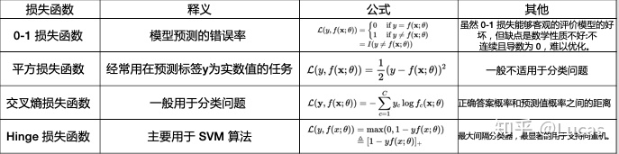

# 1.机器学习导论

## 机器学习概念

机器学习(Machine Learning, ML)，是人工智能的核心，属于人工智能的一个分支，是一个大的领域，是让计算机拥有像人一样的学习能力，模拟和实现人的学习行为和能力，可以像人一样具有识别和判断的能力，可以看作是仿生学。机器学习的核心就是数据，算法（模型），算力（计算机运算能力）。以前也有人工智能，机器学习。不过最近几年网络发展和大数据的积累，使得人工智能能够在数据和高运算能力下发挥它的作用。机器学习应用领域十分广泛，例如：数据挖掘、数据分类、计算机视觉、自然语言处理(NLP)、生物特征识别、搜索引擎、医学诊断、检测信用卡欺诈、证券市场分析、DNA序列测序、语音和手写识别、战略游戏和机器人运用等。

## 核心要素

Key Components of Machine Learning

* Data (Experience)

* Model (Hypothesis) 
* Loss Function (Objective) 
* Optimization Algorithm (Improve)

## 如何解决机器学习问题

**1.Consider the nature of available data D**

* How much data can you get? What would it cost (in money, time or effort)?

**2.Choose a representation for the input X**
* 1.Data preprocessing

**3. Choose a set of possible models H (hypothesis space)**
* set of functions h: X → Y

**4. Choose the Performance measure P (error/lossfunction)**

**5. Choose or design a learning algorithm**

* for using examples (E) to converge on a member of H that optimizes P

## 机器学习分类

现有的机器学习种类繁多，我们一般可以进行如下的分类标准：

- 是否在人类监督下学习（监督学习、非监督学习、半监督学习和强化学习）
- 是否可以动态的增量学习（在线学习和批量学习）
- 是简单的将新的数据点和已知的数据点进行匹配，还是像科学家那样对训练数据进行模型检测，然后建立一个预测模型（基于实例的学习和基于模型的学习）

这些标准之间并不排斥。

## 机器学习核心概念

### 泛化

我们常常提到模型的**泛化**能力，什么是泛化能力呢？

百度百科这样解释：是指机器学习算法对新鲜样本的适应**能力**。 学习的目的是学到隐含在数据背后的规律，对具有同一规律的学习集以外的数据，经过训练的网络也能给出合适的输出，该**能力**称为**泛化能力**。

提取几个关键词：*新鲜样本、适应能力、规律、合适输出*。由此可见，经训练样本训练的模型需要对新样本做出合适的预测，这是泛化能力的体现。

### 过拟合

### 损失函数

## 数据划分

训练数据集：用于构建机器学习模型

验证数据集：辅助构建模型，用于在构建过程中评估模型，为模型提供无偏估计，进而调整模型超参数

测试数据集：用来评估训练好的最终模型的性能（测试集是始终不参与训练的）

 **留出法：**

直接将数据划分为互斥的集合，如通常选择70%数据作为训练集，30%数据作为测试集

需要注意的是保持划分后集合数据分布的一致性，避免划分过程中引入额外的偏差而对最终结果产生影响，通常来说，单次使用留出法得到的结果往往不够稳定可靠，一般采用若干次随机换分，重复进行实验评估后取平均值作为留出法的评估结果

 **K-折交叉验证法：**

**使用单独的测试集或者验证集具有一定的局限性：**

1. 测试集是对模型的单次评估，无法完全展现评估结果的不确定性。
2. 将大的测试集划分成测试集和验证集会增加模型性能评估的偏差。
3. 分割的测试集样本规模太小。
4. 模型可能需要每一个可能存在的数据点来确定模型值。
5. 不同测试集生成的结果不同，这造成测试集具备极大的不确定性。
6. 重采样方法可对模型在未来样本上的性能进行更合理的预测。

所以在实际应用中，可以选择K-折交叉验证的方式来评估模型（CV），其偏差低，性能评估变化小。

交叉验证是将一个整体数据平均划分为K份，（保证数据分布）

先取第一份子集数据作为测试集，剩下的K-1份子集数据作为训练集

再取第二份子集数据作为测试集，剩下的K-1份子集数据作为训练集

......

不断往复，重复K次

然后将得到的结果进行加权平均，作为最终的评估结果

在平常的使用当中，10折交叉验证比较常见，当然还有5折交叉验证以及3折交叉验证

n-折交叉验证也可以进行重复试验然后再取平均值的方式。比如：5次10折交叉验证

**特例：留一交叉验证（leave one out）**

我们令样本划分次数K等于数据集合D的样本数量n，即对样本集合D划分为n份子集。

优点：训练集与原始数据集非常接近，并且可以做到训练集和测试集是对立的

缺点：计算开销很大

**自助法：**

以自主采样为基础：每次随机的从初始数据D中选择一个样本拷贝到结果数据集D`中，样本再放回到初始数据集D中，这样重复m次，就得到了含有m个样本的数据集D`，这样就可以将D`作为训练集，D - D`作为测试集，这样，样本在m次采样中始终不被采样的概率为0.368

这样一个样本在训练集中没出现的概率就是m次都未被选中的概率，即(1-1/m)^m。当m趋于无穷大时，这一概率就将趋近于e-1=0.368

自助法的性能评估变化小，在数据集小、难以有效划分数据集时很有用。另外，自助法也可以从初始数据中产生多个不同的训练集，对集成学习等方法有好处。

然而，自助法产生的数据集改变了初始数据的分布，会引入估计偏差。因而，数据量足够时，建议使用留出法和交叉验证法。