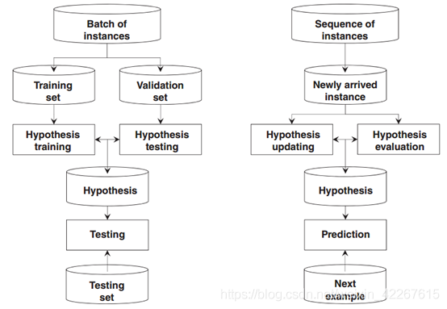
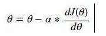
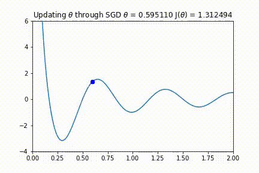
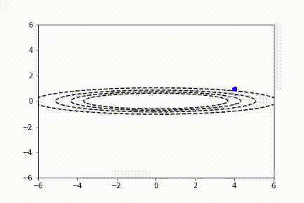
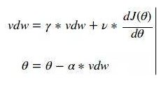
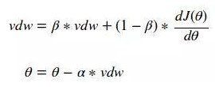
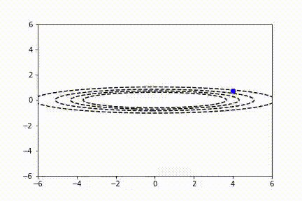

# 10.参数优化

## 在线学习和离线学习

### 离线学习

离线学习也通常称为批学习，是指对独立数据进行训练，将训练所得的模型用于预测任务中。将全部数据放入模型中进行计算，一旦出现需要变更的部分，只能通过再训练(retraining)的方式，这将花费更长的时间，并且将数据全部存在服务器或者终端上非常占地方，对内存要求高。

正是由于这个问题，传统的离线学习不能直接用于在线学习场景：

1. 离线需要多次传递训练数据，由于数据量的二次时间复杂度，导致处理效率很低
2. 离线需要分别在训练集和验证集上训练和选择，但在线学习不将训练与选择分离，不分割训练数据
3. 在批量学习设置中，通常假设数据是根据独立同分布设置的，但是在在线学习设置中，对训练数据的假设是宽松或几乎没有的。

离线学习的缺点：
1、 模型训练过程低效
2、 训练过程不易拓展于大数据场景。
3、 模型无法适应动态变化的环境

### 在线学习

在线学习也称为增量学习或适应性学习，是指对一定顺序下接收数据，每接收一个数据，模型会对它进行预测并对当前模型进行更新，然后处理下一个数据。这对模型的选择是一个完全不同，更复杂的问题。需要混合假设更新和对每轮新到达示例的假设评估。在网络异常检测中，网络异常通常包括各种网络故障、流量的异常表现和拥塞等，各种网络攻击层出不穷，数据是原数据中从未出现过的，因此要求新的在线学习方法能够自动地侦测当前要鉴别的流数据是原来数据中存在的还是新生成的 。在线学习算法具有实现简单、可拓展性强和算法性能优越等特点，适合用于海量数据处理。

### 在线学习算法的分类

根据模型是线性还是非线性模型，将在线学习算法分为两大类，在线线性学习算法和基于核的在线学习算法。

| 在线线性学习算法 | 在线核学习算法             |
| :--------------- | :------------------------- |
| 感知器算法       | 基于核的感知器算法         |
| 稀疏在线学习算法 | 基于核的在线梯度下降算法   |
| 无               | 固定缓冲区的核在线学习算法 |

以上是针对单任务的在线学习问题，比如自然语言处理、生物基因序列以及图片视频搜索等适合使用多任务学习。多任务可利用多个任务之间的相关性避免模型欠拟合，从而提高算法的泛化能力。主要包括有：

- 基于多任务的在线学习算法
- 基于Group Lasso的在线学习算法

### 在线学习算法的优化

- 通过"损失函数+正则化向"的优化框架
- 还可以通过在线学习与深度学习相结合

### 对比

离线学习与在线学习对比的流程图如下：

### 总结

在线学习与当前研究热点深度学习有待更加深入有效的融合，在线学习的分布式实现有待进一步探索和研究，在线学习是否能与强化学习结合，有待进一步探索。

### 其他的理解方式

理解方式一：

在这一次训练中：

在线学习：一个数据点训练完了直接更新权重（而不是一个batch），看到了没？直接更新权重，这里有危害处！（我们无法得知这一次的更新权重是正确的还是错误的，如果恰恰是错误的一次更新，那么我们的模型会有可能渐渐地走向错误方向，残差出现）

离线学习：一个batch训练完才更新权重，这样的话要求所有的数据必须在每一个训练操作中（batch中）都是可用的，个人理解，这样不会因为偶然的错误把网络带向极端。

这种理解方式在国外论文中出现比较多，国外称为online and batch learning.离线就是对应batch learning.这两种方式各有优点，在线学习比较快，但是有比较高的残差，离线（batch）学习能降低残差。

理解方式二：

在离线学习中，所有的训练数据在模型训练期间必须是可用的。只有训练完成了之后，模型才能被拿来用。简而言之，先训练，再用模型，不训练完就不用模型。

在在线学习中，恰恰相反，在线算法按照顺序处理数据。它们产生一个模型，并在把这个模型放入实际操作中，而不需要在一开始就提供完整的的训练数据集。随着更多的实时数据到达，模型会在操作中不断地更新。

## SGD(随机梯度下降)

随机梯度下降（SGD）也称为增量梯度下降，是一种迭代方法，用于优化可微分目标函数。该方法通过在小批量数据上计算损失函数的梯度而迭代地更新权重与偏置项。SGD在高度非凸的损失表面上远远超越了朴素梯度下降法，这种简单的爬山法技术已经主导了现代的非凸优化。

在另一个词条“gradient descent”中我们已经介绍过梯度下降的原理，即参数依据下式更新：

当模型在每见到一组训练数据都对参数进行更新时，我们称这种梯度下降法为SGD，即如下过程：

1.初始化参数（θ，学习率$\alpha$）

2.计算每个θ处的梯度

3.更新参数

4.重复步骤2 和3，直到代价值稳定

在实际运用中，使用小批量进行参数更新的mini-batch gradient descent也常常被叫做SGD，一般我们对使用单个训练数据更新还是小批量更新不做过多区分，而主要关注算法本身。

下图给出了一个简单的一维例子，可以看到模型成功的找到了最小值：

但实际上即使对于这样简单的一维问题，学习率的选取也是很重要的。如果步长过大，则算法可能永远不会找到如下的动画所示的最佳值。监控代价函数并确保它单调递减，这一点很重要。如果没有单调递减，可能需要降低学习率。

SGD的另外一个问题其训练速度。可以想象若学习率过大，我们无法获得理想的结果，而若学习率过小，训练可能会非常耗时。对于复杂的问题，用户往往想要使用非常大的学习速率来快速学习感兴趣的参数，来获得一个初步的结果进行判断。不幸的是，当代价函数波动较大时，这可能导致不稳定。从下图可以看到，由于缺乏水平方向上的最小值，y参数方向的抖动形式。动量算法试图使用过去的梯度预测学习率来解决这个问题。

因此，目前使用的SGD往往使用动量（momentum）来缓解这个问题。通常，使用动量的SGD 通过以下公式更新参数：

γ 和ν 值允许用户对dJ(θ) 的前一个值和当前值进行加权来确定新的θ值。人们通常选择γ和ν的值来创建指数加权移动平均值，如下所示：

这种简单的改变可以使优化过程产生显著的结果，我们现在可以使用更大的学习率，并在尽可能短的时间内收敛。如下图所示，在同一个问题上，我们可以更快到达一个局部（有时是全局）最优点。

当然，SGD还有许多变体，在此我们只对最基础的进行了介绍。

**优势**

1. 由于每次迭代所选取的样本少，在每轮迭代中，只随机优化某一条训练数据上的损失函数，使得每轮参数更新速度大大加快。

**劣势**

1. 同样由于每次迭代选取的样本少，梯度更新方向无法顾及到其余样本，因而准确性较低。
2. 同样的原因，容易收敛到局部最优解而非全局最优解(即使损失函数为凸)。
3. 难以并行。