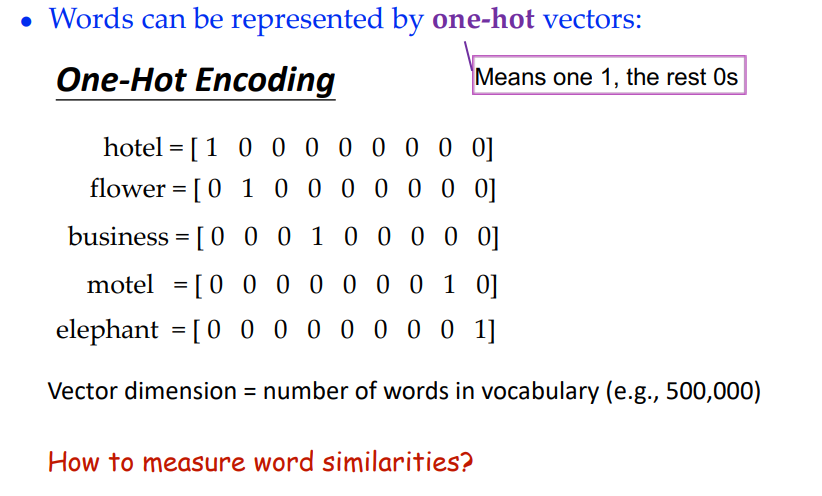
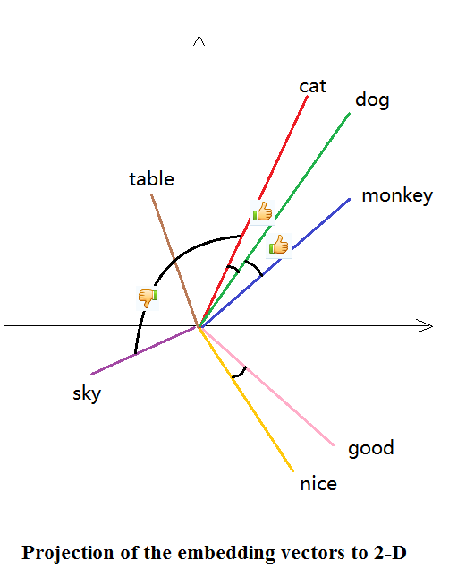
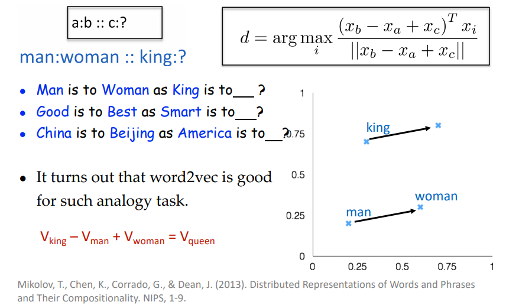
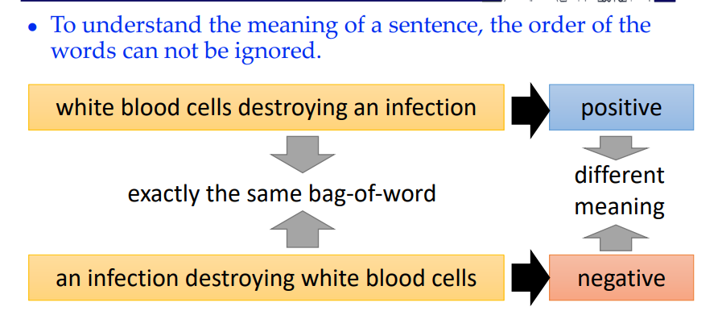
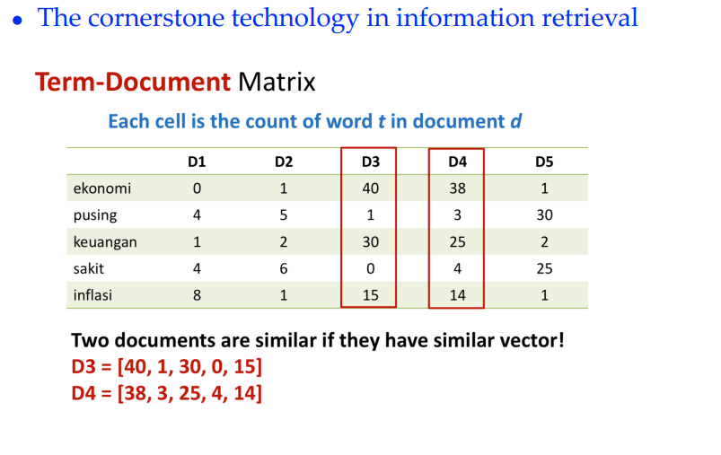
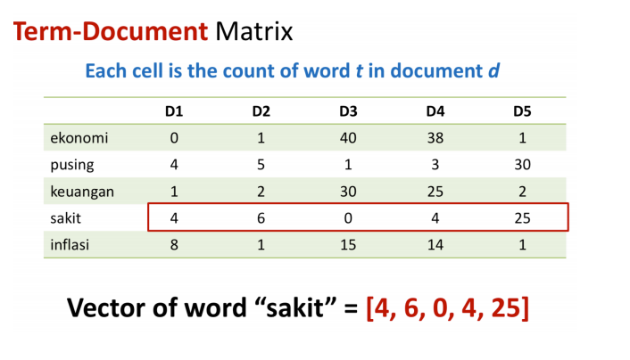
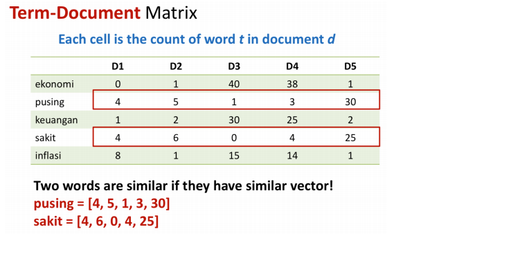

# 11.word2vec

## one-hot encoding

**problem**

用户搜索Minhang motel时，想进行匹配，但是

motel = [0 0 0 0 0 0 0 0 0 0 1 0 0 0 0] 

hotel = [0 0 0 0 0 0 0 1 0 0 0 0 0 0 0] 

两个向量是正交的，并没有任何关系

## word emmbeding

**词嵌入最粗浅的理解** 

o  词映射到低维连续向量(如图) 

cat: (-0.065, -0.035,  0.019, -0.026, 0.085,…)

dog: (-0.019, -0.076,  0.044, 0.021,0.095,…)

table: (0.027,  0.013,  0.006, -0.023, 0.014, …)

o  相似词映射到相似方向 -- 语义相似性被编码了

o  Cosine相似度衡量方向

**词嵌入可以做类比题**  

* v(“国王”) – v(“王后”) ≈ v(“男”) – v(“女”)  o  v(“英国”) + v(“首都”) ≈ v(“伦敦”)  

* 反映出语义空间中的线性关系  o词嵌入编码了语义空间中的线性关系, 向量的不同部分对应不同的语义 o  质疑：然而并没有什么x用？  o
*   两个句子: A含“英国”,“首都”，不含“伦敦”；B含“伦敦”  o  所有词的词向量的和表示句子
*   两个句子仍会比较相似

**相似词映射到相似方向：为什么** 

* 基本假设：“相似”词的邻居词分布类似  o  倒推：两个词邻居词分布类似 → 两个词语义相近 
*  **猫** 宠物 主人 喂食 蹭 喵  
*  **狗** 宠物 主人 喂食 咬 汪  
*   v(“猫”)≈v(“狗”) 
*  Apple: tree red growth design music company engineering executive 
* **v**(“apple”)≈**v**(“orange”), **v**(“apple”)≈**v**(“microsoft”)

**词嵌入的优点**  传统one-hot编码：  “天气”: (1,0,0…,0)，“气候”: (0,1,0,…0) 权力/的/游戏:   (1,0,0,1,1,0,0, …)   冰/与/火/之/歌: (0,1,1,0,0,1,1,…) o   维度高（几千–几万维稀疏向量），

* 数据稀疏  

*  没有编码不同词之间的语义相似性 

*   难以做模糊匹配  

  **词嵌入： **

*    维度低（100 – 500维）, 连续向量，方便机器学习模型处理  

*    无监督学习，容易获得大语料  

*    天然有聚类后的效果  

*  一个向量可以编码一词多义 (歧义的问题需另外处理) 

*  罕见词也可以学到不错的表示：“风姿绰约” ≈ “漂亮”

**局限**

不能表示语句中词语顺序的关系

### the vector space model

**缺点**

* long (length |V|= 20,000 to 50,000) 
*  sparse (most elements are zero) 

* 难以用作机器学习中的特征（需要调整的权重更多）

* n存储显式计数可能很难推广