# 12.深度循环的神经网络

## 深度学习

### 概念

深度学习是机器学习的一种，而机器学习是实现人工智能的必经路径。深度学习的概念源于人工神经网络的研究，含多个隐藏层的多层感知器就是一种深度学习结构。深度学习通过组合低层特征形成更加抽象的高层表示属性类别或特征，以发现数据的分布式特征表示。研究深度学习的动机在于建立模拟人脑进行分析学习的神经网络，它模仿人脑的机制来解释数据，例如图像，声音和文本等。

### 特点

区别于传统的浅层学习，深度学习的不同在于： [4] 

(1)强调了模型结构的深度，通常有5层、6层，甚至10多层的隐层节点； [4] 

(2)明确了特征学习的重要性。也就是说，通过逐层特征变换，将样本在原空间的特征表示变换到一个新特征空间，从而使分类或预测更容易。与人工规则构造特征的方法相比，利用大数据来学习特征，更能够刻画数据丰富的内在信息。 [4] 

通过设计建立适量的神经元计算节点和多层运算层次结构，选择合适的输人层和输出层，通过网络的学习和调优，建立起从输入到输出的函数关系，虽然不能100%找到输入与输出的函数关系，但是可以尽可能的逼近现实的关联关系。使用训练成功的网络模型，就可以实现我们对复杂事务处理的自动化要求。

### 与传统机器学习的区别

传统机器学习的特征提取主要依赖人工，针对特定简单任务的时候人工提取特征会简单有效，但是并不能通用。

深度学习的特征提取并不依靠人工，而是机器自动提取的。这也是为什么大家都说深度学习的可解释性很差，因为有时候深度学习虽然能有好的表现，但是我们并不知道他的原理是什么。

### 优点

**优点1：学习能力强**

从结果来看，深度学习的表现非常好，他的学习能力非常强。

**优点2：覆盖范围广，适应性好**

深度学习的神经网络层数很多，宽度很广，理论上可以映射到任意函数，所以能解决很复杂的问题。

**优点3：数据驱动，上限高**

深度学习高度依赖数据，数据量越大，他的表现就越好。在图像识别、面部识别、[NLP](https://easyai.tech/ai-definition/nlp/) 等部分任务甚至已经超过了人类的表现。同时还可以通过调参进一步提高他的上限。

**优点4：可移植性好**

由于深度学习的优异表现，有很多框架可以使用，例如 [TensorFlow](https://easyai.tech/tensorflow-course-source/)、[Pytorch](https://easyai.tech/PyTorch/)。这些框架可以兼容很多平台。

### 缺点

**缺点1：计算量大，便携性差**

深度学习需要大量的数据很大量的算力，所以成本很高。并且现在很多应用还不适合在移动设备上使用。目前已经有很多公司和团队在研发针对便携设备的芯片。这个问题未来会得到解决。

**缺点2：硬件需求高**

深度学习对算力要求很高，普通的 CPU 已经无法满足深度学习的要求。主流的算力都是使用 [GPU](https://easyai.tech/ai-definition/gpugraphics-processing-unit/) 和 [TPU](https://easyai.tech/ai-definition/tpu（tensor-processing-unit）/)，所以对于硬件的要求很高，成本也很高。

**缺点3：模型设计复杂**

深度学习的模型设计非常复杂，需要投入大量的人力物力和时间来开发新的算法和模型。大部分人只能使用现成的模型。

**缺点4：没有”人性”，容易存在偏见**

由于深度学习依赖数据，并且可解释性不高。在训练数据不平衡的情况下会出现性别歧视、种族歧视等问题。

## The deeper,the better?

**好处**

* **网络加深，有助于提升模型性能**

* **提升模块化能力**

  深度模型DNN一个比较大的优势就是，Modularization模块化。每个神经元都可以想象成是一个特征分类器，浅层的输出可以给深层的多个神经元重复使用，从而提升了模块化能力和复用能力，提升了参数的效率

* **提升Transform变换能力**

  神经网络的每个神经元，通过w * x + b，可以对输入特征进行线性变换。浅层的变换可以被深层使用。故网络层数加深，可以带来变换次数的提升，从而提升变换能力。下面是手写字识别，不同layer特征的分布。可以看出随着层数越深，输出特征区分度越来越大。这就是因为层数越深，特征变换能力越强的原因。

**挑战**

1. 加深容易导致梯度弥散和梯度爆炸问题。梯度爆炸还好处理，通过clip可以解决。梯度弥散则容易导致反向传播时，级联的梯度越来越小，传播到浅层后就几乎为0，从而导致学习特别慢，甚至无法更新参数并学习了。
2. 不同layer无法并行计算，导致前向计算比较慢，降低了模型预测和训练速度。
3. 训练时，由于反向传播，必须保存所有layer的输出，内存消耗也比较大。不过这个有一些解法，比如Reformer利用时间换空间，优化了这个问题。

## 表征学习

### 概念

在机器学习领域，表征学习（或特征学习）是一种将原始数据转换成为能够被机器学习有效开发的一种技术的集合。在特征学习算法出现之前，机器学习研究人员需要利用手动特征工程（manual feature learning）等技术从原始数据的领域知识（domain knowledge）建立特征，然后再部署相关的机器学习算法。虽然手动特征工程对于应用机器学习很有效，但它同时也是很困难、很昂贵、很耗时、并依赖于强大专业知识。特征学习弥补了这一点，它使得机器不仅能学习到数据的特征，并能利用这些特征来完成一个具体的任务。

和预测性学习（Predictive Learning）不同，表征学习的目标不是通过学习原始数据预测某个观察结果，而是学习数据的底层结构（underlying structure），从而可以分析出原始数据的其它特性。表征学习允许计算机学习使用特征的同时，也学习如何提取特征：学习如何学习。在机器学习任务中，输入数据例如图片、视频、语言文字、声音等都是高维且冗余复杂，传统的手动提取特征已变得不切合实际，所以需要借助于优秀的特征学习技术。

### 分类

特征学习可以被分为两类：监督的和无监督的，类似于机器学习。

- 在监督特征学习中，被标记过的数据被当做特征用来学习。例如神经网络，多层感知器，(监督)字典学习。
- 在无监督特征学习中，未被标记过的数据被当做特征用来学习。例如(无监督)字典学习，[独立成分分析](https://baike.baidu.com/item/独立成分分析)，[自动编码](https://baike.baidu.com/item/自动编码)，[矩阵分解](https://baike.baidu.com/item/矩阵分解)，各种[聚类分析](https://baike.baidu.com/item/聚类分析)及其变形。

## 端到端学习

（个人理解就是炼丹，什么东西都扔进去，不控制中间过程）

***1、非端到端学习（传统的语音识别系统）***

传统的语音识别需要把语音转换成语音特征向量，然后把这组向量通过机器学习，分类到各种音节上（根据语言模型），然后通过音节，还原出最大概率的语音原本要表达的单词，一般包括以下模块：

- ***特征提取模块 (Feature Extraction\***)：该模块的主要任务是从输入信号中提取特征，供声学模型处理。一般也包括了一些信号处理技术，尽可能降低环境噪声、说话人等因素对特征造成的影响，把语音变成向量。
- ***声学模型 (Acoustic Model)\***: 用于识别语音向量
- ***发音词典 (Pronnuciation Dictionary)\***：发音词典包含系统所能处理的词汇集及其发音。发音词典提供了声学模型与语言模型间的联系。
- ***语言模型 (Language Model)\***：语言模型对系统所针对的语言进行建模。
- ***解码器 (Decoder)：\***任务是对输入的信号，根据声学、语言模型及词典，寻找能够以最大概率输出该信号的词串。

传统的语音识别中的语音模型和语言模型是***分别训练\***的，缺点是不一定能够总体上提高识别率。

*来自wiki*

***2、端到端学习（端到端的语音识别系统）***

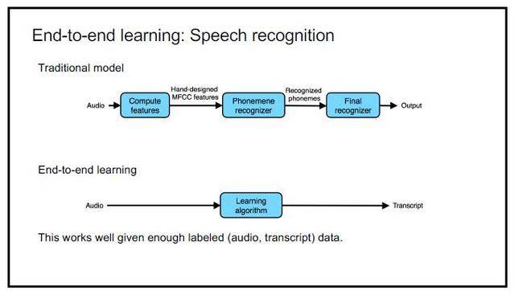吴恩达NIPS 2016演讲

**端到端学习的思路则非常简单：音频→学习算法→转录结果；**

而现在，我们可以直接通过深度学习将语音直接对标到我们最终显示出来的文本。

通过深度学习自己的特征学习功能来完成从特征提取到音节表达的整个过程。

**在给定了足够的有标注的训练数据时（语音数据以及对应的文本数据），端到端的语音识别方法的效果会很好。**

**缺点**

1. 误差会级联，下游模型受上游模型干扰特别大
2. 模型之间是割裂的，无法联合起来调参。
3. 设计多个模型，甚至需要一定背景知识，工作量大。

## 循环神经网络

### ***为什么需要RNN（循环神经网络）\***

他们都只能单独的取处理一个个的输入，前一个输入和后一个输入是完全没有关系的。但是，某些任务需要能够更好的处理**序列**的信息，即前面的输入和后面的输入是有关系的。

> ***比如，当我们在理解一句话意思时，孤立的理解这句话的每个词是不够的，我们需要处理这些词连接起来的整个序列；\*** ***当我们处理视频的时候，我们也不能只单独的去分析每一帧，而要分析这些帧连接起来的整个序列。\***

***以nlp的一个最简单词性标注任务来说，将我 吃 苹果 三个单词标注词性为 我/nn 吃/v 苹果/nn。\***

那么这个任务的输入就是：

我 吃 苹果 （已经分词好的句子）

这个任务的输出是：

*我/nn 吃/v 苹果/nn(词性标注好的句子)*

对于这个任务来说，我们当然可以直接用普通的神经网络来做，给网络的训练数据格式了就是我-> 我/nn 这样的多个单独的单词->词性标注好的单词。

***但是很明显，一个句子中，前一个单词其实对于当前单词的词性预测是有很大影响的，比如预测苹果的时候，由于前面的吃是一个动词，那么很显然苹果作为名词的概率就会远大于动词的概率，因为动词后面接名词很常见，而动词后面接动词很少见。\***

所以为了解决一些这样类似的问题，能够更好的处理序列的信息，RNN就诞生了。

### ***RNN结构\***

首先看一个简单的循环神经网络如，它由输入层、一个隐藏层和一个输出层组成：

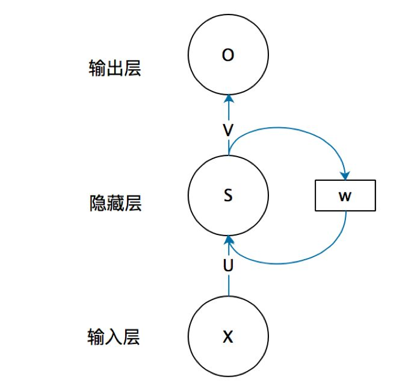

不知道初学的同学能够理解这个图吗，反正我刚开始学习的时候是懵逼的，每个结点到底代表的是一个值的输入，还是说一层的向量结点集合，如何隐藏层又可以连接到自己，**等等这些疑惑~这个图是一个比较抽象的图。**

我们现在这样来理解，如果把上面有W的那个带箭头的圈去掉，它就变成了最普通的**全连接神经网络**。x是一个向量，它表示**输入层**的值（这里面没有画出来表示神经元节点的圆圈）；s是一个向量，它表示**隐藏层**的值（这里隐藏层面画了一个节点，你也可以想象这一层其实是多个节点，节点数与向量s的维度相同）；

U是输入层到隐藏层的**权重矩阵**，o也是一个向量，它表示**输出层**的值；V是隐藏层到输出层的**权重矩阵**。

那么，现在我们来看看W是什么。**循环神经网络**的**隐藏层**的值s不仅仅取决于当前这次的输入x，还取决于上一次**隐藏层**的值s。**权重矩阵** W就是**隐藏层**上一次的值作为这一次的输入的权重。

我们给出这个抽象图对应的具体图：

***我们从上图就能够很清楚的看到，上一时刻的隐藏层是如何影响当前时刻的隐藏层的。\***

如果我们把上面的图展开，**循环神经网络**也可以画成下面这个样子：

RNN时间线展开图

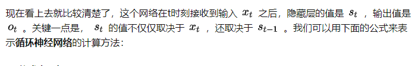

***用公式表示如下：\***

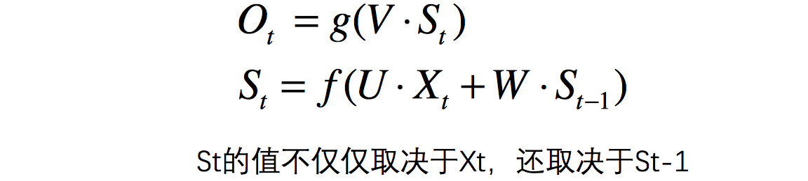

## LSTM

### 什么是LSTM

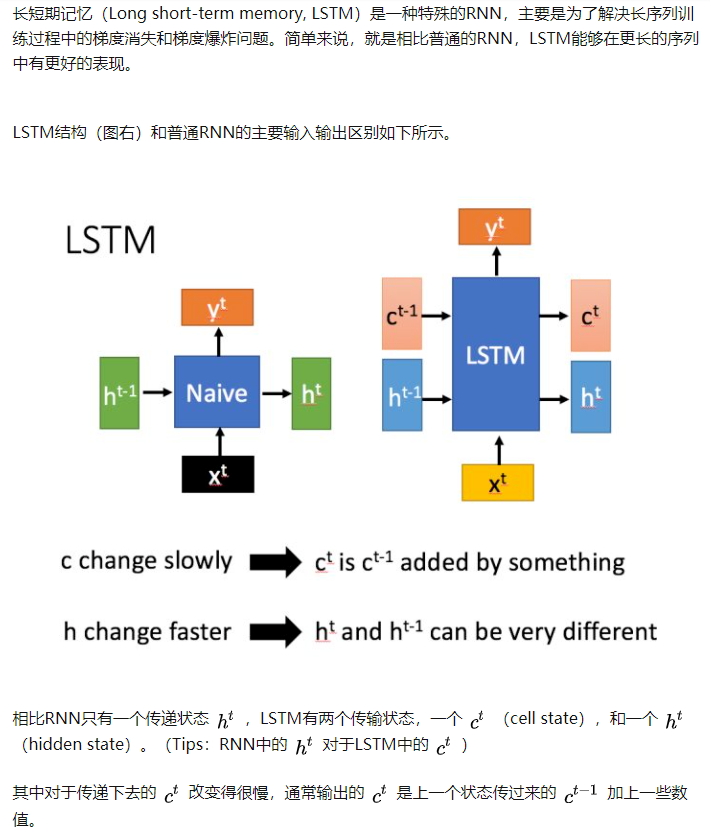

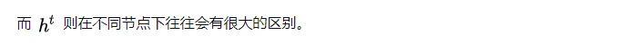

### 深入LSTM结构

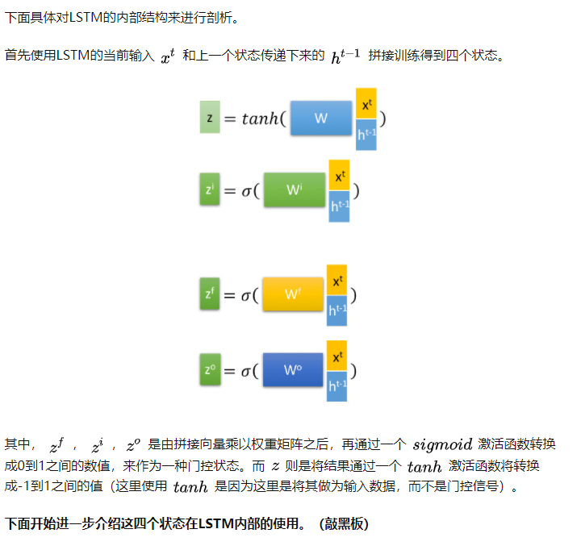

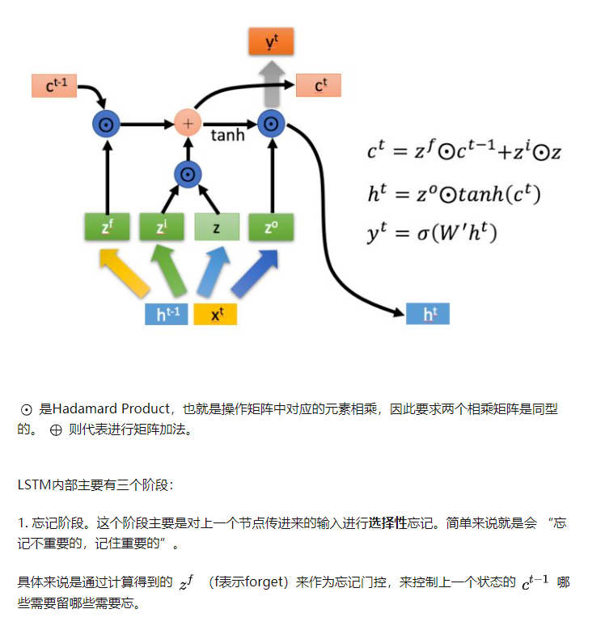

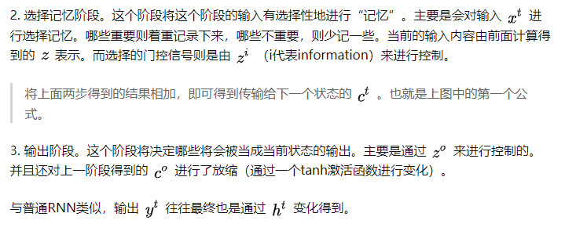

###  总结

以上，就是LSTM的内部结构。通过门控状态来控制传输状态，记住需要长时间记忆的，忘记不重要的信息；而不像普通的RNN那样只能够“呆萌”地仅有一种记忆叠加方式。对很多需要“长期记忆”的任务来说，尤其好用。

但也因为引入了很多内容，导致参数变多，也使得训练难度加大了很多。因此很多时候我们往往会使用效果和LSTM相当但参数更少的GRU来构建大训练量的模型。

## 梯度爆炸和梯度消失

### 概念

梯度消失：在神经网络中，当前面隐藏层的学习速率低于后面隐藏层的学习速率，即随着隐藏层数目的增加，分类准确率反而下降了。这种现象叫梯度消失。

梯度爆炸：在神经网络中，当前面隐藏层的学习速率低于后面隐藏层的学习速率，即随着隐藏层数目的增加，分类准确率反而下降了。这种现象叫梯度爆炸。

其实梯度消失和梯度爆炸是一回事，只是表现的形式，以及产生的原因不一样。

### 产生原因

梯度消失：（1）隐藏层的层数过多；（2）采用了不合适的激活函数(更容易产生梯度消失，但是也有可能产生梯度爆炸)

梯度爆炸：（1）隐藏层的层数过多；（2）权重的初始化值过大

### 举例

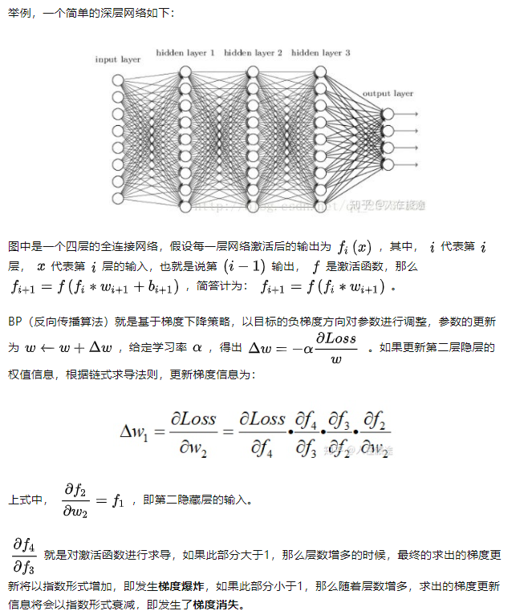

### 解决方案

（1）预训练加微调

此方法来自Hinton在2006年发表的一篇论文，Hinton为了解决梯度的问题，提出采取无监督逐层训练方法，其基本思想是每次训练一层隐节点，训练时将上一层隐节点的输出作为输入，而本层隐节点的输出作为下一层隐节点的输入，此过程是逐层“预训练”（pre-training）；在预训练完成后，再对整个网络进行“微调”（fine-tunning）。Hinton在训练深度信念网络（Deep Belief Networks中，使用了这个方法，在各层预训练完成后，再利用BP算法对整个网络进行训练。此思想相当于是先寻找局部最优，然后整合起来寻找全局最优，此方法有一定的好处，但是目前应用的不是很多了。

（2）梯度剪切

**梯度剪切**这个方案主要是针对**梯度爆炸**提出的，其思想是设置一个梯度剪切阈值，然后更新梯度的时候，如果梯度超过这个阈值，那么就将其强制限制在这个范围之内。这可以防止梯度爆炸。

另外一种**解决梯度爆炸的手段**是采用**权重正则化**（weithts regularization）。

正则化是通过对网络权重做正则限制过拟合，仔细看正则项在损失函数的形式：

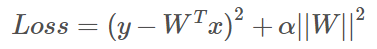

其中， a 是指正则项系数，因此，如果发生梯度爆炸，权值的范数就会变的非常大，通过正则化项，可以**部分**限制**梯度爆炸**的发生。

（3）relu、leakrelu、elu等激活函数

Relu:思想也很简单，如果激活函数的导数为1，那么就不存在梯度消失爆炸的问题了，每层的网络都可以得到相同的更新速度。

relu的优点：

\* 解决了梯度消失、爆炸的问题

*计算方便，计算速度快

*加速了网络的训练

relu的缺点：

*由于负数部分恒为0，会导致一些神经元无法激活（可通过设置小学习率部分解决）

*输出不是以0为中心的

**尽管relu也有缺点，但是仍然是目前使用最多的激活函数。**

leaky relu，max(α*z,z)，α=0.01，解决了0区间带来的影响。

elu激活函数也是为了解决relu的0区间带来的影响，其数学表达为：

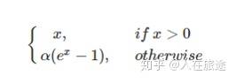

（4）batch normalization

Batchnorm是深度学习发展以来提出的最重要的成果之一了，目前已经被广泛的应用到了各大网络中，具有加速网络收敛速度，提升训练稳定性的效果，Batchnorm本质上是解决反向传播过程中的梯度问题。batchnorm全名是batch normalization，简称BN，即批规范化，通过规范化操作将输出信号x规范化到均值为0，方差为1保证网络的稳定性。

具体的batchnorm原理非常复杂，在这里不做详细展开，此部分大概讲一下batchnorm解决梯度的问题上。具体来说就是反向传播中，经过每一层的梯度会乘以该层的权重，举个简单例子：

正向传播中f2=f1(wT∗x+b)，那么反向传播中

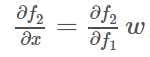

反向传播式子中有w的存在，所以w的大小影响了梯度的消失和爆炸，batchnorm就是通过对每一层的输出规范为均值和方差一致的方法，消除了w带来的放大缩小的影响，进而解决梯度消失和爆炸的问题。
（5）残差结构

（6）LSTM