# 13.seq2seq

### RNN-seq2seq

#### Seq2Seq 结构

上面的三种结构对于 RNN 的输入和输出个数都有一定的限制，但实际中很多任务的序列的长度是不固定的，例如机器翻译中，源语言、目标语言的句子长度不一样；对话系统中，问句和答案的句子长度不一样。

Seq2Seq 是一种重要的 RNN 模型，也称为 Encoder-Decoder 模型，可以理解为一种 **N×M** 的模型。模型包含两个部分：**Encoder** 用于编码序列的信息，将任意长度的序列信息编码到一个向量 **c** 里。而 **Decoder** 是解码器，解码器得到上下文信息向量 **c** 之后可以将信息解码，并输出为序列。Seq2Seq 模型结构有很多种，下面是几种比较常见的：

**第一种**

第一种 Seq2Seq 结构

**第二种**

第二种 Seq2Seq 结构

**第三种**

第三种 Seq2Seq 结构

#### 编码器 Encoder

这三种 Seq2Seq 模型的主要区别在于 Decoder，他们的 Encoder 都是一样的。下图是 Encoder 部分，Encoder 的 RNN 接受输入 **x**，最终输出一个编码所有信息的上下文向量 **c**，中间的神经元没有输出。Decoder 主要传入的是上下文向量 **c**，然后解码出需要的信息。

Seq2Seq Encoder

从上图可以看到，Encoder 与一般的 RNN 区别不大，只是中间神经元没有输出。其中的上下文向量 **c** 可以采用多种方式进行计算。

Encoder 上下文向量 c

从公式可以看到，**c** 可以直接使用最后一个神经元的隐藏状态 **h**N 表示；也可以在最后一个神经元的隐藏状态上进行某种变换 **h**N 而得到，q 函数表示某种变换；也可以使用所有神经元的隐藏状态 **h**1, **h**2, ..., **h**N 计算得到。得到上下文向量 **c** 之后，需要传递到 Decoder。

#### 解码器 Decoder

Decoder 有多种不同的结构，这里主要介绍三种。

**第一种**

第一种 Decoder 结构

第一种 Decoder 结构比较简单，将上下文向量 **c** 当成是 RNN 的初始隐藏状态，输入到 RNN 中，后续只接受上一个神经元的隐藏层状态 **h'** 而不接收其他的输入 **x**。第一种 Decoder 结构的隐藏层及输出的计算公式：

第一种 Decoder 结构隐藏层及输出层

**第二种**

第二种 Decoder 结构

第二种 Decoder 结构有了自己的初始隐藏层状态 **h'**0，不再把上下文向量 **c** 当成是 RNN 的初始隐藏状态，而是当成 RNN 每一个神经元的输入。可以看到在 Decoder 的每一个神经元都拥有相同的输入 **c**，这种 Decoder 的隐藏层及输出计算公式：

第二种 Decoder 结构隐藏层及输出层

**第三种**

第三种 Decoder 结构

第三种 Decoder 结构和第二种类似，但是在输入的部分多了上一个神经元的输出 **y'**。即每一个神经元的输入包括：上一个神经元的隐藏层向量 **h'**，上一个神经元的输出 **y'**，当前的输入 **c** (Encoder 编码的上下文向量)。对于第一个神经元的输入 **y'**0，通常是句子其实标志位的 embedding 向量。第三种 Decoder 的隐藏层及输出计算公式：

第三种 Decoder 结构隐藏层及输出层

####  Teacher Forcing

Teacher Forcing 用于训练阶段，主要针对上面第三种 Decoder 模型来说的，第三种 Decoder 模型神经元的输入包括了上一个神经元的输出 **y'**。如果上一个神经元的输出是错误的，则下一个神经元的输出也很容易错误，导致错误会一直传递下去。

而 Teacher Forcing 可以在一定程度上缓解上面的问题，在训练 Seq2Seq 模型时，Decoder 的每一个神经元并非一定使用上一个神经元的输出，而是有一定的比例采用正确的序列作为输入。

举例说明，在翻译任务中，给定英文句子翻译为中文。"I have a cat" 翻译成 "我有一只猫"，**下图是不使用 Teacher Forcing 的 Seq2Seq**：

不使用 Teacher Forcing

**如果使用 Teacher Forcing**，则神经元直接使用正确的输出作为当前神经元的输入。

## attention 机制

### **RNN结构的局限**

机器翻译解决的是输入是一串在某种语言中的一句话，输出是目标语言相对应的话的问题，如将德语中的一段话翻译成合适的英语。之前的Neural Machine Translation(一下简称NMT)模型中，通常的配置是encoder-decoder结构，即encoder读取输入的句子将其转换为定长的一个向量，然后decoder再将这个向量翻译成对应的目标语言的文字。通常encoder及decoder均采用RNN结构如LSTM或GRU等（RNN基础知识可参考[循环神经网络RNN——深度学习第十章](https://zhuanlan.zhihu.com/p/44145288)），如下图所示，我们利用encoder RNN将输入语句信息总结到最后一个hidden vector中，并将其作为decoder初始的hidden vector，利用decoder解码成对应的其他语言中的文字。

但是这个结构有些问题，尤其是RNN机制实际中存在长程梯度消失的问题，对于较长的句子，我们很难寄希望于将输入的序列转化为定长的向量而保存所有的有效信息，所以随着所需翻译句子的长度的增加，这种结构的效果会显著下降。

### **Attention机制的引入**

为了解决这一由长序列到定长向量转化而造成的信息损失的瓶颈，Attention注意力机制被引入了。Attention机制跟人类翻译文章时候的思路有些类似，即将注意力关注于我们翻译部分对应的上下文。同样的，Attention模型中，当我们翻译当前词语时，我们会寻找源语句中相对应的几个词语，并结合之前的已经翻译的部分作出相应的翻译，如下图所示，当我们翻译“knowledge”时，只需将注意力放在源句中“知识”的部分，当翻译“power”时，只需将注意力集中在"力量“。这样，当我们decoder预测目标翻译的时候就可以看到encoder的所有信息，而不仅局限于原来模型中定长的隐藏向量，并且不会丧失长程的信息。

### 数学运算

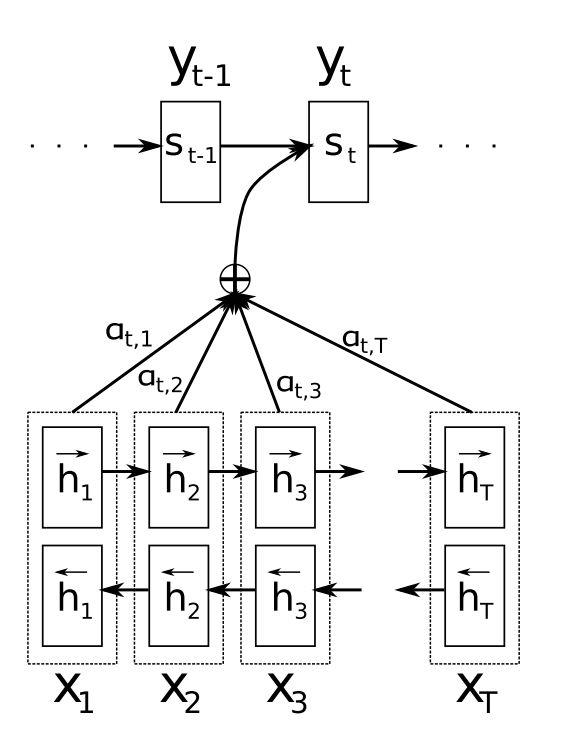

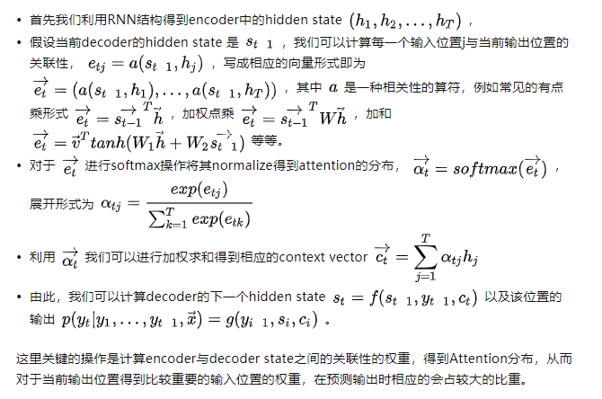

（主要是对context进行了改变，引入了输入单词的权重）

### 好处

通过Attention机制的引入，我们打破了只能利用encoder最终单一向量结果的限制，从而使模型可以集中在所有对于下一个目标单词重要的输入信息上，使模型效果得到极大的改善。还有一个优点是，我们通过观察attention 权重矩阵的变化，可以更好地知道哪部分翻译对应哪部分源文字，有助于更好的理解模型工作机制，如下图所示。

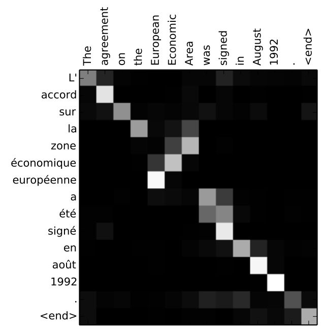

## Transformer

### **直观理解与模型整体结构**

先来看一个翻译的例子“I arrived at the bank after crossing the river” 这里面的bank指的是银行还是河岸呢，这就需要我们联系上下文，当我们看到river之后就应该知道这里bank很大概率指的是河岸。在RNN中我们就需要一步步的顺序处理从bank到river的所有词语，而当它们相距较远时RNN的效果常常较差，且由于其顺序性处理效率也较低。Self-Attention则利用了Attention机制，计算每个单词与其他所有单词之间的关联，在这句话里，当翻译bank一词时，river一词就有较高的Attention score。利用这些Attention score就可以得到一个加权的表示，然后再放到一个前馈神经网络中得到新的表示，这一表示很好的考虑到上下文的信息。如下图所示，encoder读入输入数据，利用层层叠加的Self-Attention机制对每一个词得到新的考虑了上下文信息的表征。Decoder也利用类似的Self-Attention机制，但它不仅仅看之前产生的输出的文字，而且还要attend encoder的输出。以上步骤如下动图所示：

1.00

Transformer模型的整体结构如下图所示

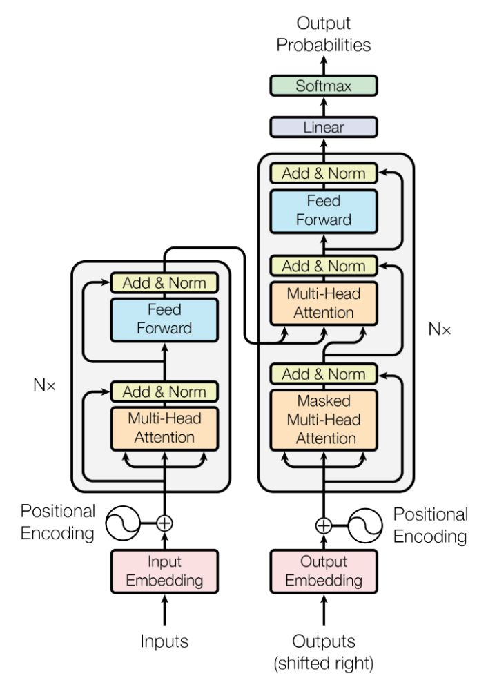

这里面Multi-head Attention其实就是多个Self-Attention结构的结合，每个head学习到在不同表示空间中的特征，如下图所示，两个head学习到的Attention侧重点可能略有不同，这样给了模型更大的容量。

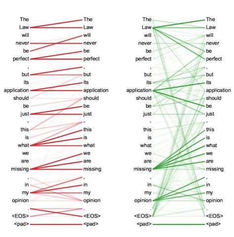

### **Self-Attention详解**

了解了模型大致原理，我们可以详细的看一下究竟Self-Attention结构是怎样的。其基本结构如下

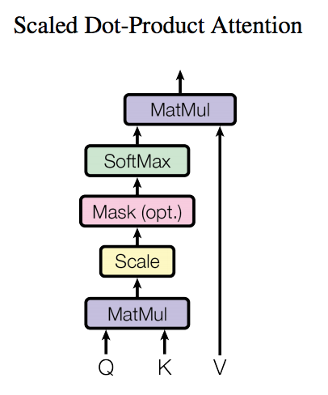

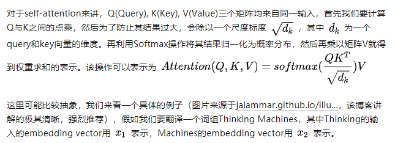

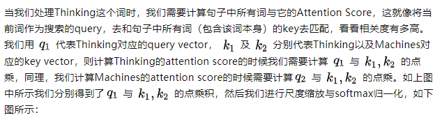

显然，当前单词与其自身的attention score一般最大，其他单词根据与当前单词重要程度有相应的score。然后我们在用这些attention score与value vector相乘，得到加权的向量。

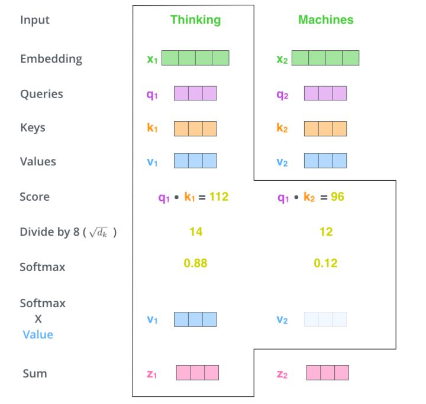

如果将输入的所有向量合并为矩阵形式，则所有query, key, value向量也可以合并为矩阵形式表示

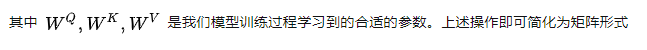

而multihead就是我们可以有不同的Q,K,V表示，最后再将其结果结合起来，如下图所示：

这就是基本的Multihead Attention单元，对于encoder来说就是利用这些基本单元叠加，其中key, query, value均来自前一层encoder的输出，即encoder的每个位置都可以注意到之前一层encoder的所有位置。

对于decoder来讲，我们注意到有两个与encoder不同的地方，一个是第一级的Masked Multi-head，另一个是第二级的Multi-Head Attention不仅接受来自前一级的输出，还要接收encoder的输出，下面分别解释一下是什么原理。

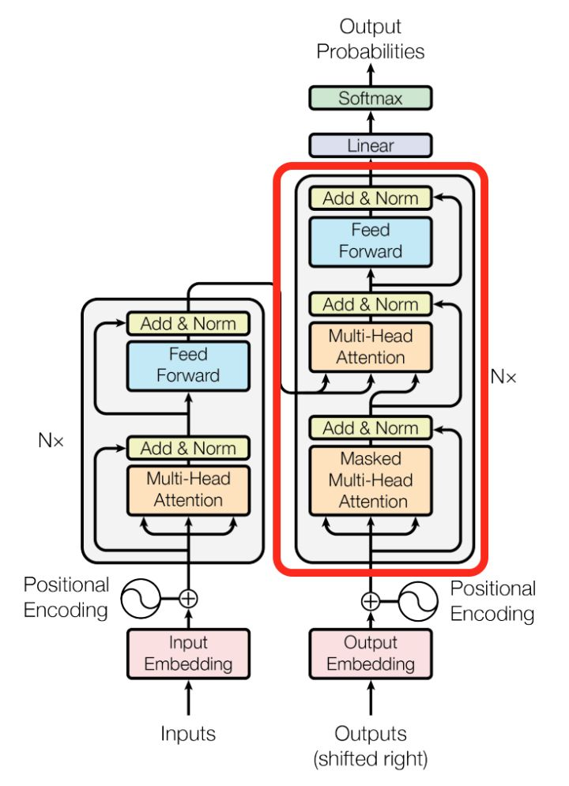

第一级decoder的key, query, value均来自前一层decoder的输出，但加入了Mask操作，即我们只能attend到前面已经翻译过的输出的词语，因为翻译过程我们当前还并不知道下一个输出词语，这是我们之后才会推测到的。

而第二级decoder也被称作encoder-decoder attention layer，即它的query来自于之前一级的decoder层的输出，但其key和value来自于encoder的输出，这使得decoder的每一个位置都可以attend到输入序列的每一个位置。

总结一下，k和v的来源总是相同的，q在encoder及第一级decoder中与k,v来源相同，在encoder-decoder attention layer中与k,v来源不同。

## BERT（这里真的看不懂了）

### Bert是什么？

BERT，全称是 Bidirectional Encoder Representation from Transformers，基于语义理解的深度双向预训练Transformer。

要理解 Bert，5 个关键词帮你理解其思想，分别是 **Pre-training、Deep、Bidirectional、Transformer、Language Understanding**。

#### Deep

Bert 与 Transformer 不同，Bert 的神经网络层更深，意味着它能更准确表达语义的理解，提取更多特征。

#### Bidirectional

BERT 被设计成一个深度双向模型，使得神经网络更有效地从第一层本身一直到最后一层捕获来自目标词的左右上下文的信息。

传统上，我们要么训练语言模型预测句子中的下一个单词( GPT 中使用的从右到左的上下文)，要么训练语言模型预测从左到右的上下文。这使得我们的模型容易由于信息丢失而产生错误。

#### Transformer

Bert 是基于 Tranformer 的深度双向语言表征模型，也就是利用 Transformer 结构构造了一个多层双向的Encoder 网络。它的特点之一就是所有层都联合上下文语境进行预训练。

Bert 的目标是生成预训练语言模型，所以只需要 Encoder 机制。Transformer 的 Encoder 是一次性读取整个文本序列，而不是从左到右或者从右到左按顺序读取。

#### Pre-training

pre-training 的意思是，作者认为，确实存在通用的语言模型，先用大量数据预训练一个通用模型，然后再微调模型，使其适用于下游任务。为了区别于针对语言生成的 Language Model，作者给通用的语言模型，取了一个名字，叫语言表征模型 Language Representation Model。

深度学习就是表征学习，大多只在预训练表征微调的基础上加一个线性分类器作为输出就可以完成下游任务。

#### Language Understanding

Bert 是一个语言表征模型，能实现语言表征目标训练，通过深度双向 Transformer 模型达到语义理解的目的。

整合以上特点，我们就可以很直观的理解 Bert，Bert 是一个用 Transformer 作为特征抽取器的深度双向预训练语言理解模型。Bert 就是一个预训练模型，利用双向 Transformer，通过大量数据训练一个语言表征模型，这是一个通用模型，通过对其微调来适用下游任务，包括分类，回归，机器翻译，问答系统等等任务。

### 深入理解Bert工作原理

bert.png

Bert 的模型结构如图左边第一个，Bert 采用了 Transformer Encoder，也就是每时每刻的 Attention 计算都能够得到全部时刻的输入。

OpenAI GPT 采用 Transformer 的 Decoder，每个时刻的 Attention 计算只能依赖于该时刻前的所有时刻的输入，因为 OpenAI GPT 是单向语言模型。

ELMO 则采用的是 LSTM，这个模型虽然可以学习到前后语义，但是输出依赖于前面的输入，决定了 EMLO 的网络层数不会太多，会造成大量耗时，这就决定了 ELMO 提取的特征有限。

### Bert的输入有什么不同

Bert 的输入相较其它模型，采用了三个 Embedding 相加的方式，通过加入 Token Embeddings，Segment Embeddings，Position Embeddings 三个向量，以此达到预训练和预测下一句的目的。

input.png

如上图，Bert 的输入 Input 是两个句子："my dog is cute"，"he likes playing"。首先会在第一句开头加上特殊Token [CLS] 用于标记句子开始，用 [SEP] 标记句子结束。

然后对每个 Token 进行 3 个 Embedding，词的 Embedding (Token Embeddings)，位置 Embedding (Position Embeddings)，句子 Embedding (Segment Embeddings)。最终将三个 Embedding 求和的方式输入到下一层。

下面详细介绍下三个 Embedding。

#### Token Embeddings

通过建立字向量表将每个字转换成一个一维向量，作为模型输入。特别的，英文词汇会做更细粒度的切分，比如playing 或切割成 play 和 ##ing，中文目前尚未对输入文本进行分词，直接对单子构成为本的输入单位。将词切割成更细粒度的 Word Piece 是为了解决未登录词的常见方法。

假如输入文本 ”I like dog“。下图则为 Token Embeddings 层实现过程。输入文本在送入 Token Embeddings 层之前要先进性 tokenization 处理，且两个特殊的 Token 会插入在文本开头 [CLS] 和结尾 [SEP]。

Bert 在处理英文文本时只需要 30522 个词，Token Embeddings 层会将每个词转换成 768 维向量，例子中 5 个Token 会被转换成一个 (6, 768) 的矩阵或 (1, 6, 768) 的张量。

token.png

#### Segment Embedding

Bert 能够处理句子对的分类任务，这类任务就是判断两个文本是否是语义相似的。句子对中的两个句子被简单的拼接在一起后送入模型中，Bert 如何区分一个句子对是两个句子呢？答案就是 Segment Embeddings。

Segement Embeddings 层有两种向量表示，前一个向量是把 0 赋值给第一个句子的各个 Token，后一个向量是把1赋值给各个 Token，问答系统等任务要预测下一句，因此输入是有关联的句子。而文本分类只有一个句子，那么 Segement embeddings 就全部是 0。

segment.png

#### Position Embedding

由于出现在文本不同位置的字/词所携带的语义信息存在差异(如 ”你爱我“ 和 ”我爱你“)，你和我虽然都和爱字很接近，但是位置不同，表示的含义不同。

在 RNN 中，第二个 ”I“ 和 第一个 ”I“ 表达的意义不一样，因为它们的隐状态不一样。对第二个 ”I“ 来说，隐状态经过 ”I think therefore“ 三个词，包含了前面三个词的信息，而第一个 ”I“ 只是一个初始值。因此，RNN 的隐状态保证在不同位置上相同的词有不同的输出向量表示。

RNN.png

RNN 能够让模型隐式的编码序列的顺序信息，相比之下，Transformer 的自注意力层 (Self-Attention) 对不同位置出现相同词给出的是同样的输出向量表示。尽管 Transformer 中两个 ”I“ 在不同的位置上，但是表示的向量是相同的。

bert.png

Transformer 中通过植入关于 Token 的相对位置或者绝对位置信息来表示序列的顺序信息。作者测试用学习的方法来得到 Position Embeddings，最终发现固定位置和相对位置效果差不多，所以最后用的是固定位置的，而正弦可以处理更长的 Sequence，且可以用前面位置的值线性表示后面的位置。

偶数位置，使用正弦编码，奇数位置，使用余弦编码。

pos.png

sin.png

Bert 中处理的最长序列是 512 个 Token，长度超过 512 会被截取，Bert 在各个位置上学习一个向量来表示序列顺序的信息编码进来，这意味着 Position Embeddings 实际上是一个 (512, 768) 的 lookup 表，表第一行是代表第一个序列的每个位置，第二行代表序列第二个位置。

最后，Bert 模型将 Token Embeddings (1, n, 768) + Segment Embeddings(1, n, 768) + Position Embeddings(1, n, 768) 求和的方式得到一个 Embedding(1, n, 768) 作为模型的输入。

### 深入理解Bert工作原理

bert.png

Bert 的模型结构如图左边第一个，Bert 采用了 Transformer Encoder，也就是每时每刻的 Attention 计算都能够得到全部时刻的输入。

OpenAI GPT 采用 Transformer 的 Decoder，每个时刻的 Attention 计算只能依赖于该时刻前的所有时刻的输入，因为 OpenAI GPT 是单向语言模型。

ELMO 则采用的是 LSTM，这个模型虽然可以学习到前后语义，但是输出依赖于前面的输入，决定了 EMLO 的网络层数不会太多，会造成大量耗时，这就决定了 ELMO 提取的特征有限。

### Bert的输入有什么不同

Bert 的输入相较其它模型，采用了三个 Embedding 相加的方式，通过加入 Token Embeddings，Segment Embeddings，Position Embeddings 三个向量，以此达到预训练和预测下一句的目的。

input.png

如上图，Bert 的输入 Input 是两个句子："my dog is cute"，"he likes playing"。首先会在第一句开头加上特殊Token [CLS] 用于标记句子开始，用 [SEP] 标记句子结束。

然后对每个 Token 进行 3 个 Embedding，词的 Embedding (Token Embeddings)，位置 Embedding (Position Embeddings)，句子 Embedding (Segment Embeddings)。最终将三个 Embedding 求和的方式输入到下一层。

下面详细介绍下三个 Embedding。

#### Token Embeddings

通过建立字向量表将每个字转换成一个一维向量，作为模型输入。特别的，英文词汇会做更细粒度的切分，比如playing 或切割成 play 和 ##ing，中文目前尚未对输入文本进行分词，直接对单子构成为本的输入单位。将词切割成更细粒度的 Word Piece 是为了解决未登录词的常见方法。

假如输入文本 ”I like dog“。下图则为 Token Embeddings 层实现过程。输入文本在送入 Token Embeddings 层之前要先进性 tokenization 处理，且两个特殊的 Token 会插入在文本开头 [CLS] 和结尾 [SEP]。

Bert 在处理英文文本时只需要 30522 个词，Token Embeddings 层会将每个词转换成 768 维向量，例子中 5 个Token 会被转换成一个 (6, 768) 的矩阵或 (1, 6, 768) 的张量。

token.png

#### Segment Embedding

Bert 能够处理句子对的分类任务，这类任务就是判断两个文本是否是语义相似的。句子对中的两个句子被简单的拼接在一起后送入模型中，Bert 如何区分一个句子对是两个句子呢？答案就是 Segment Embeddings。

Segement Embeddings 层有两种向量表示，前一个向量是把 0 赋值给第一个句子的各个 Token，后一个向量是把1赋值给各个 Token，问答系统等任务要预测下一句，因此输入是有关联的句子。而文本分类只有一个句子，那么 Segement embeddings 就全部是 0。

segment.png

#### Position Embedding

由于出现在文本不同位置的字/词所携带的语义信息存在差异(如 ”你爱我“ 和 ”我爱你“)，你和我虽然都和爱字很接近，但是位置不同，表示的含义不同。

在 RNN 中，第二个 ”I“ 和 第一个 ”I“ 表达的意义不一样，因为它们的隐状态不一样。对第二个 ”I“ 来说，隐状态经过 ”I think therefore“ 三个词，包含了前面三个词的信息，而第一个 ”I“ 只是一个初始值。因此，RNN 的隐状态保证在不同位置上相同的词有不同的输出向量表示。

RNN.png

RNN 能够让模型隐式的编码序列的顺序信息，相比之下，Transformer 的自注意力层 (Self-Attention) 对不同位置出现相同词给出的是同样的输出向量表示。尽管 Transformer 中两个 ”I“ 在不同的位置上，但是表示的向量是相同的。

bert.png

Transformer 中通过植入关于 Token 的相对位置或者绝对位置信息来表示序列的顺序信息。作者测试用学习的方法来得到 Position Embeddings，最终发现固定位置和相对位置效果差不多，所以最后用的是固定位置的，而正弦可以处理更长的 Sequence，且可以用前面位置的值线性表示后面的位置。

偶数位置，使用正弦编码，奇数位置，使用余弦编码。

pos.png

sin.png

Bert 中处理的最长序列是 512 个 Token，长度超过 512 会被截取，Bert 在各个位置上学习一个向量来表示序列顺序的信息编码进来，这意味着 Position Embeddings 实际上是一个 (512, 768) 的 lookup 表，表第一行是代表第一个序列的每个位置，第二行代表序列第二个位置。

最后，Bert 模型将 Token Embeddings (1, n, 768) + Segment Embeddings(1, n, 768) + Position Embeddings(1, n, 768) 求和的方式得到一个 Embedding(1, n, 768) 作为模型的输入。

### 主要贡献

Bert 采用深度双向 Transformer 语言模型，通过 Mask LM 来达到训练深度双向预训练模型，较之前使用单向语言模型训练更准确，信息量更大，且语义理解更准确。

论文表明，预训练模型能省去特定工程需要修改体系架构的麻烦，Bert 是第一个基于 fine-tune 的语言模型，它在大量句子级和 Token 级任务上展现了很好的性能。

Bert 的成功，一个重要原因就是数据量大，计算资源丰富。BERT 训练数据采用了英文的开源语料 BooksCropus以及英文维基百科数据，一共有 33 亿个词。同时 BERT 模型的标准版本有 1 亿的参数量，与 GPT 持平，而 BERT的大号版本有 3 亿多参数量，这应该是目前自然语言处理中最大的预训练模型了。

当然，这么大的模型和这么多的数据，训练的代价也是不菲的。谷歌用了 16 个自己的 TPU 集群（一共 64 块 TPU）来训练大号版本的 BERT，一共花了 4 天的时间。

对于是否可以复现预训练，作者在 Reddit 上有一个大致的回复，指出 OpenAI 当时训练GPT用了将近 1 个月的时间，而如果用同等的硬件条件来训练 BERT 估计需要 1 年的时间。不过他们会将已经训练好的模型和代码开源，方便大家训练好的模型上进行后续任务。