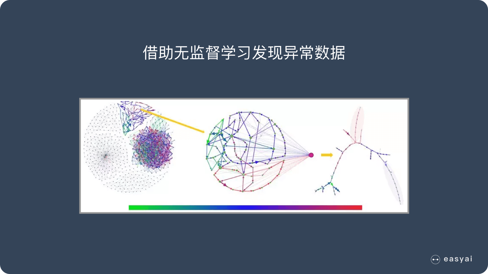
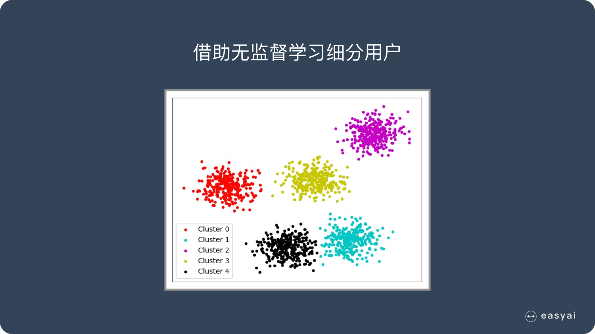

# 15.无监督学习

## 什么是无监督学习？

无监督学习是机器学习中的一种**训练方式/学习方式**：

下面通过跟监督学习的对比来理解无监督学习：

1. 监督学习是一种目的明确的训练方式，你知道得到的是什么；而**无监督学习则是没有明确目的的训练方式，你无法提前知道结果是什么**。
2. 监督学习需要给数据打标签；而**无监督学习不需要给数据打标签**。
3. 监督学习由于目标明确，所以可以衡量效果；而**无监督学习几乎无法量化效果如何**。

简单总结一下：

**无监督学习是一种机器学习的训练方式，它本质上是一个统计手段，在没有标签的数据里可以发现潜在的一些结构的一种训练方式。**

它主要具备3个特点：

1. 无监督学习没有明确的目的
2. 无监督学习不需要给数据打标签
3. 无监督学习无法量化效果

这么解释很难理解，下面用一些具体案例来告诉大家无监督学习的一些实际应用场景，通过这些实际场景，大家就能了解无监督学习的价值。

 

## 无监督学习的使用场景

**案例1：发现异常**

有很多违法行为都需要”洗钱”，这些洗钱行为跟普通用户的行为是不一样的，到底哪里不一样？

如果通过人为去分析是一件成本很高很复杂的事情，我们可以通过这些行为的特征对用户进行分类，就更容易找到那些行为异常的用户，然后再深入分析他们的行为到底哪里不一样，是否属于违法洗钱的范畴。

**通过无监督学习，我们可以快速把行为进行分类，虽然我们不知道这些分类意味着什么，但是通过这种分类，可以快速排出正常的用户，更有针对性的对异常行为进行深入分析。**

 

**案例2：用户细分**

这个对于广告平台很有意义，我们不仅把用户按照性别、年龄、地理位置等维度进行用户细分，还可以通过用户行为对用户进行分类。

通过很多维度的用户细分，广告投放可以更有针对性，效果也会更好。

 

**案例3：推荐系统**

大家都听过”啤酒+尿不湿”的故事，这个故事就是根据用户的购买行为来推荐相关的商品的一个例子。

比如大家在淘宝、天猫、京东上逛的时候，总会根据你的浏览行为推荐一些相关的商品，有些商品就是无监督学习通过聚类来推荐出来的。系统会发现一些购买行为相似的用户，推荐这类用户最”喜欢”的商品。

## k-means算法

### 一、聚类思想

​    所谓聚类算法是指将一堆没有标签的数据自动划分成几类的方法，属于无监督学习方法，这个方法要保证同一类的数据有相似的特征，如下图所示：

​    根据样本之间的距离或者说是相似性（亲疏性），把越相似、差异越小的样本聚成一类（簇），最后形成多个簇，使同一个簇内部的样本相似度高，不同簇之间差异性高。

### 二、k-means聚类分析算法

**相关概念：**

**K值**：要得到的簇的个数

**质心**：每个簇的均值向量，即向量各维取平均即可

**距离量度**：常用欧几里得距离和余弦相似度（先标准化）

**算法流程：**

1、首先确定一个k值，即我们希望将数据集经过聚类得到k个集合。

2、从数据集中随机选择k个数据点作为质心。

3、对数据集中每一个点，计算其与每一个质心的距离（如欧式距离），离哪个质心近，就划分到那个质心所属的集合。

4、把所有数据归好集合后，一共有k个集合。然后重新计算每个集合的质心。

5、如果新计算出来的质心和原来的质心之间的距离小于某一个设置的阈值（表示重新计算的质心的位置变化不大，趋于稳定，或者说收敛），我们可以认为聚类已经达到期望的结果，算法终止。

6、如果新质心和原质心距离变化很大，需要迭代3~5步骤。

### 三、数学原理

K-Means采用的启发式方式很简单，用下面一组图就可以形象的描述:

​    上图a表达了初始的数据集，假设k=2。在图b中，我们随机选择了两个k类所对应的类别质心，即图中的红色质心和蓝色质心，然后分别求样本中所有点到这两个质心的距离，并标记每个样本的类别为和该样本距离最小的质心的类别，如图c所示，经过计算样本和红色质心和蓝色质心的距离，我们得到了所有样本点的第一轮迭代后的类别。此时我们对我们当前标记为红色和蓝色的点分别求其新的质心，如图d所示，新的红色质心和蓝色质心的位置已经发生了变动。图e和图f重复了我们在图c和图d的过程，即将所有点的类别标记为距离最近的质心的类别并求新的质心。最终我们得到的两个类别如图f。

### 四、实例

坐标系中有六个点：

1、我们分两组，令K等于2，我们随机选择两个点：P1和P2

2、通过勾股定理计算剩余点分别到这两个点的距离：

3、第一次分组后结果：

​    组A：P1

​    组B：P2、P3、P4、P5、P6

4、分别计算A组和B组的质心：

​    A组质心还是P1=（0，0）

​    B组新的质心坐标为：P哥=（（1+3+8+9+10）/5，（2+1+8+10+7）/5）=（6.2，5.6）

5、再次计算每个点到质心的距离：

6、第二次分组结果：

​    组A：P1、P2、P3

​    组B：P4、P5、P6

7、再次计算质心：

​    P哥1=（1.33，1） 

​    P哥2=（9，8.33）

8、再次计算每个点到质心的距离：

9、第三次分组结果：

​    组A：P1、P2、P3

​    组B：P4、P5、P6

可以发现，第三次分组结果和第二次分组结果一致，说明已经收敛，聚类结束。

### 五、K-Means的优缺点

**优点：**

1、原理比较简单，实现也是很容易，收敛速度快。

2、当结果簇是密集的，而簇与簇之间区别明显时, 它的效果较好。

3、主要需要调参的参数仅仅是簇数k。

**缺点：**

1、K值需要预先给定，很多情况下K值的估计是非常困难的。

2、K-Means算法对初始选取的质心点是敏感的，不同的随机种子点得到的聚类结果完全不同 ，对结果影响很大。

3、对噪音和异常点比较的敏感。用来检测异常值。

4、采用迭代方法，**可能只能得到局部的最优解，而无法得到全局的最优解**。

### **六、细节问题**

**1、K值怎么定？**

​    答：分几类主要取决于个人的经验与感觉，通常的做法是多尝试几个K值，看分成几类的结果更好解释，更符合分析目的等。或者可以把各种K值算出的**E**做比较，取最小的**E**的K值。

**2、初始的K个质心怎么选？**

​    答：最常用的方法是随机选，初始质心的选取对最终聚类结果有影响，因此算法一定要多执行几次，哪个结果更reasonable，就用哪个结果。       当然也有一些优化的方法，第一种是选择彼此距离最远的点，具体来说就是先选第一个点，然后选离第一个点最远的当第二个点，然后选第三个点，第三个点到第一、第二两点的距离之和最小，以此类推。第二种是先根据其他聚类算法（如层次聚类）得到聚类结果，从结果中每个分类选一个点。

**3、关于离群值？**

​    答：离群值就是远离整体的，非常异常、非常特殊的数据点，在聚类之前应该将这些“极大”“极小”之类的离群数据都去掉，否则会对于聚类的结果有影响。但是，离群值往往自身就很有分析的价值，可以把离群值单独作为一类来分析。

4、单位要一致！

​    答：比如X的单位是米，Y也是米，那么距离算出来的单位还是米，是有意义的。但是如果X是米，Y是吨，用距离公式计算就会出现“米的平方”加上“吨的平方”再开平方，最后算出的东西没有数学意义，这就有问题了。

5、标准化

​    答：如果数据中X整体都比较小，比如都是1到10之间的数，Y很大，比如都是1000以上的数，那么，在计算距离的时候Y起到的作用就比X大很多，X对于距离的影响几乎可以忽略，这也有问题。因此，如果K-Means聚类中选择欧几里德距离计算距离，数据集又出现了上面所述的情况，就一定要进行数据的标准化（normalization），即将数据按比例缩放，使之落入一个小的特定区间。

### 七、初始点的选取

​    常见的方法是随机的选取初始质心，但是这样簇的质量常常很差。处理选取初始质心问题的一种常用技术是：多次运行，每次使用一组不同的随机初始质心，然后选取具有最小SSE（误差的平方和）的簇集。这种策略简单，但是效果可能不好，这取决于数据集和寻找的簇的个数。   
​     第二种有效的方法是，取一个样本，并使用层次聚类技术对它聚类。从层次聚类中提取K个簇，并用这些簇的质心作为初始质心。该方法通常很有效，但仅对下列情况有效：（1）样本相对较小，例如数百到数千（层次聚类开销较大）；（2）K相对于样本大小较小
​     第三种选择初始质心的方法，随机地选择第一个点，或取所有点的质心作为第一个点。然后，对于每个后继初始质心，选择离已经选取过的初始质心最远的点。使用这种方法，确保了选择的初始质心不仅是随机的，而且是散开的。但是，这种方法可能选中离群点。此外，求离当前初始质心集最远的点开销也非常大。为了克服这个问题，通常

该方法用于点样本。由于离群点很少（多了就不是离群点了），它们多半不会在随机样本中出现。计算量也大幅减少。

