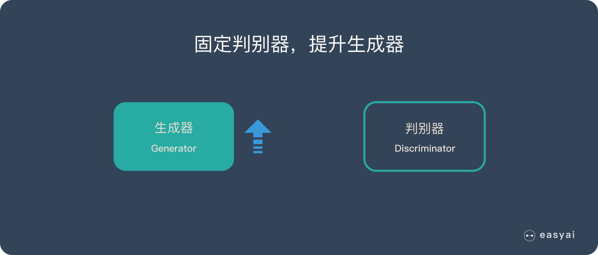
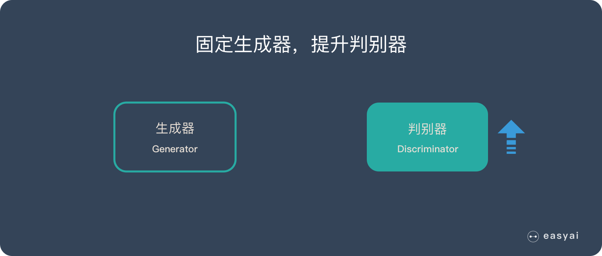
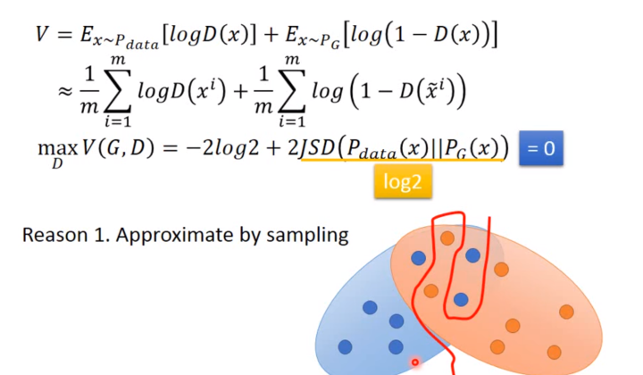
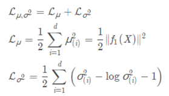

# 16.生成式模型

## GAN

### 基本原理

生成对抗网络（GAN）由2个重要的部分构成：

1. **生成器(Generator**)：通过机器生成数据（大部分情况下是图像），目的是“骗过”判别器
2. **判别器(Discriminator**)：判断这张图像是真实的还是机器生成的，目的是找出生成器做的“假数据”

下面详细介绍一下过程：

**第一阶段：固定「判别器D」，训练「生成器G」**

我们使用一个还 OK 判别器，让一个「生成器G」不断生成“假数据”，然后给这个「判别器D」去判断。

一开始，「生成器G」还很弱，所以很容易被揪出来。

但是随着不断的训练，「生成器G」技能不断提升，最终骗过了「判别器D」。

到了这个时候，「判别器D」基本属于瞎猜的状态，判断是否为假数据的概率为50%。

**第二阶段：固定「生成器G」，训练「判别器D」**

当通过了第一阶段，继续训练「生成器G」就没有意义了。这个时候我们固定「生成器G」，然后开始训练「判别器D」。

「判别器D」通过不断训练，提高了自己的鉴别能力，最终他可以准确的判断出所有的假图片。

到了这个时候，「生成器G」已经无法骗过「判别器D」。

**循环阶段一和阶段二**

通过不断的循环，「生成器G」和「判别器D」的能力都越来越强。

最终我们得到了一个效果非常好的「生成器G」，我们就可以用它来生成我们想要的图片了。

下面的实际应用部分会展示很多“惊艳”的案例。

### 优缺点

**3个优势**

1. 能更好建模数据分布（图像更锐利、清晰）
2. 理论上，GANs 能训练任何一种生成器网络。其他的框架需要生成器网络有一些特定的函数形式，比如输出层是高斯的。
3. 无需利用马尔科夫链反复采样，无需在学习过程中进行推断，没有复杂的变分下界，避开近似计算棘手的概率的难题。

**2个缺陷**

1. 难训练，不稳定。生成器和判别器之间需要很好的同步，但是在实际训练中很容易D收敛，G发散。D/G 的训练需要精心的设计。
2. 模式缺失（Mode Collapse）问题。GANs的学习过程可能出现模式缺失，生成器开始退化，总是生成同样的样本点，无法继续学习。

### 数学细节

![[公式]](https://www.zhihu.com/equation?tex=%5Cbegin%7Balign%7D%0A%5Ctheta+%5E%2A+%26%3D+arg%5C+%5Cmax_%7B%5Ctheta%7D%5Cprod_%7Bi%3D1%7D%5E%7Bm%7DP_G%28x%5Ei%3B%5Ctheta%29+%5C%5C%0A%26%3Darg%5C+%5Cmax_%7B%5Ctheta%7D%5C+log%5Cprod_%7Bi%3D1%7D%5E%7Bm%7DP_G%28x%5Ei%3B%5Ctheta%29+%5C%5C%0A%26%3Darg%5C+%5Cmax_%7B%5Ctheta%7D+%5Csum_%7Bi%3D1%7D%5E%7Bm%7DlogP_G%28x%5Ei%3B%5Ctheta%29+%5C%5C%0A%26+%5Capprox+arg%5C+%5Cmax_%7B%5Ctheta%7D%5C+E_%7Bx%5Csim+P_%7Bdata%7D%7D%5BlogP_G%28x%3B%5Ctheta%29%5D+%5C%5C%0A%26+%3D+arg%5C+%5Cmax_%7B%5Ctheta%7D%5Cint_%7Bx%7D+P_%7Bdata%7D%28x%29logP_G%28x%3B%5Ctheta%29dx+-+%5Cint_%7Bx%7DP_%7Bdata%7D%28x%29logP_%7Bdata%7D%28x%29dx+%5C%5C%0A%26%3Darg%5C+%5Cmax_%7B%5Ctheta%7D%5Cint_%7Bx%7DP_%7Bdata%7D%28x%29%28logP_G%28x%3B%5Ctheta%29-logP_%7Bdata%7D%28x%29%29dx+%5C%5C%0A%26%3Darg%5C+%5Cmin_%7B%5Ctheta%7D%5Cint_%7Bx%7DP_%7Bdata%7D%28x%29log+%5Cfrac%7BP_%7Bdata%7D%28x%29%7D%7BP_G%28x%3B%5Ctheta%29%7Ddx+%5C%5C%0A%26%3Darg%5C+%5Cmin_%7B%5Ctheta%7D%5C+KL%28P_%7Bdata%7D%28x%29%7C%7CP_G%28x%3B%5Ctheta%29%29%0A%5Cend%7Balign%7D%0A+)

#### 训练

避免上述情况的方法就是更新G的时候，不要更新G太多。

知道了网络的训练顺序，我们还需要设定两个loss function，一个是D的loss，一个是G的loss。下面是整个GAN的训练具体步骤：

上述步骤在机器学习和深度学习中也是非常常见，易于理解。

#### 存在的问题

但是上面G的loss function还是有一点小问题，下图是两个函数的图像：

对于这个问题，我们是否应该让D变得弱一点，减弱它的分类能力，但是从理论上讲，为了让它能够有效的区分真假图片，我们又希望它能够powerful，所以这里就产生了矛盾。

还有可能的原因是，虽然两个分布都是高维的，但是两个分布都十分的窄，可能交集相当小，这样也会导致JS divergence算出来=log2，约等于没有交集。

解决的一些方法，有添加噪声，让两个分布变得更宽，可能可以增大它们的交集，这样JS divergence就可以计算，但是随着时间变化，噪声需要逐渐变小。

还有一个问题叫Mode Collapse，如下图：

这个图的意思是，data的分布是一个双峰的，但是学习到的生成分布却只有单峰，我们可以看到模型学到的数据，但是却不知道它没有学到的分布。

造成这个情况的原因是，KL divergence里的两个分布写反了

## VAE

### 标准自编码器——AE

本节主要来源于【1】。

####  用one-hot向量

我们用[1, 0, 0, 0]代表猫，用[0, 1, 0, 0]代表狗。虽然这要没什么问题，但是我们最多只能储存4张图片。当然，我们也可以增加向量的长度和网络的参数，那么我们可以获得更多的图片。

####  向量表示

上述向量很稀疏。为了解决这个问题，我们想使用实数值向量而不是0，1向量。可认为这种实数值向量是原图片的一种编码，这也就引出了编码/解码的概念。举个例子，[3.3, 4.5, 2.1, 9.8]代表猫，[3.4, 2.1, 6.7, 4.2] 代表狗。这个已知的初始向量可以作为我们的**潜在变量**。

#### 标准自编码器——AE

如果像我上面一样，随机初始化一些向量去代表图片的编码，这不是一个很好的办法，我们更希望计算机能帮我们自动编码。在autoencoder模型中，我们加入一个编码器，它能帮我们把图片编码成向量。然后解码器能够把这些向量恢复成图片。

我们现在获得了一个有点实际用处的网络了。而且我们现在能训练任意多的图片了。如果我们把这些图片的编码向量存在来，那以后我们就能通过这些编码向量来重构我们的图像。我们称之为标准自编码器。

### VAE直白理解

#### 3.1 文字简述VAE

**但我们想建一个产生式模型，而不是一个只是储存图片的网络。现在我们还不能产生任何未知的东西，因为我们不能随意产生合理的潜在变量。因为合理的潜在变量都是编码器从原始图片中产生的。这里有个简单的解决办法。我们可以对编码器添加约束，就是强迫它产生服从单位高斯分布的潜在变量。正是这种约束，把VAE和标准自编码器给区分开来了。**

现在，产生新的图片也变得容易：我们只要从单位高斯分布中进行采样，然后把它传给解码器就可以了。

事实上，我们还需要在重构图片的精确度和单位高斯分布的拟合度上进行权衡。

我们可以让网络自己去决定这种权衡。对于我们的损失函数，我们可以把这两方面进行加和。一方面，是图片的重构误差，我们可以用平均平方误差来度量，另一方面。我们可以用KL散度来度量我们潜在变量的分布和单位高斯分布的差异。

为了优化KL散度，我们需要应用一个简单的参数重构技巧：不像标准自编码器那样产生实数值向量，VAE的编码器会产生两个向量:一个是均值向量，一个是标准差向量。

#### 举例说明VAE

为了更加形象，我们可以认为潜在变量是一种数据的转换。

我们假设我们有一堆实数在区间[0, 10]上，每个实数对应一个物体名字。比如，5.43对应着苹果，5.44对应着香蕉。当有个人给你个5.43，你就知道这是代表着苹果。我们能用这种方法够编码无穷多的物体，因为[0, 10]之间的实数有无穷多个。

但是，如果某人给你一个实数的时候其实是加了高斯噪声的呢？比如你接受到了5.43，原始的数值可能是 [4.4 ~ 6.4]之间的任意一个数，真实值可能是5.44(香蕉)。如果给的方差越大，那么这个平均值向量所携带的可用信息就越少。

我们可以把这种逻辑用在编码器和解码器上。编码越有效，那么标准差向量就越能趋近于标准高斯分布的单位标准差。

这种约束迫使编码器更加高效，并能够产生信息丰富的潜在变量。这也提高了产生图片的性能。而且我们的潜变量不仅可以随机产生，也能从未经过训练的图片输入编码器后产生。

**用文献【****5】的图示很好理解这两者的差距**：

### VAE的模型理论

#### 模型框架

本节理解主要来源于【7】，其中比较难理解的部分为一对一配对：

再次强调，这时候每一个 *Xk* 都配上了一个专属的正态分布，才方便后面的生成器做还原。但这样有多少个 *X* 就有多少个正态分布了。我们知道正态分布有两组参数：均值 *μ* 和方差 *σ*^2（多元的话，它们都是向量）。

个人理解：数量是一对一的，只是维度上有差异。降低的是单个物品的维度。

从损失函数出发：重构损失（D(X̂k,Xk)^2） + KL loss：

首先，我们希望重构X，也就是最小化（D(X̂k,Xk)^2），但是这个重构过程受到噪声的影响，因为Zk是通过重新采样过的，不是直接由encoder算出来的。显然噪声会增加重构的难度，不过好在这个噪声强度（也就是方差）通过一个神经网络算出来的，所以最终模型为了重构得更好，肯定会想尽办法让方差为0。而方差为0的话，也就没有随机性了，所以不管怎么采样其实都只是得到确定的结果（也就是均值）。说白了，**模型会慢慢退化成普通的AutoEncoder，噪声不再起作用。**

为了使得为了使模型具有生成能力，VAE决定让所有的p(Z∣X)都向标准正态分布看齐。如果所有的p(Z∣X)都很接近标准正态分布N(0,I)，那么根据定义：

这样我们就能达到我们的先验假设：p(Z)是标准正态分布。然后我们就可以放心地从N(0,I)中采样来生成图像或者其他原始信息了。那怎么让所有的p(Z∣X)都向N(0,I)看齐呢？如果没有外部知识的话，其实最直接的方法应该是在重构误差的基础上中加入额外的loss：

因为它们分别代表了均值μ 和方差的对数logσ2，达到N(0,I)就是希望二者尽量接近于0了。不过，这又会面临着这**两个损失的比例要怎么选取的问题**，选取得不好，生成的图像会比较模糊。所以，原论文直接算了一般（各分量独立的）正态分布与标准正态分布的KL散度KL(N(μ,σ2)∥N(0,I))作为这个额外的loss，计算结果为：

这里d是隐变量的维度，μi和σi表示分别代表一般正态分布的均值向量和方差向量的第i个分量。直接用这个式子做补充loss，就不用考虑均值损失和方差损失的相对比例问题了。显然，这个loss也可以分两部分理解：

 

#### Reparameterization Trick

这是实现模型的一个技巧。我们要从p(Z∣Xk)中采样一个Zk出来，尽管我们知道了p(Z∣Xk)是正态分布，但是均值方差都是靠模型算出来的，我们要靠这个过程反过来优化均值方差的模型，但是"采样"这个操作是不可导的，而采样的结果是可导的，于是我们利用了一个事实：

于是，我们将从N(μ,σ2)采样变成了从N(0,I)中采样，然后通过参数变换得到从N(μ,σ2)中采样的结果。这样一来，"采样"这个操作就不用参与梯度下降了，改为采样的结果参与，使得整个模型可训练了。

#### VAE本质

VAE本质上就是在我们常规的自编码器的基础上，对encoder的结果（在VAE中对应着计算均值的网络）加上了"高斯噪声"，使得结果decoder能够对噪声有鲁棒性；而那个额外的KL loss（目的是让均值为0，方差为1），事实上就是相当于对encoder的一个正则项，希望encoder出来的东西均有零均值。

那另外一个encoder（对应着计算方差的网络）的作用呢？它是用来动态调节噪声的强度的。直觉上来想，当decoder还没有训练好时（重构误差远大于KL loss），就会适当降低噪声（KL loss增加），使得拟合起来容易一些（重构误差开始下降）；反之，如果decoder训练得还不错时（重构误差小于KL loss），这时候噪声就会增加（KL loss减少），使得拟合更加困难了（重构误差又开始增加），这时候decoder就要想办法提高它的生成能力了。

简言之，重构的过程是希望没噪声的，而KL loss则希望有高斯噪声的，两者是对立的。所以，VAE跟GAN一样，内部其实是包含了一个对抗的过程，只不过它们两者是混合起来，共同进化的。

### 模型比较

*上图分别是AE，VAE和GAN*

#### VAE和AE的比较：

**相同点**：两者都是X->Z->X'的结构

**不同点**：AE寻找的是单值映射关系，即：z=f(x)。而VAE寻找的是分布的映射关系，即：DX→DZ

为什么会有这个差别呢？我们不妨从生成模型的角度考虑一下。既然AE的decoder做的是Z−>X'的变换，那么理论上它也可以作为生成器使用。但这里有个问题，显然不是所有的RZ都是有效的Z。Z的边界在哪里？如何得到有效的Z，从而生成x？这些都不是AE能解决的。VAE映射的是分布，而分布可以通过采样得到有效的z，从而生成相应的x。个人理解：换句话说，AE是固定的z，而VAE是一个分布（一般是由均值和标准差构成的正态分布），相当于一个概率范围。若是将VAE中的方差设置为0，则就是为AE的形式。

#### VAE和GAN:

VAE（Variational Auto-Encoder）和GAN（Ganerative Adversarial Networks）都是生成模型（Generative model）

AE是可以理解为VAE中encoder输出的方差为0的一种情况，这个时候就是单值映射了。就我目前的理解，GAN中引入的随机数是为了输出的多样性，而VAE引入随机数是为了增大泛化性。

相比于变分自编码器, GANs没有引入任何决定性偏置( deterministic bias),变分方法引入决定性偏置,因为他们优化对数似然的下界,而不是似然度本身,这看起来导致了VAEs生成的实例比GANs更模糊。当然要区别看待这个问题：GAN的目的是为了生成，而VAE目的是为了压缩，目的不同效果自然不同。

### 附件一：问答

Q1：我们的模型却要最小化重构误差，让X_k对应的z_k分布尽可能包含X_k样本的信息，最后又要再最小化z的分布和N(0,1)，在N(0,1)上采样z来生成。这样做的目的是什么？

A1 ：这个做法的目的是引入噪音，提高模型的泛化能力。比如极端点，假如一个网络死记硬背住了各个X和z的对应，也可以做到重构误差很低，但是没有任何泛化能力。强迫z必须从分布中取样，就是让网络不能这么干

Q2：loss包含哪些，怎么训练

A2：总的loss等于重构误差加KL loss，如果不用概率分布，直接用均值做重构（就是传统的encoder-decoder）是比较容易训练的，能得到更大的loss的下降。所以开始训练梯度会选择这个路径，等到重构误差不大了，梯度慢慢会倾向于降低KL loss