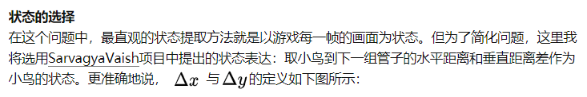
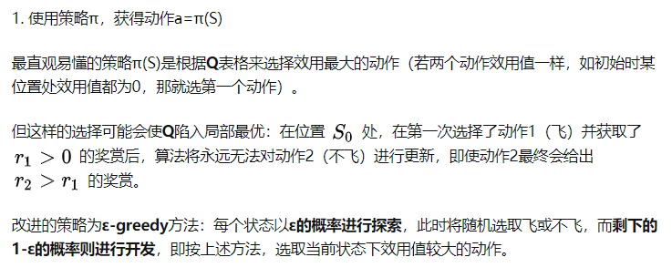

# 17.强化学习

## 基本模型和原理

强化学习是从动物学习、参数扰动自适应控制等理论发展而来，其基本原理是：

如果Agent的某个行为策略导致环境正的奖赏(强化信号)，那么Agent以后产生这个行为策略的趋势便会加强。Agent的目标是在每个离散状态发现最优策略以使期望的折扣奖赏和最大。

强化学习把学习看作试探评价过程，Agent选择一个动作用于环境，环境接受该动作后状态发生变化，同时产生一个强化信号(奖或惩)反馈给Agent，Agent根据强化信号和环境当前状态再选择下一个动作，选择的原则是使受到正强化(奖)的概率增大。选择的动作不仅影响立即强化值，而且影响环境下一时刻的状态及最终的强化值。

[](https://baike.baidu.com/pic/强化学习/2971075/0/30ecd5ef347b560bacafd594?fr=lemma&ct=single)强化学习

强化学习不同于连接主义学习中的监督学习，主要表现在教师信号上，强化学习中由环境提供的强化信号是Agent对所产生动作的好坏作一种评价(通常为标量信号)，而不是告诉Agent如何去产生正确的动作。由于外部环境提供了很少的信息，Agent必须靠自身的经历进行学习。通过这种方式，Agent在行动一一评价的环境中获得知识，改进行动方案以适应环境。

强化学习系统学习的目标是动态地调整参数，以达到强化信号最大。若已知r/A梯度信息，则可直接可以使用监督学习算法。因为强化信号r与Agent产生的动作A没有明确的函数形式描述，所以梯度信息r/A无法得到。因此，在[强化学习](https://baike.baidu.com/item/强化学习)系统中，需要某种随机单元，使用这种随机单元，Agent在可能动作空间中进行搜索并发现正确的动作。

## Q-learning

### 基本算法

Q-learning是强化学习的经典算法之一，它是一个value-based算法，同时也是一个model-free的算法。这里的Q指的是动作价值，即当前状态s*s*下，通过策略\pi*π*采取动作a*a*之后，能够获得的奖励r*r*。

**算法原理**

该算法的主要思想很简单。假设强化学习过程中所有状态的集合为$S$，动作空间为$A$。首先建立一张Q值表，记录强化学习过程中每一个时刻的$t$状态$s_t\epsilon S$下，采取不同的动作$a_i\epsilon A$的收益。一张Q值表的示例如下：

| state | a1       | a2       |
| :---- | :------- | :------- |
| s1    | q(s1,a1) | q(s1,a2) |
| s2    | q(s2,a1) | q(s2,a2) |
| s3    | q(s3,a1) | q(s3,a2) |

之后，根据这一张Q值表来选取能够获得最大的收益的动作，一般是通过$\epsilon-greedy$的方式选取当前状态下，Q值最大的动作。

Q-learning的整个迭代过程实际上就是去更新这张Q值表，当Q值表收敛时，通过$\epsilon-greedy$选取的Q值就是最优动作价值函数$q_*(s,a)$，其对应的策略就是最优策略$\pi_*(a|s)$。

这里需要注意的是，由于Q-learning是model-free的算法，因此不用考虑环境的状态转移模型，也就不用关心状态价值函数$v_\pi(s)$。

Q-learning是使用时序差分TD来更新Q值表的，时序差分的更新公式如下：

$Q(S,A)+\alpha(R+\gamma\max_aQ(S',a)-Q(S,A))Q(S,A)+α(R+γ max_{a}Q(S′,a)−Q(S,A))$

其中$R+\gamma\max_aQ(S',a)R+γ max_{a} Q(S′,a)$表示TD目标，$R+\gamma\max_aQ(S',a)-Q(S,A)R+γmax_{a}Q(S′,a)−Q(S,A)$是TD误差。


**算法流程**


随机初始化所有的状态S*S*和动作对应的价值𝑄。 对于终止状态其𝑄值初始化为0。然后执行下面的流程，迭代$T$次。

1. 初始化$S$为当前状态序列的第一个状态。

2. 用$\epsilon-greedy$在当前状态$S$选择出动作$A$。

3. 在状态$S$执行当前动作$A$，得到新状态$S'′$和奖励$R$。

4. 更新价值函数Q(S,A)*Q*(*S*,*A*):

   $Q(S,A)+\alpha(R+\gamma\max_aQ(S',a)-Q(S,A))Q(S,A)+α(R+γmax_{a}Q(S′,a)−Q(S,A))$

5. S=$S′$；A=$A′$

6. 如果$S$是终止状态，当前轮迭代完毕，否则转到步骤2。

### 应用举例

### 一

我们可以通过**强化学习**（reinforcement learning）来解决小鸟怎么飞这个问题。强化学习中有**状态**（state）、**动作**（action）、**奖赏**（reward）这三个要素。智能体（Agent，指小鸟）会根据当前状态来采取动作，并记录被反馈的奖赏，以便下次再到相同状态时能采取更优的动作。

**状态的选择**



（图片来自Flappy Bird RL by SarvagyaVaish）


**动作的选择**
每一帧，小鸟只有两种动作可选：1.向上飞一下。2.什么都不做。

**奖赏的选择**
小鸟活着时，每一帧给予1的奖赏；若死亡，则给予-1000的奖赏。

#### **关于Q** 

提到Q-learning，我们需要先了解Q的含义。

**Q**为**动作效用函数**（action-utility function），用于评价在特定状态下采取某个动作的优劣。它是**智能体的记忆**。


这张表一共$m×n$行，表示 ![[公式]](https://www.zhihu.com/equation?tex=m+%5Ctimes+n) 个状态，每个状态所对应的动作都有一个**效用值**。

理想状态下，在完成训练后，我们会获得一张完美的**Q**表格。我们希望只要小鸟根据当前位置查找到对应的行，选择**效用值较大**的动作作为当前帧的动作，就可以无限地存活。

#### **训练** 

下面的伪代码说明了我们如何训练，来得到一个尽量完美的Q表格。

```text
初始化 Q = {};
while Q 未收敛：
    初始化小鸟的位置S，开始新一轮游戏
    while S != 死亡状态：
        使用策略π，获得动作a=π(S) 
        使用动作a进行游戏，获得小鸟的新位置S',与奖励R(S,a)
        Q[S,A] ← (1-α)*Q[S,A] + α*(R(S,a) + γ* max Q[S',a]) // 更新Q
        S ← S'
```

其中有些值得注意的地方：




### 二

假设我们需要走到5房间。


转变为如下图：先构造奖励，达到5，即能够走得5的action则说明奖励比较高设置成100，没有达到5说明奖励比较低，设置成0。


 

 

***\*Q-learning实现步骤：\****


 **2、案例详解：**

 


第一步的Q(1,5)：最开始的Q矩阵都是零矩阵，迭代完之后Q（1,5）是100


第二次迭代：依旧是随机


收敛的意思是最后Q基本不变了，然后归一化操作，所有值都除以500，然后计算百分比。

则最后的分值填充如下：


 

## 基于策略的强化学习

- **策略目标函数**

那么直接基于策略的学习是如何优化策略的呢？要搞清楚这个问题，我们得搞清楚下面这个问题：我们优化策略的最终目的是什么？**尽可能获得更多的奖励**。我们设计一个目标函数来衡量策略的好坏，针对不同的问题类型，这里有三个目标函数可以选择：

**1. Start value：**在能够产生完整Episode的环境下，也就是在个体可以到达终止状态时，我们可以用这样一个值来衡量整个策略的优劣：从某状态s1算起知道终止状态个体获得的累计奖励。这个值称为start value. 这个数值的意思是说：如果个体总是从某个状态s1开始，或者以一定的概率分布从s1开始，那么从该状态开始到Episode结束个体将会得到怎样的最终奖励。这个时候算法真正关心的是：找到一个策略，当把个体放在这个状态s1让它执行当前的策略，能够获得start value的奖励。这样我们的目标就变成最大化这个start value：


**2. Average Value：**对于连续环境条件，不存在一个开始状态，这个时候可以使用 average value。意思是 考虑我们个体在某时刻处在某状态下的概率，也就是个体在该时刻的状态分布，针对每个可能的状态计算从该时刻开始一直持续与环境交互下去能够得到的奖励，按该时刻各状态的概率分布求和：


个人体会：对于持续状态，此时要确定个体在某一时刻某个状态开始持续与环境交互能够得到的奖励已经无法得到一个真实确切的结果了，因为要持续交互下去。这里已经用到了状态的价值，而不是收获，并且必须要考虑衰减系数。

**3. Average reward per time-step：**又或者我们可以使用每一个时间步长在各种情况下所能得到的平均奖励，也就是说在一个确定的时间步长里，查看个体出于所有状态的可能性，然后每一种状态下采取所有行为能够得到的即时奖励，所有奖励安概率求和得到：


个人体会：这里的time-step不是说一定长度的时间平均，而是指一个确定的时刻。其实这三个式子的目标都是同一个目标，都是试图描述（衡量）个体在某一时刻的价值。

- **优化目标函数**

找到目标函数，下一步的工作是优化策略参数然后使得目标函数值最大化。因此可以说基于策略的强化学习实际上是一个优化问题，找到参数θ来最大化目标函数。有些算法使用梯度，有些则不使用梯度。如果有机会得到梯度，那么使用梯度上升的算法通常更加优秀一些。理解了使用梯度的算法的使用，那么也将很容易将不基于梯度的算法应用到策略优化中。

本讲内容将主要聚焦于使用梯度的策略优化，同时使用基于序列结构片段（equential structure）的方法。怎么理解基于序列结构呢？打个比方，我们不会去让个体持续与环境交互直至耗光其整个生命周期，然后得到一个结果，根据这个结果来优化策略，这类似与遗传算法。这样做对于个体来说就没有意义了。我们选取个体与环境交互中的一个序列结构片段，通过这种学列结构片段来学习，优化策略进而知道个体后续与环境的交互。

以上就是本讲的简介，下面将终点介绍目标函数、梯度上升等。


## on-policy 和 off-policy

### 概念

首先，我们搞清楚一个问题：什么是行为策略（Behavior Policy）和目标策略（Target Policy）：行为策略是用来与环境互动产生数据的策略，即在训练过程中做决策；而目标策略在行为策略产生的数据中不断学习、优化，即学习训练完毕后拿去应用的策略。上面的例子中百官（锦衣卫）就是行为策略，去收集情况或情报，给皇帝（目标策略）做参考来学习，当皇帝收集到的情报越多，能做的决策就越优。

**咦，为什么会有两个策略呢？**

因为从人类的直观上来看，为了解决强化学习问题中的exploitation（利用） 和 exploration （探索），我们可以利用一个策略（行为策略）来保持探索性，提供多样化的数据，而不断的优化另一个策略（目标策略）。

On-policy 的目标策略和行为策略是同一个策略，其好处就是简单粗暴，直接利用数据就可以优化其策略，但这样的处理会导致策略其实是在学习一个局部最优，因为On-policy的策略没办法很好的同时保持即探索又利用；而Off-policy将目标策略和行为策略分开，可以在保持探索的同时，

### 数学解释（真看不懂了）


## PG（策略梯度）

在PG算法中，我们的Agent又被称为Actor，Actor对于一个特定的任务，都有自己的一个策略π，策略π通常用一个神经网络表示，其参数为θ。从一个特定的状态state出发，一直到任务的结束，被称为一个完整的eposide，在每一步，我们都能获得一个奖励r，一个完整的任务所获得的最终奖励被称为R。这样，一个有T个时刻的eposide，Actor不断与环境交互，形成如下的序列τ：


这样一个序列τ是不确定的，因为Actor在不同state下所采取的action可能是不同的，一个序列τ发生的概率为：


序列τ所获得的奖励为每个阶段所得到的奖励的和，称为R(τ)。因此，在Actor的策略为π的情况下，所能获得的期望奖励为：


而我们的期望是调整Actor的策略π，使得期望奖励最大化，于是我们有了策略梯度的方法，既然我们的期望函数已经有了，我们只要使用梯度提升的方法更新我们的网络参数θ（即更新策略π）就好了，所以问题的重点变为了求参数的梯度。梯度的求解过程如下：


上面的过程中，我们首先利用log函数求导的特点进行转化，随后用N次采样的平均值来近似期望，最后，我们将pθ展开，将与θ无关的项去掉，即得到了最终的结果。

所以，一个PG方法的完整过程如下：


我们首先采集数据，然后基于前面得到的梯度提升的式子更新参数，随后再根据更新后的策略再采集数据，再更新参数，如此循环进行。注意到图中的大红字only used once，因为在更新参数后，我们的策略已经变了，而先前的数据是基于更新参数前的策略得到的。

接下来讲两个PG方法的小tip：

**增加一个基线**
 通过上面的介绍你可能发现了，PG方法在更新策略时，基本思想就是增加reward大的动作出现的概率，减小reward小的策略出现的概率。假设现在有一种情况，我们的reward在无论何时都是正的，对于没有采样到的动作，它的reward是0。因此，如果一个比较好的动作没有被采样到，而采样到的不好的动作得到了一个比较小的正reward，那么没有被采样到的好动作的出现概率会越来越小，这显然是不合适的，因此我们需要增加一个奖励的基线，让reward有正有负。
 一般增加的基线是所获得奖励的平均值：


**增加折扣因子**
 这个很容易理解，就像买股票一样，未来的1块钱的价值要小于当前1块钱的价值，因此未来的1块钱变成现在的价值，需要进行一定的折扣


**使用优势函数**

我们之前介绍的PG方法，对于同一个eposide中的所有数据，使用的奖励都是一样的，其实我们可以将其变为与st和at相关的。这里我们使用的是优势函数，即Qπ(st,at) - Vπ(st)。其中Qπ(st,at)可以使用从当前状态开始到eposide结束的奖励折现和得到，Vπ(st)可以通过一个critic来计算得到。


作者：文哥的学习日记
链接：https://www.jianshu.com/p/9f113adc0c50
来源：简书
著作权归作者所有。商业转载请联系作者获得授权，非商业转载请注明出处。


## PPO

接着上面的讲，PG方法一个很大的缺点就是参数更新慢，因为我们每更新一次参数都需要进行重新的采样，这其实是中on-policy的策略，即我们想要训练的agent和与环境进行交互的agent是同一个agent；与之对应的就是off-policy的策略，即想要训练的agent和与环境进行交互的agent不是同一个agent，简单来说，就是拿别人的经验来训练自己。举个下棋的例子，如果你是通过自己下棋来不断提升自己的棋艺，那么就是on-policy的，如果是通过看别人下棋来提升自己，那么就是off-policy的：


那么为了提升我们的训练速度，让采样到的数据可以重复使用，我们可以将on-policy的方式转换为off-policy的方式。即我们的训练数据通过另一个Actor（对应的网络参数为θ'得到。这要怎么做呢？通过下面的思路：


通过这种方式，我们的p(x)和q(x)的分布不能差别太大，否则需要进行非常多次的采样，才能得到近似的结果：


如上图所示，很显然，在x服从p(x)分布时，f(x)的期望为负，此时我们从q(x)中来采样少数的x，那么我们采样到的x很有可能都分布在右半部分，此时f(x)大于0，我们很容易得到f(x)的期望为正的结论，这就会出现问题，因此需要进行大量的采样。

那么此时我们想要期望奖励最大化，则变为：


则梯度变为：


最后一项因为我们假设两个分布不能差太远，所以认为他们是相等的，为了求解方便，我们直接划掉。此时似然函数变为：


由梯度变为似然函数，使用的还是下面式子，大家可以自己手动算一下：


到这里，我们马上就要得到我们的PPO算法了，再坚持一下！

我们前面介绍了，我们希望θ和θ'不能差太远，这并不是说参数的值不能差太多，而是说，输入同样的state，网络得到的动作的概率分布不能差太远。得到动作的概率分布的相似程度，我们可以用KL散度来计算，将其加入PPO模型的似然函数中，变为：


在实际中，我们会动态改变对θ和θ'分布差异的惩罚，如果KL散度值太大，我们增加这一部分惩罚，如果小到一定值，我们就减小这一部分的惩罚，基于此，我们得到了PPO算法的过程：


PPO算法还有另一种实现方式，不将KL散度直接放入似然函数中，而是进行一定程度的裁剪：


上图中，绿色的线代表min中的第一项，即不做任何处理，蓝色的线为第二项，如果两个分布差距太大，则进行一定程度的裁剪。最后对这两项再取min，防止了θ更新太快。

