# 18.集成学习

## 概念

在机器学习的有监督学习算法中，我们的目标是学习出一个稳定的且在各个方面表现都较好的模型，但实际情况往往不这么理想，有时我们只能得到多个有偏好的模型（弱监督模型，在某些方面表现的比较好）。集成学习就是组合这里的多个弱监督模型以期得到一个更好更全面的强监督模型，集成学习潜在的思想是即便某一个弱分类器得到了错误的预测，其他的弱分类器也可以将错误纠正回来。

集成学习在各个规模的数据集上都有很好的策略。

- **数据集大：划分成多个小数据集，学习多个模型进行组合
  **
- **数据集小：利用Bootstrap方法进行抽样，得到多个数据集，分别训练多个模型再进行组合**

## GBDT

### 一、DT：回归树 Regression Decision Tree

提起决策树（DT, Decision Tree) 绝大部分人首先想到的就是C4.5分类决策树。但如果一开始就把GBDT中的树想成分类树，那就错了。千万不要以为GBDT是很多棵分类树。决策树分为两大类，回归树和分类树。前者用于预测实数值，如明天的温度、用户的年龄、网页的相关程度；后者用于分类标签值，如晴天/阴天/雾/雨、用户性别、网页是否是垃圾页面。这里要强调的是，前者的结果加减是有意义的，如10岁+5岁-3岁=12岁，后者则无意义，如男+男+女=到底是男是女？GBDT的核心在于累加所有树的结果作为最终结果，就像前面对年龄的累加（-3是加负3），而分类树的结果显然是没办法累加的，所以**GBDT中的树都是回归树，不是分类树**，这点对理解GBDT相当重要（尽管GBDT调整后也可用于分类但不代表GBDT的树是分类树）。

回归树总体流程类似于分类树，区别在于，回归树的每一个节点都会得一个预测值，以年龄为例，该预测值等于属于这个节点的所有人年龄的平均值。分枝时穷举每一个feature的每个阈值找最好的分割点，但衡量最好的标准不再是最大熵，而是最小化平方误差。也就是被预测出错的人数越多，错的越离谱，平方误差就越大，通过最小化平方误差能够找到最可靠的分枝依据。分枝直到每个叶子节点上人的年龄都唯一或者达到预设的终止条件(如叶子个数上限)，**若最终叶子节点上人的年龄不唯一，则以该节点上所有人的平均年龄做为该叶子节点的预测年龄。**

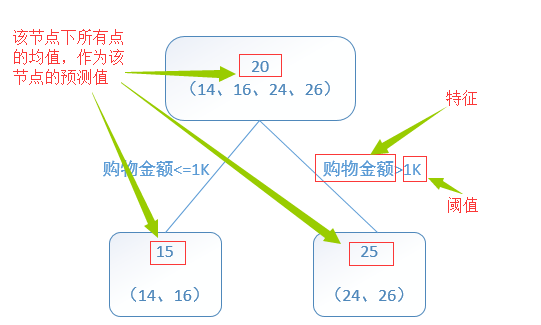

回归数示例

回归树算法如下图（截图来自《统计学习方法》5.5.1 CART生成）：

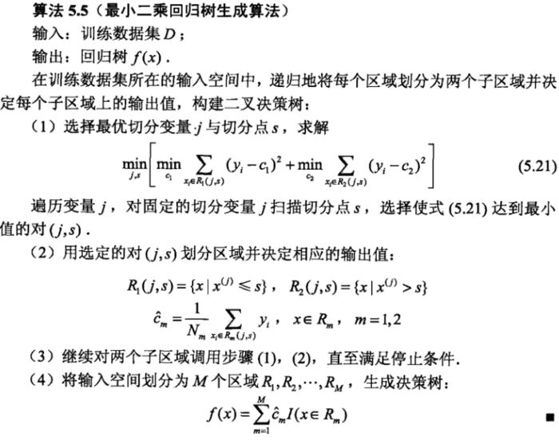

回归树生成算法

#  

### 二、 GB：梯度迭代 Gradient Boosting

梯度提升（Gradient boosting）是一种用于回归、分类和排序任务的机器学习技术[[1\]](https://link.jianshu.com/?t=https%3A%2F%2Fwww.zybuluo.com%2Fyxd%2Fnote%2F611571%23fn%3A1)，属于Boosting算法族的一部分。Boosting是一族可将弱学习器提升为强学习器的算法，属于集成学习（ensemble learning）的范畴。Boosting方法基于这样一种思想：对于一个复杂任务来说，将多个专家的判断进行适当的综合所得出的判断，要比其中任何一个专家单独的判断要好。通俗地说，就是“三个臭皮匠顶个诸葛亮”的道理。梯度提升同其他boosting方法一样，通过集成（ensemble）多个弱学习器，通常是决策树，来构建最终的预测模型。

Boosting、bagging和stacking是集成学习的三种主要方法。

不同于bagging方法，boosting方法通过分步迭代（stage-wise）的方式来构建模型，在迭代的每一步构建的弱学习器都是为了弥补已有模型的不足。Boosting族算法的著名代表是AdaBoost。AdaBoost算法通过给已有模型预测错误的样本更高的权重，使得先前的学习器做错的训练样本在后续受到更多的关注的方式来弥补已有模型的不足。

**相比于AdaBoost，梯度提升方法的优点:**

虽然同属于Boosting族，但是梯度提升方法的优点比较多。

- 1、与AdaBoost算法不同，梯度提升方法在迭代的**每一步构建一个**能够**沿着梯度最陡的方向降低损失**（steepest-descent）的学习器来弥补已有模型的不足。
- 2、经典的AdaBoost算法只能处理采用指数损失函数的二分类学习任务，**而梯度提升方法通过设置不同的可微损失函数可以处理各类学习任务（多分类、回归、Ranking等），应用范围大大扩展。**
- 3、AdaBoost算法对异常点（outlier）比较敏感，**而梯度提升算法通过引入bagging思想、加入正则项等方法能够有效地抵御训练数据中的噪音，具有更好的健壮性。**

提升树是迭代多棵回归树来共同决策。当采用平方误差损失函数时，每一棵回归树学习的是之前所有树的结论和残差，拟合得到一个当前的残差回归树，残差的意义如公式：残差 = 真实值 - 预测值 。提升树即是整个迭代过程生成的回归树的累加。**GBDT的核心就在于，每一棵树学的是之前所有树结论和的残差，这个残差就是一个加预测值后能得真实值的累加量。**

#  

### 三、Gradient Boosting Decision Tree：梯度提升决策树

###### 为什么梯度提升方法倾向于选择决策树（通常是CART树）作为基学习器呢？

这与决策树算法自身的优点有很大的关系：

- 1、 决策树可以认为是if-then规则的集合，易于理解，可解释性强，预测速度快；
- 2、**决策树算法相比于其他的算法需要更少的特征工程**，比如可以不用做特征标准化，可以很好的处理字段缺失的数据，也可以不用关心特征间是否相互依赖等
- 3、**决策树能够自动组合多个特征，它可以毫无压力地处理特征间的交互关系并且是非参数化的，因此你不必担心异常值或者数据是否线性可分**。
  举个例子，西瓜a（乌黑色、纹路清晰）可能是好瓜，西瓜b（青绿色，纹路清晰）的也可能是好瓜。决策树一样可以处理。

###### 决策树有优点，自然也有缺点，不过，可以通过梯度提升方法解决这个缺点。

单独使用决策树算法时，有容易过拟合缺点。怎么解决呢？

- 通过各种方法，抑制决策树的复杂性，**降低单棵决策树的拟合能力**
- 通过梯度提升的方法集成多个决策树，则预测效果上来的同时，也能够很好的解决过拟合的问题。
  （这一点具有bagging的思想，降低单个学习器的拟合能力，提高方法的泛化能力。）

由此可见，梯度提升方法和决策树学习算法可以互相取长补短，是一对完美的搭档。

###### 怎么降低单棵决策树的复杂度？

抑制单颗决策树的复杂度的方法有很多：

- 限制树的最大深度、限制叶子节点的最少样本数量、限制节点分裂时的最少样本数量
- 吸收bagging的思想对训练样本采样（subsample），在学习单颗决策树时只使用一部分训练样本
- 借鉴随机森林的思路在学习单颗决策树时只采样一部分特征
- **在目标函数中添加正则项惩罚复杂的树结构**等。

现在主流的GBDT算法实现中这些方法基本上都有实现，因此GBDT算法的超参数还是比较多的，应用过程中需要精心调参，并用交叉验证的方法选择最佳参数。

提升树利用**加法模型和前向分步算法**实现学习的优化过程。当损失函数时平方损失和指数损失函数时，每一步的优化很简单，如平方损失函数学习残差回归树。

### 前向分布算法(Forward stagewise additive modeling)

提升方法其实是一个比adaboost概念更大的算法，因为adaboost可以表示为boosting的前向分布算法(Forward stagewise additive modeling)的一个特例，boosting最终可以表示为：

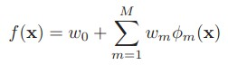

其中的w是权重，Φ是弱分类器(回归器)的集合,其实就是一个加法模型(即基函数的线性组合)

**前向分布算法**实际上是一个贪心的算法，也就是在每一步求解弱分类器Φ(m)和其参数w(m)的时候不去修改之前已经求好的分类器和参数：

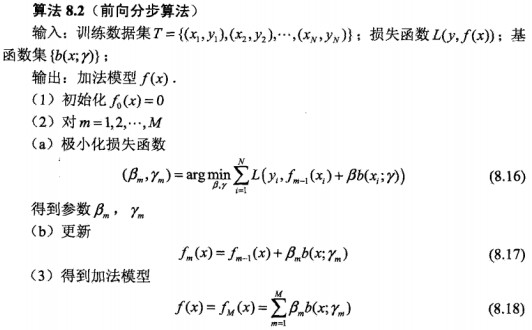

前向分布算法 来自《统计学习方法》

为了表示方便，我们以后用β代替w进行描述了，图中的b是之前说的Φ弱分类器

OK，这也就是提升方法（之前向分布算法）的大致结构了，可以看到其中存在变数的部分其实就是极小化损失函数 这关键的一步了，如何选择损失函数决定了算法的最终效果(名字)……这一步你可以看出算法的“趋势”，以后再单独把“趋势”拿出来说吧，因为我感觉理解算法的关键之一就是理解算法公式的“趋势”

###### 各种提升方法

不同的损失函数和极小化损失函数方法决定了boosting的最终效果，我们现在来说几个常见的boosting：

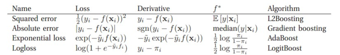

广义上来讲，所谓的Gradient Boosting 其实就是在更新的时候选择梯度下降的方向来保证最后的结果最好，一些书上讲的“残差” 方法其实就是L2Boosting吧，因为它所定义的残差其实就是L2Boosting的Derivative，接下来我们着重讲一下弱回归器是决策树的情况，也就是GBDT。

### 加法模型（additive model）

GBDT算法可以看成是由K棵树组成的加法模型：

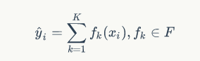

其中F为所有树组成的函数空间，以回归任务为例，回归树可以看作为一个把特征向量映射为某个score的函数。该模型的参数为：Θ = {f1, f2, ... , fk} 。于一般的机器学习算法不同的是，加法模型不是学习d维空间中的权重，而是直接学习函数（决策树）集合。上述加法模型的目标函数定义为：

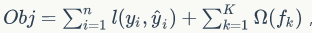

其中Ω表示决策树的复杂度，那么该如何定义树的复杂度呢？比如，可以考虑树的节点数量、树的深度或者叶子节点所对应的分数的L2范数等等。

##### 如何来学习加法模型呢？

解这一优化问题，可以用前向分布算法（forward stagewise algorithm）。因为学习的是加法模型，如果能够从前往后，每一步只学习一个基函数及其系数（结构），逐步逼近优化目标函数，那么就可以简化复杂度。这一学习过程称之为Boosting。具体地，我们从一个常量预测开始，每次学习一个新的函数，过程如下：

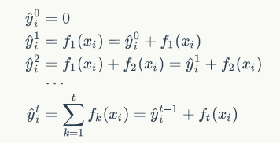

前向分布算法过程

举个例子，参考自一篇博客, 该博客举出的例子较直观地展现出多棵决策树线性求和过程以及残差的意义。
还是年龄预测，简单起见训练集只有4个人，A,B,C,D，他们的年龄分别是14,16,24,26。其中A、B分别是高一和高三学生；C,D分别是应届毕业生和工作两年的员工。如果是用一棵传统的回归决策树来训练，会得到如下图1所示结果：

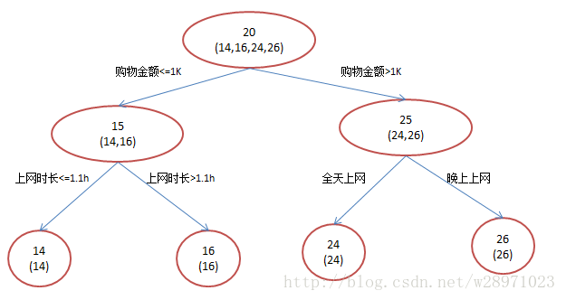

现在我们使用GBDT来做这件事，由于数据太少，我们限定叶子节点做多有两个，即每棵树都只有一个分枝，并且限定只学两棵树。我们会得到如下图2所示结果：

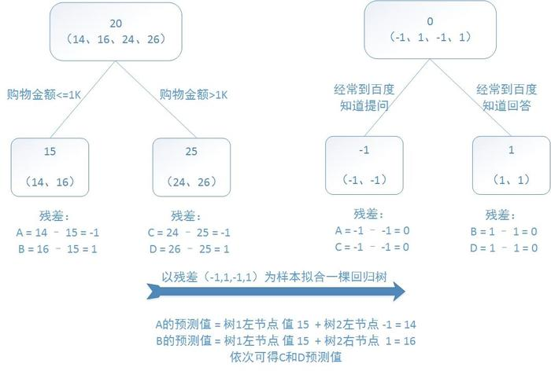

在第一棵树分枝和图1一样，由于A,B年龄较为相近，C,D年龄较为相近，他们被分为两拨，每拨用平均年龄作为预测值。此时计算残差**（残差的意思就是： A的预测值 + A的残差 = A的实际值）**，所以A的残差就是15-16=-1（注意，A的预测值是指前面所有树累加的和，这里前面只有一棵树所以直接是15，如果还有树则需要都累加起来作为A的预测值）。进而得到A,B,C,D的残差分别为-1,1，-1,1。然后我们拿残差替代A,B,C,D的原值，到第二棵树去学习，如果我们的预测值和它们的残差相等，则只需把第二棵树的结论累加到第一棵树上就能得到真实年龄了。这里的数据显然是我可以做的，第二棵树只有两个值1和-1，直接分成两个节点。此时所有人的残差都是0，即每个人都得到了真实的预测值。

换句话说，现在A,B,C,D的预测值都和真实年龄一致了。Perfect!：
A: 14岁高一学生，购物较少，经常问学长问题；预测年龄A = 15 – 1 = 14
B: 16岁高三学生；购物较少，经常被学弟问问题；预测年龄B = 15 + 1 = 16
C: 24岁应届毕业生；购物较多，经常问师兄问题；预测年龄C = 25 – 1 = 24
D: 26岁工作两年员工；购物较多，经常被师弟问问题；预测年龄D = 25 + 1 = 26

那么哪里体现了Gradient呢？其实回到第一棵树结束时想一想，无论此时的cost function是什么，是均方差还是均差，只要它以误差作为衡量标准，残差向量(-1, 1, -1, 1)都是它的全局最优方向，这就是Gradient。

讲到这里我们已经把GBDT最核心的概念、运算过程讲完了！没错就是这么简单。

该例子很直观的能看到，预测值等于所有树值得累加，如A的预测值 = 树1左节点 值 15 + 树2左节点 -1 = 14。
因此，给定当前模型 fm-1(x)，只需要简单的拟合当前模型的残差。现将回归问题的提升树算法叙述如下：

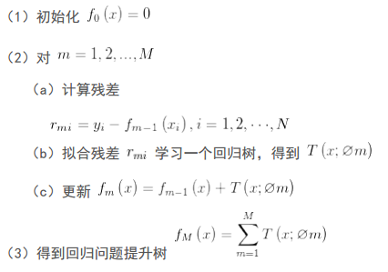

#### 1）既然图1和图2 最终效果相同，为何还需要GBDT呢？

答案是过拟合。过拟合是指为了让训练集精度更高，学到了很多”仅在训练集上成立的规律“，导致换一个数据集当前规律就不适用了。其实只要允许一棵树的叶子节点足够多，训练集总是能训练到100%准确率的（大不了最后一个叶子上只有一个instance)。在训练精度和实际精度（或测试精度）之间，后者才是我们想要真正得到的。
我们发现图1为了达到100%精度使用了3个feature（上网时长、时段、网购金额），其中分枝“上网时长>1.1h” 很显然已经过拟合了，这个数据集上A,B也许恰好A每天上网1.09h, B上网1.05小时，但用上网时间是不是>1.1小时来判断所有人的年龄很显然是有悖常识的；
相对来说图2的boosting虽然用了两棵树 ，但其实只用了2个feature就搞定了，后一个feature是问答比例，显然图2的依据更靠谱。（当然，这里是LZ故意做的数据，所以才能靠谱得如此狗血。实际中靠谱不靠谱总是相对的） Boosting的最大好处在于，每一步的残差计算其实变相地增大了分错instance的权重，而已经分对的instance则都趋向于0。这样后面的树就能越来越专注那些前面被分错的instance。就像我们做互联网，总是先解决60%用户的需求凑合着，再解决35%用户的需求，最后才关注那5%人的需求，这样就能逐渐把产品做好，因为不同类型用户需求可能完全不同，需要分别独立分析。如果反过来做，或者刚上来就一定要做到尽善尽美，往往最终会竹篮打水一场空。