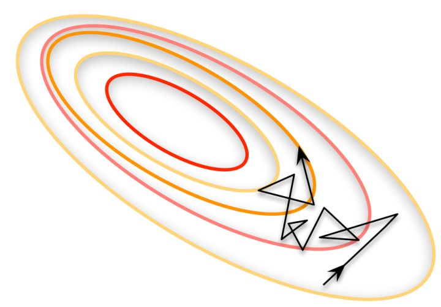
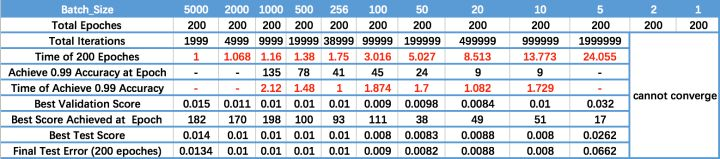

# 常见的超参

- 优化器（Optimizer）：机器学习算法的参数都需要优化器来优化，比较传统的是随机梯度下降（SGD），但是它收敛较慢而且在某些情况下比较容易得到局部最优解。Adam是目前收敛速度快且常被使用的优化器，它加入了动量Momentum，可以加速收敛并且有更好的最优解。
- 迭代次数：迭代次数是指训练网络时候同时完成前向/反向传播的次数。每次迭代都会更新网络模型的参数并且减小损失函数的值。比较合适的迭代次数为测试/训练错误错误率相差较小并且两者错误率都在能接受范围内的时候。如果此时继续训练网络，很有可能会出过拟合的情况。
- 激活函数：在神经网络中，激活函数的作用是增加非线性因素，以至于网络可以拟合复杂的非线性函数来更高效地解决复杂的问题。因为在实际情况中，更多问题都是非线性的，所以运用非线性激活函数可以拟合实际场景问题，增加网络的泛化能力。常用的激活函数有sigmoid, relu, tanh, leaky relu等等。
- 学习率（Learning rate）是指在优化算法中更新网络权重的幅度大小。学习率可以是恒定的、逐渐降低的，基于动量的或者是自适应的。不同的优化算法决定不同的学习率。当学习率过大则可能导致模型不收敛，损失loss不断上下震荡；学习率过小则导致模型收敛速度偏慢，需要更长的时间训练。通常学习率取值为[0.01, 0.001, 0.0001]。

* Dropout可以作为训练深度神经网络的一种trick供选择。在每个训练批次中，通过忽略一半的特征检测器（让一半的隐层节点值为0），可以明显地减少过拟合现象。这种方式可以减少特征检测器（隐层节点）间的相互作用，检测器相互作用是指某些检测器依赖其他检测器才能发挥作用。

  Dropout说的简单一点就是：我们在前向传播的时候，让某个神经元的激活值以一定的概率p停止工作，这样可以使模型泛化性更强，因为它不会太依赖某些局部的特征，如图1所示。

  当前Dropout被大量利用于全连接网络，而且一般认为设置为0.5或者0.3，而在卷积网络隐藏层中由于卷积自身的稀疏化以及稀疏化的ReLu函数的大量使用等原因，Dropout策略在卷积网络隐藏层中使用较少。总体而言，Dropout是一个超参，需要根据具体的网络、具体的应用领域进行尝试。

* batch size

**谈谈深度学习中的 Batch_Size**
Batch_Size（批尺寸）是机器学习中一个重要参数，涉及诸多矛盾，下面逐一展开。

**首先，为什么需要有 Batch_Size 这个参数？**
Batch 的选择，**首先决定的是下降的方向。**如果数据集比较小，完全可以采用**全数据集** （ **Full Batch Learning** ）的形式，这样做至少有 2 个好处：其一，由全数据集确定的方向能够更好地代表样本总体，从而[更准确地朝向极值所在的方向](http://www.zhihu.com/question/37129350/answer/70964527#)。其二，由于不同权重的梯度值差别巨大，因此选取一个全局的学习率很困难。 Full Batch Learning 可以使用**Rprop** 只基于梯度符号并且针对性单独更新各权值。

对于更大的数据集，以上 2 个好处又变成了 2 个坏处：其一，随着数据集的海量增长和内存限制，一次性载入所有的数据进来变得越来越不可行。其二，以 Rprop 的方式迭代，会由于各个 Batch 之间的采样差异性，各次梯度修正值相互抵消，无法修正。这才有了后来 **RMSProp** 的妥协方案。

**既然 Full Batch Learning 并不适用大数据集，那么走向另一个极端怎么样？**
所谓另一个极端，就是每次只训练一个样本，即 Batch_Size = 1。这就是**在线学习****（Online Learning）**。线性神经元在均方误差代价函数的错误面是一个抛物面，横截面是椭圆。对于多层神经元、非线性网络，在局部依然近似是抛物面。使用在线学习，每次修正方向以各自样本的梯度方向修正，横冲直撞各自为政，**难以达到收敛**。

**可不可以选择一个适中的 Batch_Size 值呢？**
当然可以，这就是**批梯度下降法（Mini-batches Learning）**。因为如果数据集足够充分，那么用一半（甚至少得多）的数据训练算出来的梯度与用全部数据训练出来的梯度是几乎一样的。

**在合理范围内，增大 Batch_Size 有何好处？**

- 内存利用率提高了，大矩阵乘法的并行化效率提高。
- 跑完一次 epoch（全数据集）所需的迭代次数减少，对于相同数据量的处理速度进一步加快。
- 在一定范围内，一般来说 Batch_Size 越大，其确定的下降方向越准，引起训练震荡越小。

**盲目增大 Batch_Size 有何坏处？**

- 内存利用率提高了，但是内存容量可能撑不住了。
- 跑完一次 epoch（全数据集）所需的迭代次数减少，要想达到相同的精度，其所花费的时间大大增加了，从而对参数的修正也就显得更加缓慢。
- Batch_Size 增大到一定程度，其确定的下降方向已经基本不再变化。

**调节 Batch_Size 对训练效果影响到底如何？**
这里跑一个 LeNet 在 MNIST 数据集上的效果。MNIST 是一个手写体标准库，我使用的是 **Theano** 框架。这是一个 Python 的深度学习库。[安装方便](https://link.zhihu.com/?target=http%3A//deeplearning.net/software/theano/install.html%23install)（几行命令而已），调试简单（自带 Profile），GPU / CPU 通吃，[官方教程相当完备](https://link.zhihu.com/?target=http%3A//deeplearning.net/tutorial/contents.html)，支持模块十分丰富（除了 CNNs，更是支持 RBM / DBN / LSTM / RBM-RNN / SdA / MLPs）。在其上层有 [Keras](https://link.zhihu.com/?target=http%3A//keras.io/) 封装，支持 GRU / JZS1, JZS2, JZS3 等较新结构，支持 Adagrad / Adadelta / RMSprop / Adam 等优化算法。

运行结果如上图所示，其中绝对时间做了标幺化处理。运行结果与上文分析相印证：

- Batch_Size 太小，算法在 200 epoches 内不收敛。
- 随着 Batch_Size 增大，处理相同数据量的速度越快。
- 随着 Batch_Size 增大，达到相同精度所需要的 epoch 数量越来越多。
- 由于上述两种因素的矛盾， Batch_Size 增大到某个时候，达到**时间上**的最优。
- 由于最终收敛精度会陷入不同的局部极值，因此 Batch_Size 增大到某些时候，达到最终收敛**精度上**的最优。