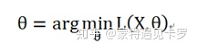
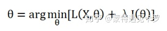
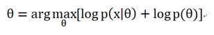
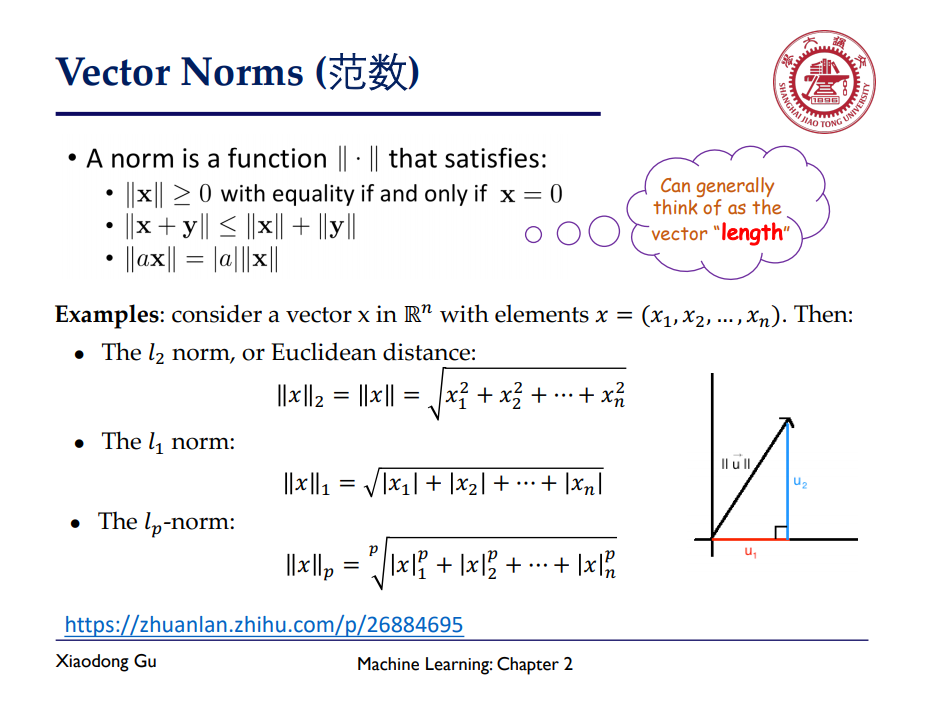

# 2.数学基础

## 贝叶斯主义与频率主义

概率论始终围绕着模型(参数)和案例展开，概率通常指某个事件发生的可能性。

频率主义认为：**概率及其模型(参数)是真实确定存在的，而事件本身是随机的；**因此，可以通过**最大似然估计**参数的值。比如，在随机试验过程中，我们把某事件发生的比例或频率作为该事件发生的概率。

贝叶斯主义则持完全不同的观点，他们认为：**真实出现的事件是一种确定性的存在，而模型及其参数反而是不确定的随机变量**。在分析过程中，总是先假设一个**先验的概率分布**，随着样本的增加，不断的修正先验的概率分布。

频率主义描述为事件在概率参数下出现的可能，通过最大似然估计参数，可通过**经验风险最小化**(ERM)描述

贝叶斯主义描述为概率参数在已有事件下的可信度，通过先验分布结合实际出现的事件修正概率参数，可通过**结构风险最小化**(SRM)描述。

实际上就是将经验风险最小化**正则化**，防止了过拟合。常用的方法是**最大后验概率估计**(MAP)。

第一项对应对数似然估计，第二项对应先验分布。

**经验风险最小化是无偏估计，结构风险最小化是有偏估计**。

在样本非常多时，两种方法的效果差不多，但当样本非常有限时，实践表明：贝叶斯方法总能取得较好的效果，通过添加先验分布实际上降低了系统的复杂度。

### 范数

### 贝叶斯公式

通常，事件A在事件B(发生)的条件下的概率，与事件B在事件A的条件下的概率是不一样的；然而，这两者是有确定的关系,贝叶斯法则就是这种关系的陈述。

作为一个规范的原理，[贝叶斯法则](https://baike.baidu.com/item/贝叶斯法则)对于所有概率的解释是有效的；然而，频率主义者和贝叶斯主义者对于在应用中概率如何被[赋值](https://baike.baidu.com/item/赋值)有着不同的看法：频率主义者根据[随机事件](https://baike.baidu.com/item/随机事件)发生的频率，或者总体[样本](https://baike.baidu.com/item/样本)里面的个数来赋值概率；贝叶斯主义者要根据未知的命题来赋值概率。一个结果就是，贝叶斯主义者有更多的机会使用贝叶斯法则。

贝叶斯法则是关于随机事件A和B的[条件概率](https://baike.baidu.com/item/条件概率)和[边缘概率](https://baike.baidu.com/item/边缘概率)的。

其中P(A|B)是在B发生的情况下A发生的可能性。

为完备事件组，即

在[贝叶斯法则](https://baike.baidu.com/item/贝叶斯法则)中，每个名词都有约定俗成的名称：

Pr(A)是A的[先验概率](https://baike.baidu.com/item/先验概率)或边缘概率。之所以称为"先验"是因为它不考虑任何B方面的因素。

Pr(A|B)是已知B发生后A的[条件概率](https://baike.baidu.com/item/条件概率)，也由于得自B的取值而被称作A的[后验概率](https://baike.baidu.com/item/后验概率)。

Pr(B|A)是已知A发生后B的条件概率，也由于得自A的取值而被称作B的后验概率。

Pr(B)是B的先验概率或边缘概率，也作标准化常量（normalized constant）。

**按这些术语，Bayes法则可表述为：**

后验概率 = (似然度 * 先验概率)/标准化常量　也就是说，后验概率与先验概率和似然度的乘积成正比。

另外，比例Pr(B|A)/Pr(B)也有时被称作标准似然度（standardised likelihood），Bayes法则可表述为：

后验概率 = 标准似然度 * 先验概率。

### 梯度

设二元函数

 在平面区域D上具有一阶连续偏导数，则对于每一个点P（x，y）都可定出一个向量

 ,该函数就称为函数

 在点P（x，y）的梯度，记作gradf（x，y）或

 ,即有：

gradf（x，y）=

 =

其中

 称为（二维的）向量[微分算子](https://baike.baidu.com/item/微分算子)或Nabla算子，

 。

设

 是方向l上的单位向量，则

由于当方向l与梯度方向一致时，有

所以当l与梯度方向一致时,方向导数

 有最大值，且最大值为梯度的模，即

因此说，函数在一点沿梯度方向的变化率最大，最大值为该梯度的[模](https://baike.baidu.com/item/模/13332717)。