# 3.线性回归

## **表示法**

我们在接下来的几节先讨论简单线性回归，也就是只考虑一个输入变量，一个输出变量的线性回归。

为了后面解释和使用方便，首先正式定义简单线性回归中的基本元素。

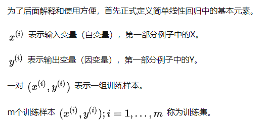

上面表示法中的i代表第i个样本。

大写的X代表所有输入值组成的空间。

大写的Y代表所有输出值组成的空间。

监督学习的定义是, 给定一个训练集, 我们的目标是“学习”得到一个函数 h : x→y, 使h(x)是真实值y的一个“好的”预测值。这里h叫做模型，也叫做**假设（hypothesis）**.

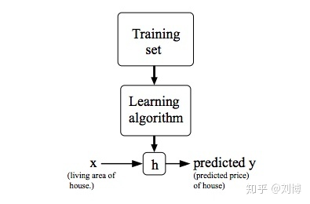

如果我们要预测的输出值是**连续的**，那么该问题就称作**回归问题**。

对于简单线性回归来说，我们的模型h可以表示如下：

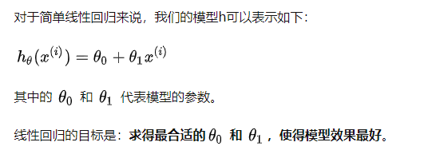

## **代价函数（Cost Function）**

如何衡量模型效果的好坏？

代价函数的作用是用来测量我们的模型$h$的准确程度。

以最简单的一个代价函数为例，也就是**均方误差（Mean squared error）**。

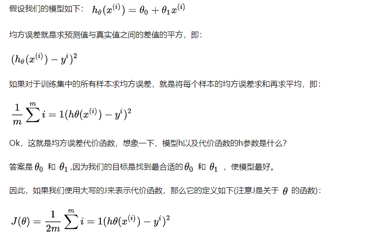

这里的一个细节是，公式中的分母由m变成了2m，这里并不影响公式的作用，但是对于后面的工作有帮助，我们后面将会提到这点。

这里需要考虑一个问题，有了代价函数，如何使模型效果最好？

由于代价函数越大，代表预测值与真实值之间的误差就越大，因此，问题的答案是使代价函数最小的参数 theta就是最好的参数。

## **梯度下降（Gradient Descent）**

下面介绍另一种求解参数的方法，梯度下降法。

既然代价函数是关于![[公式]](线性回归.assets/equation.svg)的函数，我们就可以可视化该函数，见下图：

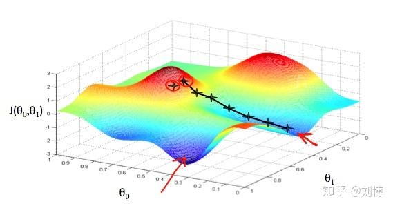

图中的蓝色区域是代价函数最小的点，因此，找到该点对应的![[公式]](线性回归.assets/equation.svg)，即完成了任务。

如何找到最低点对应的![[公式]](线性回归.assets/equation.svg)？

答案是对代价函数求偏导数：

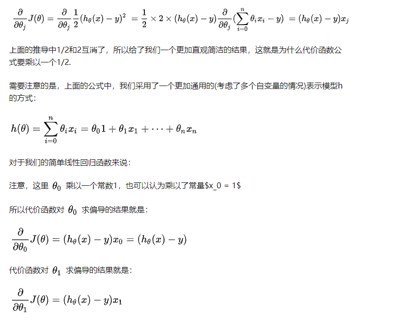

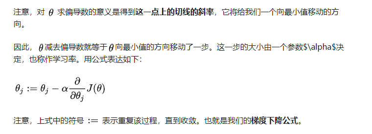

## **学习率**

现在我们讨论一下学习率，当学习率比较小时，我们得到最优解的速度将很慢。

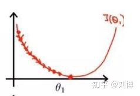

当学习率比较大时，我们很容易无法得到全局最优解。

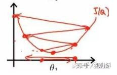

另外一种情况是，我们的学习率设置的比较小时，得到了局部最优解，而不是全局最优解的情况。

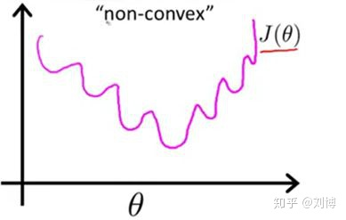

最后一种情况，对于我们使用的代价函数来说并不成立，因为我们使用的均方误差MSE是一个凸函数，也就是说说，该函数任意两点的连线都不会与该函数交叉，所以，该函数不存在局部最优解。

## **数据归一化**

为了提高求解效率，我们还需要进行数据归一化处理。为什么要这么做？我们先看下面的图。

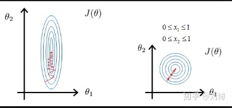



左边是没有经过归一化处理，右边是经过归一化处理，两张同都使用梯度下降，很明显右边的方法通过更少的步骤得到了解。

## **梯度下降法的三种方式**

第一种方式就是全量梯度下降，也就是说每一次梯度下降都利用全部的数据。这种方法简称为BGD（Batch Gradient Descent）。该算法的缺点是当数据量m较大时，速度很慢。

第二种方式是随机梯度下降，即随机梯度下降（Stochastic Gradient Descent），简称SGD。这种方法的意思是 ，每次梯度下降的过程使用一个随机的样本，但是该方法有一个问题，就是每次选取的学习率如果太小则速度很慢，太大怎么无法得到全局最优解，解决该问题的方法就是灵活设置学习率，让学习率一开始比较大，随后逐渐减小，这种方法也称作模拟退火（simulated annealing）。

第三种方法介于上面两种方法之间，即mini-batch Gradient Descent，简称mini-batch GD，该方法是每次梯度下降过程使用一个比较小的随机数据集。该方法的好处是能够利用计算机对于矩阵求解的性能优化，进而加快计算效率。

## 矩阵表示

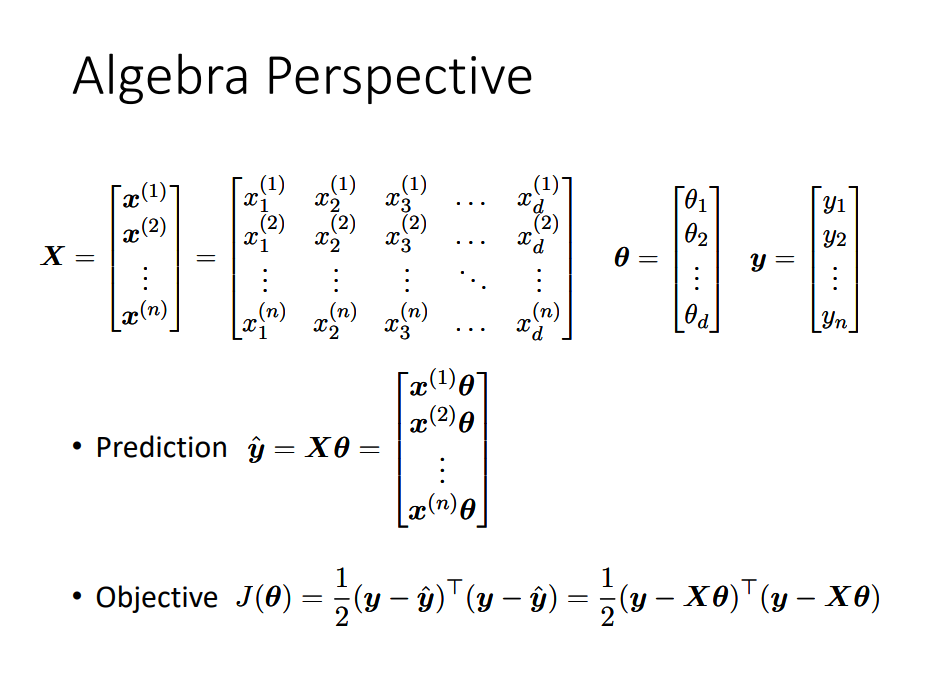

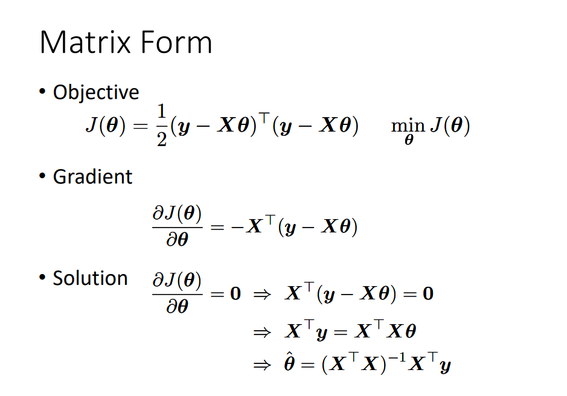

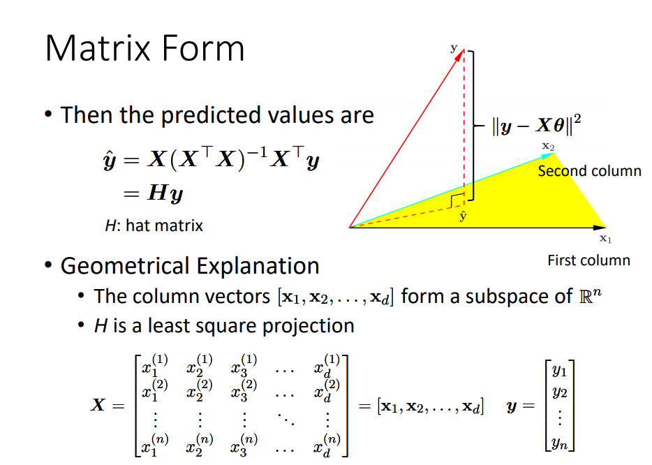

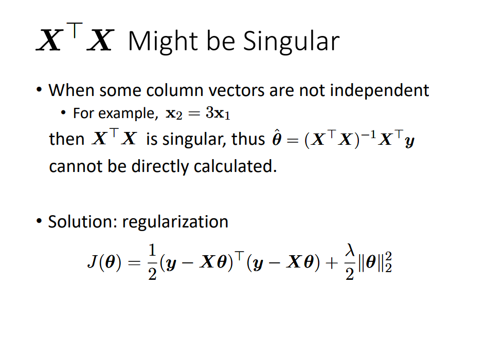

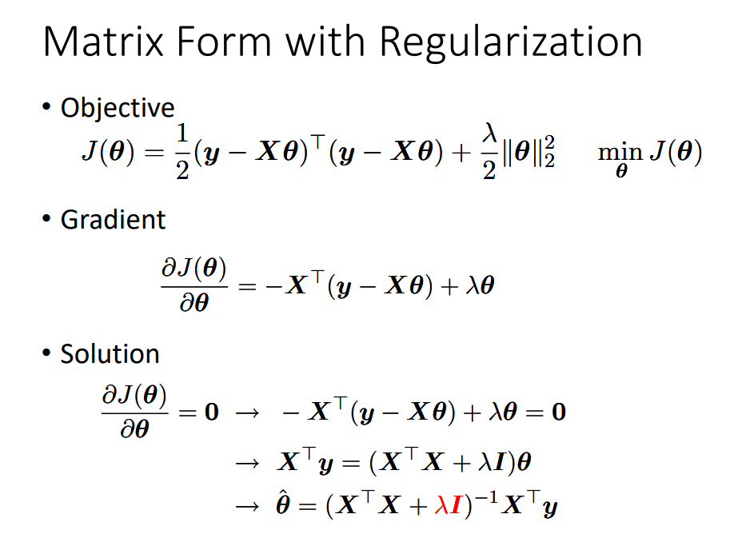