# 4.概率参数估计

## 极大似然估计

1.求极大似然函数估计值的一般步骤：

（1） 写出[似然函数](https://baike.baidu.com/item/似然函数)；

（2） 对似然函数取对数，并整理；

（3） 求[导数](https://baike.baidu.com/item/导数) ；

（4） 解似然方程 。

2.利用高等数学中求[多元函数](https://baike.baidu.com/item/多元函数)的极值的方法，有以下极大似然估计法的具体做法：

(1)根据总体的分布，建立[似然函数](https://baike.baidu.com/item/似然函数) 

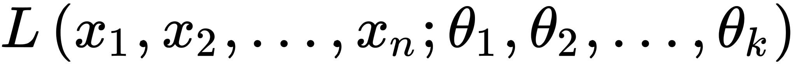

;

(2) 当 L 关于 

可微时，(由微积分求极值的原理）可由方程组

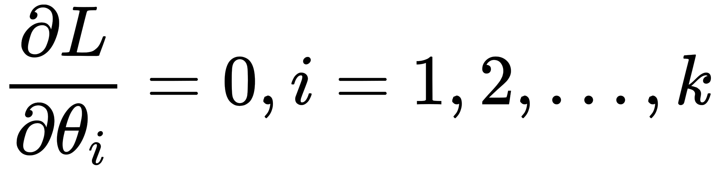

:

定出

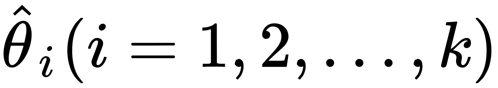

，称以上方程组为似然方程.

因为 L 与 

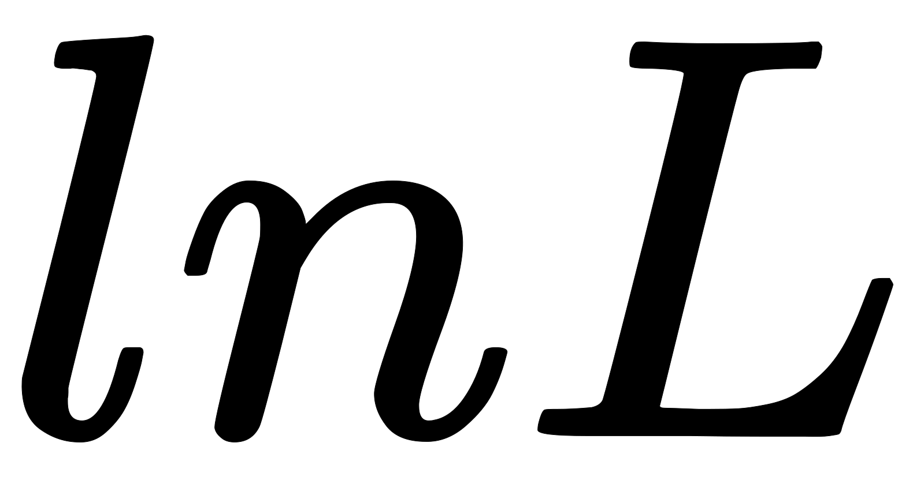

有相同的极大值点，所以

也可由方程组

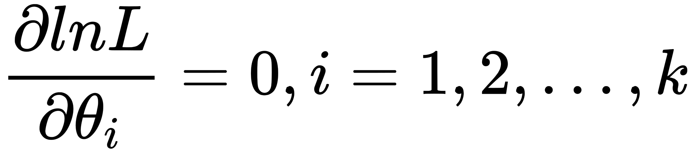

定出 

，称以上方程组为对数似然方程；

 就是所求参数

 的极大似然估计量。

当总体是离散型的，将上面的[概率密度函数](https://baike.baidu.com/item/概率密度函数)

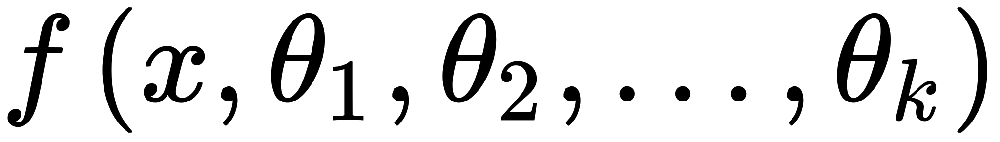

，换成它的分布律

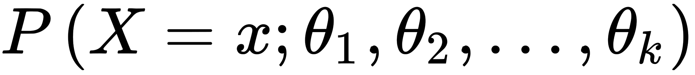

## 共轭分布

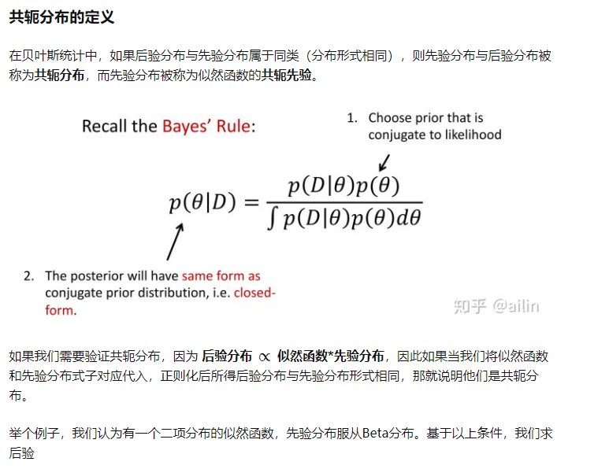

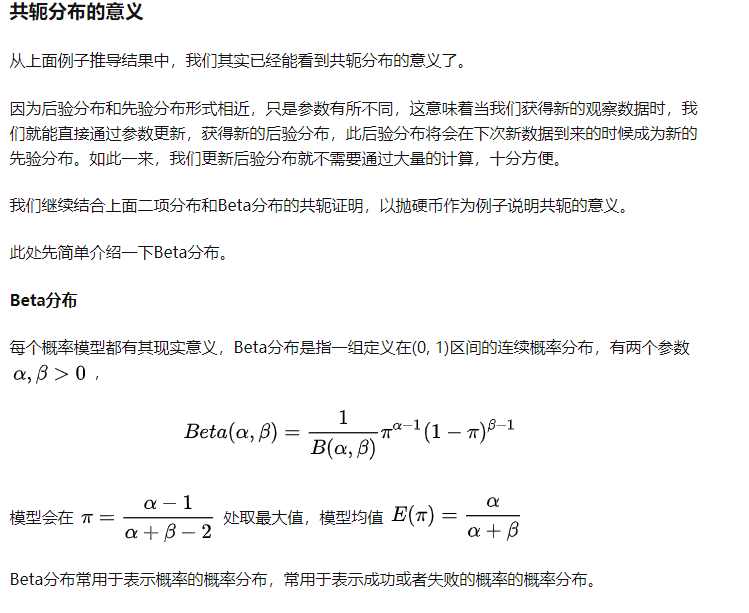

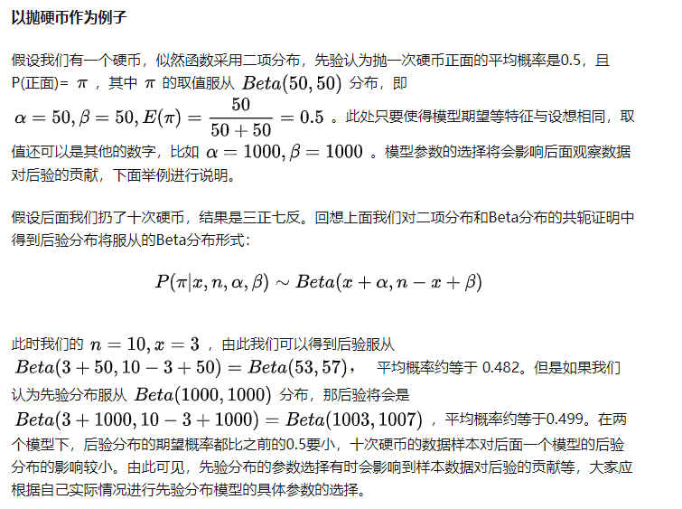

### 举例

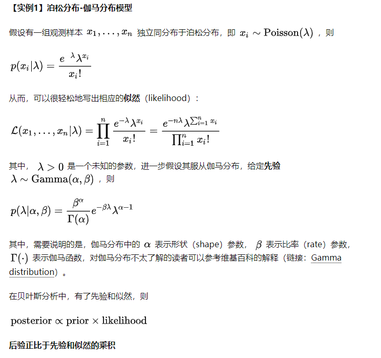

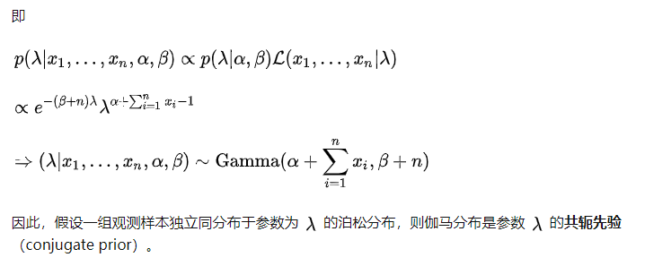

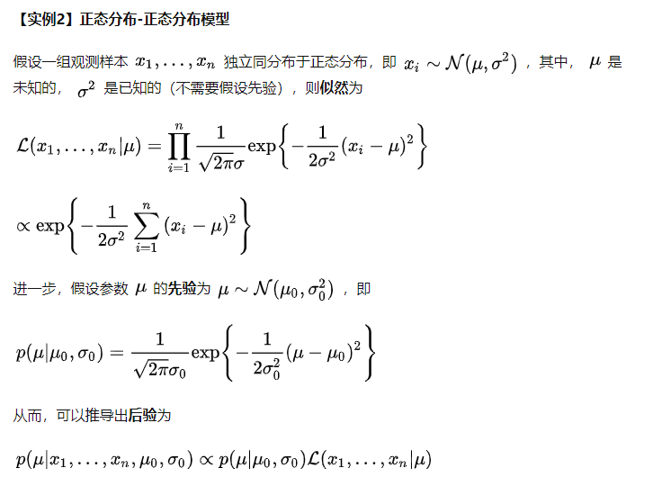

