# 5.贝叶斯分类

## 朴素贝叶斯

### 题目举例

那么既然是朴素贝叶斯**分类算法**，它的核心算法又是什么呢？

**是下面这个贝叶斯公式：**

****

**换个表达形式就会明朗很多，如下：**

****

**我们最终求的p(类别|特征)即可！就相当于完成了我们的任务。**

## **例题分析**

**下面我先给出例子问题。**

**给定数据如下：**

**现在给我们的问题是，如果一对男女朋友，男生想女生求婚，男生的四个特点分别是不帅，性格不好，身高矮，不上进，请你判断一下女生是嫁还是不嫁？**

这是一个典型的分类问题，**转为数学问题就是比较p(嫁|(不帅、性格不好、身高矮、不上进))与p(不嫁|(不帅、性格不好、身高矮、不上进))的概率**，谁的概率大，我就能给出嫁或者不嫁的答案！

这里我们联系到朴素贝叶斯公式：

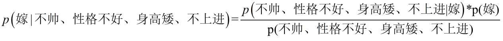

我们需要求p(嫁|(不帅、性格不好、身高矮、不上进),这是我们不知道的，但是通过朴素贝叶斯公式可以转化为好求的三个量，**p(不帅、性格不好、身高矮、不上进|嫁)、p（不帅、性格不好、身高矮、不上进)、p(嫁)（至于为什么能求，后面会讲，那么就太好了，将待求的量转化为其它可求的值，这就相当于解决了我们的问题！）**

## **朴素贝叶斯算法的朴素一词解释**

**那么这三个量是如何求得？**

是根据已知训练数据统计得来，下面详细给出该例子的求解过程。

回忆一下我们要求的公式如下：

那么我只要求得p(不帅、性格不好、身高矮、不上进|嫁)、p（不帅、性格不好、身高矮、不上进)、p(嫁)即可，好的，下面我分别求出这几个概率，最后一比，就得到最终结果。

**p(不帅、性格不好、身高矮、不上进|嫁) = p(不帅|嫁)\*p(性格不好|嫁)\*p(身高矮|嫁)\*p(不上进|嫁)，那么我就要分别统计后面几个概率，也就得到了左边的概率！**

等等，为什么这个成立呢？学过概率论的同学可能有感觉了，这个等式成立的条件需要特征之间相互独立吧！

**对的！这也就是为什么朴素贝叶斯分类有朴素一词的来源，朴素贝叶斯算法是假设各个特征之间相互独立，那么这个等式就成立了！**

**但是为什么需要假设特征之间相互独立呢？**

1、我们这么想，假如没有这个假设，那么我们对右边这些概率的估计其实是不可做的，这么说，我们这个例子有4个特征，其中帅包括{帅，不帅}，性格包括{不好，好，爆好}，身高包括{高，矮，中}，上进包括{不上进，上进}，**那么四个特征的联合概率分布总共是4维空间，总个数为2\*3\*3\*2=36个。**

**24个，计算机扫描统计还可以，但是现实生活中，往往有非常多的特征，每一个特征的取值也是非常之多，那么通过统计来估计后面概率的值，变得几乎不可做，这也是为什么需要假设特征之间独立的原因。**

2、假如我们没有假设特征之间相互独立，那么我们统计的时候，就需要在整个特征空间中去找，比如统计p(不帅、性格不好、身高矮、不上进|嫁),

**我们就需要在嫁的条件下，去找四种特征全满足分别是不帅，性格不好，身高矮，不上进的人的个数，这样的话，由于数据的稀疏性，很容易统计到0的情况。 这样是不合适的。**

根据上面俩个原因，朴素贝叶斯法对条件概率分布做了条件独立性的假设，由于这是一个较强的假设，朴素贝叶斯也由此得名！这一假设使得朴素贝叶斯法变得简单，但有时会牺牲一定的分类准确率。

好的，上面我解释了为什么可以拆成分开连乘形式。那么下面我们就开始求解！

我们将上面公式整理一下如下：

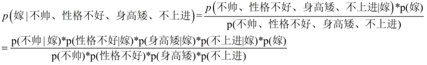

下面我将一个一个的进行统计计算（**在数据量很大的时候，根据中心极限定理，频率是等于概率的，这里只是一个例子，所以我就进行统计即可**）。

p(嫁)=？

首先我们整理训练数据中，嫁的样本数如下：

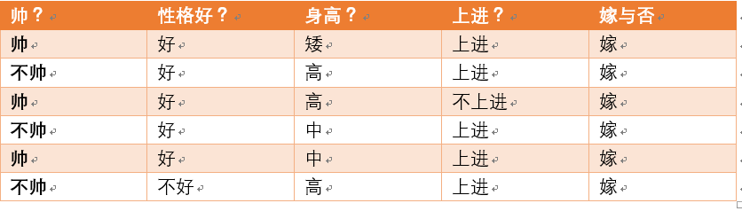

**则 p(嫁) = 6/12（总样本数） = 1/2**

p(不帅|嫁)=？统计满足样本数如下：

**则p(不帅|嫁) = 3/6 = 1/2**

**p(性格不好|嫁)= ？统计满足样本数如下：**

**则p(性格不好|嫁)= 1/6

**

**p（矮|嫁） = ?统计满足样本数如下：**

**则p(矮|嫁) = 1/6**

**p(不上进|嫁) = ?统计满足样本数如下：**

****

**则p(不上进|嫁) = 1/6**

**下面开始求分母，p(不帅)，p（性格不好），p（矮），p（不上进）**

**统计样本如下：**

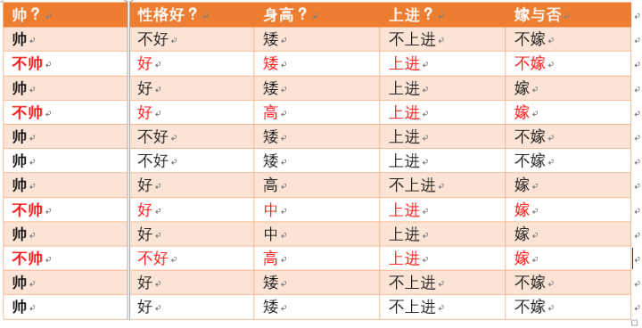

**不帅统计如上红色所示，占4个，那么p（不帅） = 4/12 = 1/3**

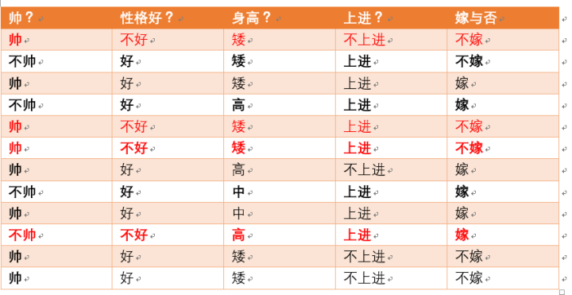

性格不好统计如上红色所示，占4个，那么p（性格不好） = 4/12 = 1/3

身高矮统计如上红色所示，占7个，那么p（身高矮） = 7/12

不上进统计如上红色所示，占4个，那么p（不上进） = 4/12 = 1/3

**到这里，要求p(不帅、性格不好、身高矮、不上进|嫁)的所需项全部求出来了，下面我带入进去即可，**

= (1/2*1/6*1/6*1/6*1/2)/(1/3*1/3*7/12*1/3)

**下面我们根据同样的方法来求p(不嫁|不帅，性格不好，身高矮，不上进)，完全一样的做法，为了方便理解，我这里也走一遍帮助理解。首先公式如下：**

下面我也一个一个来进行统计计算，这里与上面公式中，分母是一样的，于是我们分母不需要重新统计计算！

p（不嫁）=？根据统计计算如下（**红色为满足条件**）：

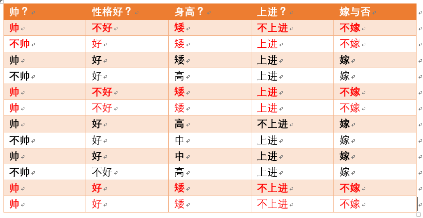

则p(不嫁)=6/12 = 1/2

p(不帅|不嫁) = ？统计满足条件的样本如下（**红色为满足条件**）：

则p（不帅|不嫁） = 1/6

p（性格不好|不嫁） = ？据统计计算如下（**红色为满足条件**）：

则p（性格不好|不嫁） =3/6 = 1/2

p（矮|不嫁） = ？据统计计算如下（红色为满足条件）：

则p（矮|不嫁） = 6/6 = 1

p（不上进|不嫁） = ？据统计计算如下（红色为满足条件）：

则p（不上进|不嫁） = 3/6 = 1/2

那么根据公式：

p (不嫁|不帅、性格不好、身高矮、不上进) = ((1/6*1/2*1*1/2)*1/2)/(1/3*1/3*7/12*1/3)

**很显然(1/6\*1/2\*1\*1/2) > (1/2\*1/6\*1/6\*1/6\*1/2)**

**于是有p (不嫁|不帅、性格不好、身高矮、不上进)>p (嫁|不帅、性格不好、身高矮、不上进)**

**所以我们根据朴素贝叶斯算法可以给这个女生答案，是不嫁！！！！**

### 优缺点

优点：

（1） 算法逻辑简单,易于实现

（2）分类过程中时空开销小

缺点：

理论上，**朴素贝叶斯模型与其他分类方法相比具有最小的误差率。但是实际上并非总是如此，这是因为朴素贝叶斯模型假设属性之间相互独立，这个假设在实际应用中往往是不成立的，在属性个数比较多或者属性之间相关性较大时，分类效果不好。**

而在属性相关性较小时，朴素贝叶斯性能最为良好。对于这一点，有半朴素贝叶斯之类的算法通过考虑部分关联性适度改进。

## 贝叶斯网络

### 贝叶斯网络的定义

令G = (I,E)表示一个有向无环图(DAG)，其中I代表图形中所有的节点的集合，而E代表有向连接线段的集合，且令X = (Xi)i ∈ I为其有向无环图中的某一节点i所代表的随机变量，若节点X的联合概率可以表示成：

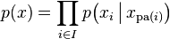

则称X为相对于一有向无环图G 的贝叶斯网络，其中，

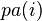

表示节点i之“因”，或称pa(i)是i的parents（父母）。

此外，对于任意的随机变量，其联合概率可由各自的局部条件概率分布相乘而得出：

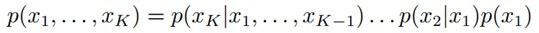

如下图所示，便是一个简单的贝叶斯网络：

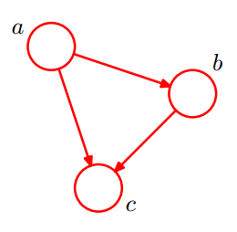

因为a导致b，a和b导致c，所以有

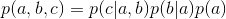

### 2.2 贝叶斯网络的实例

给定如下图所示的贝叶斯网络：

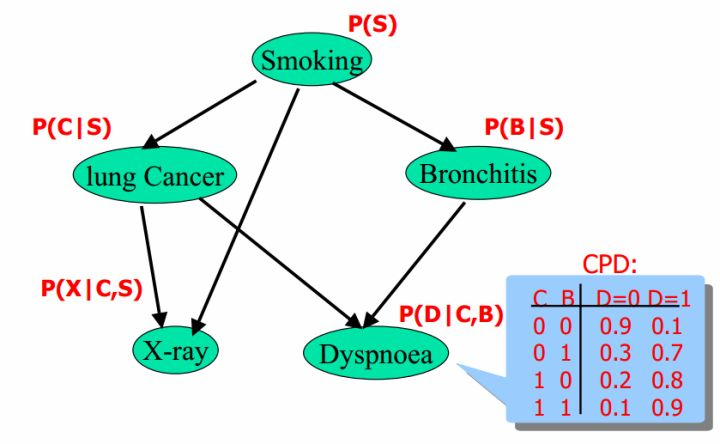

其中，各个单词、表达式表示的含义如下：

- smoking表示吸烟，其概率用P(S)表示，lung Cancer表示的肺癌，一个人在吸烟的情况下得肺癌的概率用P(C|S)表示，X-ray表示需要照医学上的X光，肺癌可能会导致需要照X光，吸烟也有可能会导致需要照X光（所以smoking也是X-ray的一个因），所以，因吸烟且得肺癌而需要照X光的概率用P(X|C,S)表示。
- Bronchitis表示支气管炎，一个人在吸烟的情况下得支气管炎的概率用P(B|S)，dyspnoea表示呼吸困难，支气管炎可能会导致呼吸困难，肺癌也有可能会导致呼吸困难（所以lung Cancer也是dyspnoea的一个因），因吸烟且得了支气管炎导致呼吸困难的概率用P(D|C,B)表示。

lung Cancer简记为C，Bronchitis简记为B，dyspnoea简记为D，且C = 0表示lung Cancer不发生的概率，C = 1表示lung Cancer发生的概率，B等于0（B不发生）或1（B发生）也类似于C，同样的，D=1表示D发生的概率，D=0表示D不发生的概率，便可得到dyspnoea的一张概率表，如上图的最右下角所示。

### 2.3 贝叶斯网络的3种结构形式

给定如下图所示的一个贝叶斯网络，

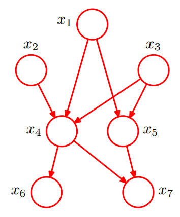

从图上可以比较直观的看出：

- \1. x1,x2,…x7的联合分布为

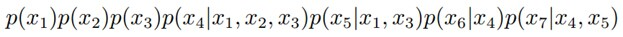

- \2. x1和x2独立（对应head-to-head）；
- \3. x6和x7在x4给定的条件下独立（对应tail-to-tail）。

根据上图，第1点可能很容易理解，但第2、3点中所述的条件独立是啥意思呢？其实第2、3点是贝叶斯网络中3种结构形式中的其中二种。为了说清楚这个问题，需要引入D-Separation（D-分离）这个概念。

D-Separation是一种用来判断变量是否条件独立的图形化方法。换言之，对于一个DAG(有向无环图)E，D-Separation方法可以快速的判断出两个节点之间是否是条件独立的。

### 2.3.1 形式1：head-to-head

贝叶斯网络的第一种结构形式如下图所示

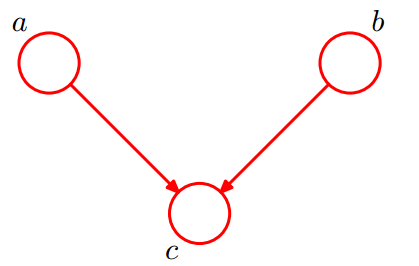

所以有：P(a,b,c) = P(a)*P(b)*P(c|a,b)成立，化简后可得：

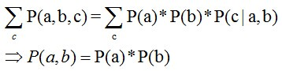

即在**c未知的条件下，a、b被阻断(blocked)，是独立的**，称之为head-to-head条件独立，对应本节中最开始那张图中的“x1、x2独立”。

### 2.3.2 形式2：tail-to-tail

贝叶斯网络的第二种结构形式如下图所示

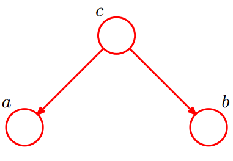

有P(a,b,c)=P(c)*P(a|c)*P(b|c)，则：P(a,b|c)=P(a,b,c)/P(c)，然后将P(a,b,c)=P(c)*P(a|c)*P(b|c)带入上式，得到：P(a,b|c)=P(a|c)*P(b|c)。
即**在c给定的条件下，a，b被阻断(blocked)，是独立的**，称之为tail-to-tail条件独立，对应本节中最开始那张图中的“x6和x7在x4给定的条件下独立”。

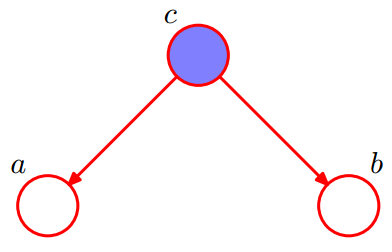

### 2.3.3 形式3：head-to-tail

贝叶斯网络的第三种结构形式如下图所示：

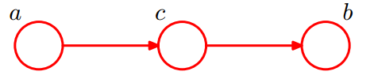

有：P(a,b,c)=P(a)*P(c|a)*P(b|c)。

化简后可得：

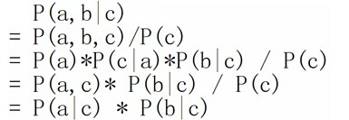

即：**在c给定的条件下，a，b被阻断(blocked)，是独立的**，称之为head-to-tail条件独立。

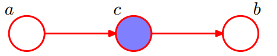

**插一句**：这个head-to-tail其实就是一个链式网络，如下图所示：

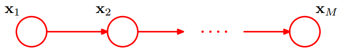

在xi给定的条件下，xi+1的分布和x1,x2…xi-1条件独立。即：xi+1的分布状态只和xi有关，和其他变量条件独立，这种顺次演变的随机过程，就叫做马尔科夫链（Markov chain）。且有：

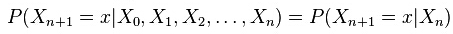

OK，今天在总结贝叶斯网络中的上述3种结构时，发现跟河流关系比较相像，比如：

- ①两条小河流入一条大河，叫head-to-head，由P(a,b,c)=P(c|a,b)P(b)P(a)，可得：P(a,b) = P(a)*P(b)，即c未知的条件下，a、b被阻断(blocked)，是独立的。同时，也谓之汇连，且汇连是条件依赖的（C依赖于A、B的联合分布），汇连这种情况也称为一个v-结构；

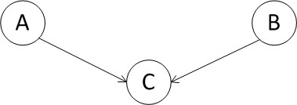

- ②一条大河到某处分叉成两条支流，称之为tail-to-tail，由P(a,b,c)=P(b|c)P(a|c)P(c) ，可得：P(a,b|c)=P(a|c)*P(b|c)，即在c给定的条件下，a，b被阻断(blocked)，是独立的。同时，也谓之分连；

- ③一条大河流到底，中间不分叉不汇入其它河流，但可能其中的某段叫什么江，另一段叫什么江，称之为head-to-tail，由P(a,b,c)=P(b|c)P(c|a)P(a) ，化简可得：P(a,b,c)=P(a)*P(c|a)*P(b|c)，即在c给定的条件下，a，b被阻断(blocked)，是独立的。同时，也谓之顺连；

不知道读者对这个河流的比喻怎么看？^_^

接着，将上述结点推广到结点集，则是：对于任意的结点集A，B，C，考察所有通过A中任意结点到B中任意结点的路径，若要求A，B条件独立，则需要所有的路径都被阻断(blocked)，即满足下列两个前提之一：

1. A和B的“head-to-tail型”和“tail-to-tail型”路径都通过C；
2. A和B的“head-to-head型”路径不通过C以及C的子孙；

最后，举例说明上述D-Separation的3种情况，则是如下图所示：

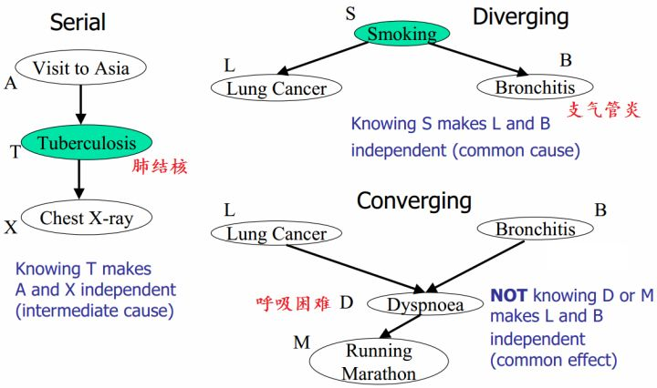

上图中左边部分是head-to-tail，右边部分的右上角是tail-to-tail，右边部分的右下角是head-to-head。