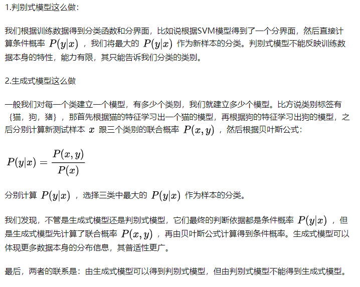
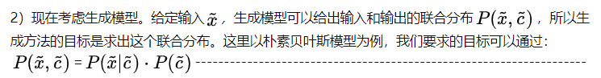
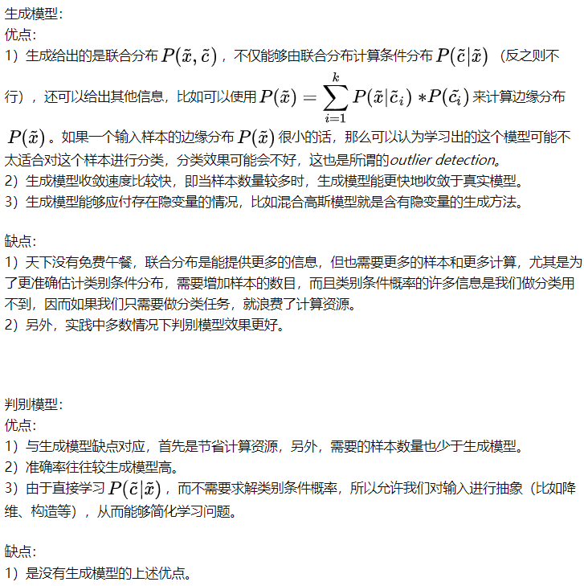

# 6.线性判别分析

## 生成模型和判别模型

**做一个总结，判别模型求解的思路是：条件分布------>模型参数后验概率最大------->（似然函数![[公式]](线性判别分析.assets/equation)参数先验）最大------->最大似然**

这样将求联合分布的问题转化成了求类别先验概率和类别条件概率的问题，朴素贝叶斯方法做了一个较强的假设--------feature的不同维度是独立分布的，简化了类别条件概率的计算，如果去除假设就是贝叶斯网络，这里不再赘述。
以朴素贝叶斯为例，**生成模型的求解思路是：联合分布------->求解类别先验概率和类别条件概率**

### 优缺点比较

### 常用的模型举例

有两种类型用来决定

 的线性分类器。第一种模型条件机率

 。这类的算法包括：

- [线性判别分析](https://baike.baidu.com/item/线性判别分析)（LDA） --- 假设为[高斯](https://baike.baidu.com/item/高斯)条件密度模型。
- [朴素贝叶斯分类器](https://baike.baidu.com/item/朴素贝叶斯分类器)--- 假设为条件独立性假设模型。

第二种方式则称为[判别模型](https://baike.baidu.com/item/判别模型)（discriminative models），这种方法是试图去最大化一个[训练集](https://baike.baidu.com/item/训练集)（training set）的输出值。在训练的成本函数中有一个额外的项加入，可以容易地表示[正则化](https://baike.baidu.com/item/正则化)。例子包含：

- [Logit模型](https://baike.baidu.com/item/Logit模型)---的[最大似然估计](https://baike.baidu.com/item/最大似然估计)，其假设观察到的训练集是由一个依赖于分类器的输出的二元模型所产生。
- [感知元](https://baike.baidu.com/item/感知元)（Perceptron） --- 一个试图去修正在训练集中遇到错误的算法。
- [支持向量机](https://baike.baidu.com/item/支持向量机)--- 一个试图去最大化决策超平面和训练集中的样本间的[边界](https://baike.baidu.com/item/边界)（margin）的算法。