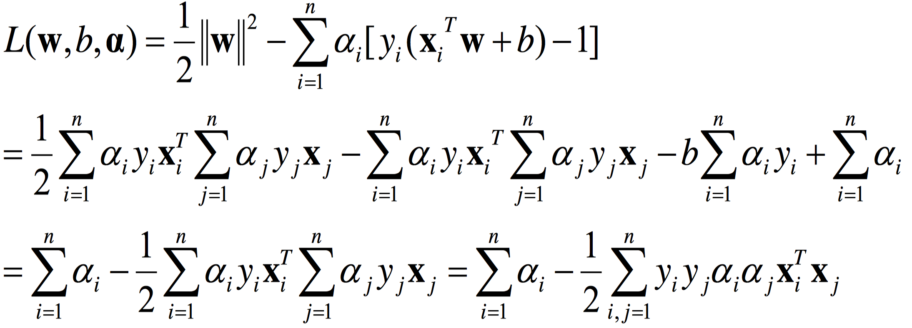
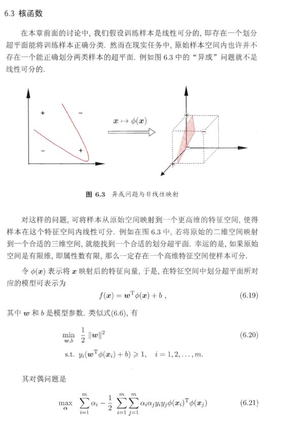
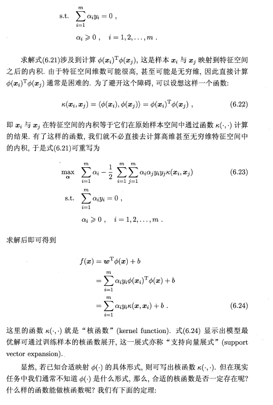
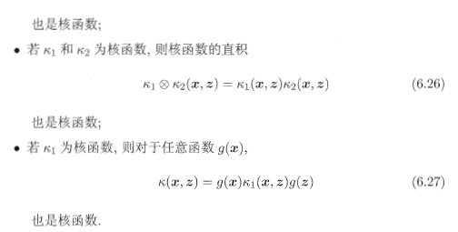

# 7.支持向量机与Kernel技术

# 支持向量机(Support Vector Machine, SVM)

## 1. 概要

### 1.1 简介

自从大半年前接触到SVM以来，感觉一直没怎么把SVM整明白。直到最近上的《模式识别》课程才仿佛打通了我的任督二脉，使我终于搞清楚了SVM的来龙去脉，所以写个博客作个总结。

SVM是什么? 先来看看维基百科上对[SVM的定义](https://zh.wikipedia.org/wiki/支持向量机):

> 支持向量机（英语：support vector machine，常简称为SVM，又名支持向量网络）是在分类与回归分析中分析数据的监督式学习模型与相关的学习算法。给定一组训练实例，每个训练实例被标记为属于两个类别中的一个或另一个，SVM训练算法创建一个将新的实例分配给两个类别之一的模型，使其成为非概率二元线性分类器。SVM模型是将实例表示为空间中的点，这样映射就使得单独类别的实例被尽可能宽的明显的间隔分开。然后，将新的实例映射到同一空间，并基于它们落在间隔的哪一侧来预测所属类别。

如果从未接触SVM的话，维基的这一大段解释肯定会让你一头雾水。简单点讲，SVM就是一种二类分类模型，他的基本模型是的定义在特征空间上的**间隔最大**的线性分类器，SVM的学习策略就是间隔最大化。

### 1.2 直观理解

我们先来看看下面这个图:

图1.1

图中有分别属于两类的一些二维数据点和三条直线。如果三条直线分别代表三个分类器的话，请问哪一个分类器比较好？

我们凭直观感受应该觉得答案是H3。首先H1不能把类别分开，这个分类器肯定是不行的；H2可以，但分割线与最近的数据点只有很小的间隔，如果测试数据有一些噪声的话可能就会被H2错误分类(即对噪声敏感、泛化能力弱)。H3以较大间隔将它们分开，这样就能容忍测试数据的一些噪声而正确分类，是一个泛化能力不错的分类器。

对于支持向量机来说，数据点若是$p$维向量，我们用$p-1$维的超平面来分开这些点。但是可能有许多超平面可以把数据分类。最佳超平面的一个合理选择就是以最大间隔把两个类分开的超平面。因此，SVM选择能够使离超平面最近的数据点的到超平面距离最大的超平面。

以上介绍的SVM只能解决线性可分的问题，为了解决更加复杂的问题，支持向量机学习方法有一些由简至繁的模型:

- 线性可分SVM

  > 当训练数据线性可分时，通过硬间隔(hard margin，什么是硬、软间隔下面会讲)最大化可以学习得到一个线性分类器，即硬间隔SVM，如上图的的H3。

- 线性SVM

  > 当训练数据不能线性可分但是可以近似线性可分时，通过软间隔(soft margin)最大化也可以学习到一个线性分类器，即软间隔SVM。

- 非线性SVM

  > 当训练数据线性不可分时，通过使用核技巧(kernel trick)和软间隔最大化，可以学习到一个非线性SVM。

## 2. 线性可分SVM——硬间隔

考虑如下形式的**线性可分**的训练数据集:
$$
{(X_1,y_1),(X_2,y_2),…,(X_n,y_n)}
$$

其中 $X_i$是一个含有$d$个元素的列向量, 即$X_i\in \mathbf{R}^d$; $y_i$是标量, $y\in{+1,-1}$, $y_i = +1$时表示$X_i$属于正类别, $y_i = -1$时表示$X_i$属于负类别。

> 注: 本文中, $X$、$X_i$、$W$等都是(列)向量，有的文章一般用 $x_i$ 表示一个向量而用 $X$ 表示所有 $x_i$ 组成的一个矩阵，注意区分。

回忆一下感知机的目标: 找到一个超平面使其能正确地将每个样本正确分类。感知机使用误分类最小的方法求得超平面，不过此时解有无穷多个(例如图1.1的H2和H3以及它俩的任意线性组合)。而线性可分支持向量机利用间隔最大化求最优分离超平面,这时解是唯一的。

### 2.1 超平面与间隔

一个超平面由法向量$W$和截距$b$决定,其方程为$X^TW+b=0$, 可以规定法向量指向的一侧为正类,另一侧为负类。下图画出了三个平行的超平面，法方向取左上方向。

> 注意: 如果$X$和$W$都是列向量,即$X^TW$会得到$X$和$W$的点积(dot product, 是一个标量),等价于$X \cdot W$和$W \cdot X$。

图2.1

为了找到最大间隔超平面，我们可以先选择分离两类数据的两个平行超平面，使得它们之间的距离尽可能大。在这两个超平面范围内的区域称为“间隔(margin)”，最大间隔超平面是位于它们正中间的超平面。这个过程如上图所示。

### 2.2 间隔最大化

将高数里面求两条平行直线的距离公式推广到高维可求得图2.1中margin的$\rho$:
$$
margin = \rho = \frac 2 {||W||} \tag{2.2.1}
$$
我们的目标是使$\rho$最大, 等价于使$\rho^2$最大:
$$
\underset{W,b}{max} \rho \iff \underset{W,b}{max} \rho^2 \iff \underset{W,b}{min}\frac 1 2 ||W||^2 \tag{2.2.2}
$$
上式的$\frac 1 2$是为了后续求导后刚好能消去，没有其他特殊意义。

同时也不要忘了有一些约束条件:

$$
X_i^TW+b \ge +1, y_i=+1 \\\\
X_i^TW+b \le -1, y_i=-1 \tag{2.2.3}
$$

总结一下，间隔最大化问题的数学表达就是
$$
\underset{W,b}{min}J(W) = \underset{W,b}{min}\frac 1 2 ||W||^2 \\\\
s.t.\quad y_i(X_i^TW+b) \ge 1, i=1,2,…n. \tag{2.2.4}
$$
通过求解上式即可得到最优超平面 $ \hat{W} $ 和 $ \hat{b} $ 。具体如何求解见2.4和2.5节。

### 2.3 支持向量

在线性可分的情况下，训练数据集的样本点中与分离超平面距离最近的数据点称为支持向量(support vector)，支持向量是使$(2.2.4)$中的约束条件取等的点，即满足
$$
y_i(X_i^TW+b) = 1 \tag{2.3.1}
$$
的点。也即所有在直线$ X^TW+b = 1$或直线$ X^TW+b = -1$的点。如下图所示:

图2.2

**在决定最佳超平面时只有支持向量起作用，而其他数据点并不起作用**(具体推导见2.4节最后)。如果移动非支持向量，甚至删除非支持向量都不会对最优超平面产生任何影响。也即支持向量对模型起着决定性的作用，这也是“支持向量机”名称的由来。

### 2.4 对偶问题

如何求解式 $(2.2.4)$ 呢？

我们称式 $(2.2.4)$ 所述问题为原始问题(primal problem), 可以应用拉格朗日乘子法构造拉格朗日函数(Lagrange function)再通过求解其对偶问题(dual problem)得到原始问题的最优解。转换为对偶问题来求解的原因是:

- 对偶问题更易求解，由下文知对偶问题只需优化一个变量$\alpha$且约束条件更简单；
- 能更加自然地引入核函数，进而推广到非线性问题。

首先构建拉格朗日函数。为此需要引进拉格朗日乘子(Lagrange multiplier) $\alpha_i \ge 0, i=1,2,…n$。则拉格朗日函数为:
$$
L(W,b,\alpha)=\frac 1 2 ||W||^2 - \sum_{i=1}^n \alpha_i [y_i(X_i^TW+b)-1]
\tag{2.4.1}
$$
因此，给定一个$W$和$b$, 若不满足式$(2.2.4)$的约束条件，那么有
$$
\underset{\alpha}{max} L(W,b,\alpha) = +\infty \tag{2.4.2}
$$
否则，若满足式$(2.2.4)$的约束条件，有
$$
\underset{\alpha}{max} L(W,b,\alpha) = J(W) = \frac 1 2 ||W||^2 \tag{2.4.3}
$$
结合式$(2.4.2)$和$(2.4.3)$知，优化问题
$$
\underset{W, b}{min} \underset{\alpha}{max} L(W,b,\alpha)\tag{2.4.4}
$$
与式$(2.2.4)$所述问题是完全等价的。

根据拉格朗日对偶性，式$(2.4.4)$所述问题即原始问题的对偶问题是:
$$
\underset{\alpha}{max} \underset{W, b}{min} L(W,b,\alpha) \tag{2.4.5}
$$
> 以上具体推导细节可参见书籍《统计学习方法》或者知乎文章[拉格朗日对偶性](https://zhuanlan.zhihu.com/p/38182879)

为了求得对偶问题的解，需要先求得$L(W,b,\alpha)$对$W$和$b$的极小再求对$\alpha$的极大。

(1) 求$\underset{W, b}{min} L(W,b,\alpha)$:
对拉格朗日函数求导并令导数为0，有:
$$
\nabla_W L(W,b,\alpha) = W - \sum_{i=1}^n \alpha_i y_i X_i = 0 \implies W= \sum_{i=1}^n \alpha_i y_i X_i\tag{2.4.6}
$$

$$
\nabla_b L(W,b,\alpha) = - \sum_{i=1}^n \alpha_i y_i = 0 \implies \sum_{i=1}^n \alpha_i y_i = 0 \tag{2.4.7}
$$
将上面两式代入$L(W,b,\alpha)$：

所以，
$$
\underset{W, b}{min} L(W,b,\alpha) = -\frac 1 2 \sum_{i=1}^n \sum_{j=1}^n \alpha_i \alpha_j y_i y_j X_i^T X_j \ + \ \sum_{i=1}^n \alpha_i \tag{2.4.8}
$$
(2) 求$\underset{W, b}{min} L(W,b,\alpha)$ 对$\alpha$的极大:
等价于式$(2.4.8)$对$\alpha$求极大，也等价于式$(2.4.8)$取负数后对$\alpha$求极小，即
$$
\underset{\alpha}{min} \quad \frac 1 2 \sum_{i=1}^n \sum_{j=1}^n \alpha_i \alpha_j y_i y_j X_i^T X_j \ - \ \sum_{i=1}^n \alpha_i \tag{2.4.9}
$$
同时满足约束条件:
$$
\sum_{i=1}^n \alpha_i y_i = 0 \\\\
\alpha_i \ge 0, i=1,2,…,n. \tag{2.4.10}
$$
至此，我们得到了原始最优化问题$(2.2.4)$和对偶最优化问题$(2.4.9)$、$(2.4.10)$。

由slater条件知，因为原始优化问题的目标函数和不等式约束条件都是凸函数，并且该不等式约束是严格可行的(因为数据是线性可分的), 所以存在 $ \hat{W} $, $ \hat{b}$ ,$\hat{\alpha} $，使得$ \hat{W} $, $ \hat{b}$是原始问题的解，$\hat{\alpha} $是对偶问题的解。这意味着求解原始最优化问题$(2.2.4)$可以转换为求解对偶最优化问题$(2.4.9)$、$(2.4.10)$。

> slater 条件:
> 原始问题一般性表达为
> $$
> \underset{x}{min} \quad f(x) \\\\
> s.t. \ c_i(x) \le 0, i=1,2,…k \\\\
> \quad \quad h_j(x) = 0, j=1,2,…,l
> $$
> 则其拉格朗日函数为
> $$
> L(x,\alpha,\beta)=f(x) + \sum_{i=1}^k \alpha_i c_i(x) +
> \sum_{j=1}^l \beta_j h_j(x), \quad \alpha_i \ge 0
> $$
> 假设原始问题目标函数 $f(x)$ 和不等式约束条件 $c_i(x)$都是凸函数，原始问题等式约束$h_j(x)$都是仿射函数，且不等式约束 $c_i(x)$是严格可行的，即存在 $x$ ，对所有 $i$ 都有 $c_i(x) < 0$ ，则存在 $\hat{x} $, $\hat{\alpha} $, $\hat{\beta} $，使 $\hat{x} $ 是原始问题的解， $\hat{\alpha} $, $\hat{\beta} $是对偶问题的解。

那么如何求解优化问题$(2.4.9)$、$(2.4.10)$的最优解 $\hat{\alpha}$ 呢？
不难发现这是一个二次规划问题，有现成的通用的算法来求解。

> 事实上通用的求解二次规划问题的算法的复杂度正比于训练数据样本数，所以在实际应用中需要寻求更加高效的算法，例如序列最小优化(Sequential Minimal Optimiation, SMO)算法。

假设我们现在求得了$(2.4.9)$、$(2.4.10)$的最优解 $\hat{\alpha}$，则根据式$(2.4.6)$可求得最优$\hat{W}$：
$$
\hat{W}= \sum_{i=1}^n \hat{\alpha}_i y_i X_i \tag{2.4.11}
$$
因为至少存在一个 $\hat{\alpha}_j > 0$(若不存在，即 $\hat{\alpha}$ 全为0，则 $\hat{W}=0$, 即 $margin = \frac 2 {||\hat{W}||}= \infty $,显然不行), 再根据KKT条件，即
$$
\begin{cases}
乘子非负: \alpha_i \ge 0 (i=1,2,…n.下同) \\\\
约束条件: y_i(X_i^TW+b) - 1\ge 0 \\\\
互补条件: \alpha_i (y_i(X_i^TW+b) - 1)=0
\end{cases}
$$
所以至少存在一个 $j$ , 使 $ y_j(X_j^T \hat{W}+\hat{b}) - 1=0$, 即可求得最优 $\hat{b}$:
$$
\begin{aligned}
\hat{b} & = \frac 1 {y_j} -X_j^T \hat{W} \\\\
& = y_j -X_j^T \hat{W} \\\\
& = y_j-\sum_{i=1}^n \hat{\alpha}_i y_i X_j^T X_i
\end{aligned} \tag{2.4.12}
$$
至此，所以我们就求得了整个线性可分SVM的解。求得的分离超平面为:
$$
\sum_{i=1}^n \hat{\alpha}_i y_i X^TX_i + \hat{b}=0 \tag{2.4.13}
$$
则分类的决策函数为
$$
f(X) = sign(\sum_{i=1}^n \hat{\alpha}_i y_i X^TX_i + \hat{b})
\tag{2.4.14}
$$
再来分析KKT条件里的互补条件，对于任意样本 $(X_i, y_i)$ ，总会有 $ \alpha_i=0 $ 或者 $y_if(X_i)=y_i(X_i^T \hat{W}+b) = 1$。则有

- 若$ \alpha_i=0$，此样本点不是支持向量，对模型没有任何作用；

- 若$ \alpha_i>0$，此样本点位于最大间隔边界上，是一个支持向量，如下图所示。

  
  

  

  图2.3

  

此外，当样本点是非支持向量时，因为$ \alpha_i=0$, 所以SVM的解中的求和项中第 $i$ 项就为0，所以SVM的解$(2.4.11)$、$(2.4.12)$可简化为如下形式:
$$
\hat{W}= \sum_{i \in SV} \hat{\alpha}_i y_i X_i \tag{2.4.15}
$$

$$
\hat{b} = y_j-\sum_{i \in SV} \hat{\alpha}_i y_i X_j^T X_i
\tag{2.4.16}
$$
类似的，判别函数也可转换成如下形式:
$$
f(X) = sign(\sum_{i \in SV} \hat{\alpha}_i y_i X^TX_i + \hat{b})
\tag{2.4.17}
$$
所以，整个SVM的解只与支持向量SV有关，与非支持向量无关。这也就解释了2.3节的结论，即在决定最佳超平面时只有支持向量起作用，而其他数据点并不起作用。

## 3. 线性SVM——软间隔

在前面的讨论中，我们一直假定训练数据是严格线性可分的，即存在一个超平面能完全将两类数据分开。但是现实任务这个假设往往不成立，例如下图所示的数据。

图3.1

### 3.1 软间隔最大化

解决该问题的一个办法是允许SVM在少量样本上出错，即将之前的硬间隔最大化条件放宽一点，为此引入“软间隔(soft margin)”的概念。即允许少量样本不满足约束
$$
y_i(X_i^TW+b) \ge 1 \tag{3.1.1}
$$
为了使不满足上述条件的样本点尽可能少，我们需要在优化的目标函数$(2.2.2)$里面新增一个对这些点的惩罚项。最常用的是hinge损失:
$$
l_{hinge}(z) = max(0, 1-z) \tag{3.1.2}
$$
即若样本点满足约束条件损失就是0, 否则损失就是 $1-z$ ,则优化目标 $(2.2.2)$ 变成
$$
\underset{W,b}{min} \quad \frac 1 2 ||W||^2 + C \sum_{i=1}^n max(0, 1 - y_i(X_i^TW+b))
\tag{3.1.3}
$$
其中 $C > 0$ 称为惩罚参数，$C$ 越小时对误分类惩罚越小，越大时对误分类惩罚越大，当 $C$ 取正无穷时就变成了硬间隔优化。实际应用时我们要合理选取 $C$，$C$ 越小越容易欠拟合，$C$ 越大越容易过拟合。

如果我们引入“松弛变量” $ \xi_i \ge 0$, 那么式 $(3.1.3)$ 可重写成
$$
\underset{W,b,\xi}{min} \quad \frac 1 2 ||W||^2 + C \sum_{i=1}^n \xi_i\\\\
s.t.\ y_i(X_i^TW+b) \ge 1-\xi_i \\\\
\xi_i \ge 0, i=1,2,…n. \tag{3.1.4}
$$
上式所述问题即软间隔支持向量机。

### 3.2 对偶问题

式 $(3.1.4)$ 表示的软间隔支持向量机依然是一个凸二次规划问题，和硬间隔支持向量机类似，我们可以通过拉格朗日乘子法将其转换为对偶问题进行求解。
式 $(3.1.4)$ 对应的拉格朗日函数为
$$
L(W,b,\xi,\alpha,\beta)=\frac 1 2 ||W||^2 + C \sum_{i=1}^n \xi_i - \sum_{i=1}^n \alpha_i [y_i(X_i^TW+b) - 1 + \xi_i] - \sum_{i=1}^n \beta_i \xi_i
\tag{3.2.1}
$$
类似2.4节，为了求得对偶问题的解，我们需要先求得$L(W,b,\xi,\alpha,\beta)$对 $W$、$b$ 和 $\xi$ 的极小再求对 $\alpha$ 和 $\beta$ 的极大。

> 以下两步和2.4节几乎完全一样，除了最后对 $\alpha$ 的约束条件略有不同。

(1) 求$\underset{W, b, \xi}{min} L(W,b,\xi,\alpha,\beta)$:
将 $L(W,b,\xi,\alpha,\beta)$ 分别对 $W$、$b$ 和 $\xi$ 求偏导并令为0可得
$$
W=\sum_{i=1}^n \alpha_i y_i X_i \tag{3.2.2}
$$

$$
\sum_{i=1}^n \alpha_i y_i = 0 \tag{3.2.3}
$$

$$
C = \alpha_i + \beta_i \tag{3.2.4}
$$
将上面三个式子代入式 $(3.2.1)$ 并进行类似式 $(2.4.8)$ 的推导即得
$$
\underset{W, b, \xi}{min} L(W,b,\xi,\alpha,\beta) =
-\frac 1 2 \sum_{i=1}^n \sum_{j=1}^n \alpha_i \alpha_j y_i y_j X_i^T X_j \ + \ \sum_{i=1}^n \alpha_i \tag{3.2.5}
$$
注意其中的 $\beta$ 被消去了。

(2) 求$\underset{W, b, \xi}{min} L(W,b,\xi,\alpha,\beta)$对 $\alpha$ 的极大：
式$(3.2.5)$对$\alpha$求极大，也等价于式$(3.2.5)$取负数后对$\alpha$求极小，即
$$
\underset{\alpha}{min} \quad \frac 1 2 \sum_{i=1}^n \sum_{j=1}^n \alpha_i \alpha_j y_i y_j X_i^T X_j \ - \ \sum_{i=1}^n \alpha_i \tag{3.2.6}
$$
同时满足约束条件:
$$
\sum_{i=1}^n \alpha_i y_i = 0 \\\\
\quad 0 \le \alpha_i \le C, i=1,2,…,n. \tag{3.2.7}
$$
至此，我们得到了原始最优化问题$(3.1.4)$和对偶最优化问题$(3.2.6)$、$(3.2.7)$。

类似2.4节地，假设我们现在通过通用的二次规划求解方法或者SMO算法求得了$(3.2.6)$、$(3.2.7)$的最优解 $\hat{\alpha}$，则根据式$(3.2.2)$可求得最优$\hat{W}$：
$$
\hat{W}= \sum_{i=1}^n \hat{\alpha}_i y_i X_i \tag{3.2.8}
$$
再根据KKT条件，即
$$
\begin{cases}
乘子非负: \alpha_i \ge 0 ,\enspace \beta_i \ge 0 (i=1,2,…n.下同)\\\\
约束条件: y_i(X_i^TW+b) - 1\ge \xi_i \\\\
互补条件: \alpha_i [y_i(X_i^TW+b) - 1+\xi_i]=0, \enspace \beta_i \xi_i=0
\end{cases}
$$
可求得整个软间隔SVM的解，即:
$$
\hat{W}= \sum_{i \in SV} \hat{\alpha}_i y_i X_i \tag{3.2.9}
$$

$$
\hat{b} = y_j-\sum_{i \in SV} \hat{\alpha}_i y_i X_j^T X_i
\tag{3.2.10}
$$
其中 $j$ 需满足 $0 < \hat{\alpha}_j < C$ 。

对于任意样本 $(X_i, y_i)$ ，

- 若 $ \alpha_i=0$，此样本点不是支持向量，该样本对模型没有任何的作用；
- 若 $ \alpha_i>0$，此样本是一个支持向量。

若满足 $ \alpha_i>0$ ，进一步地，

- 若 $ 0 < \alpha_i < C$, 由式 $(3.2.4)$ 得 $\beta_i = 0$，即刚好 $y_i(X_i^TW+b) =1$，样本恰好在最大间隔边界上；
- 若 $\alpha_i = C$，有$\beta_i > 0$，此时若 $\beta_i < 1$则该样本落在最大间隔内部，若 $\beta_i > 1$ 则该样本落在最大间隔内部即被错误分类。

如下图所示。

图3.2

因此，我们有与2.4节相同的结论，最优超平面只与支持向量有关而与非支持向量无关。

### 3.3 惩罚参数 $C$

对于不同惩罚参数 $C$，SVM结果如下图所示。

图3.3

再来看看我们的原始目标函数:
$$
\underset{W,b,\xi}{min} \quad \frac 1 2 ||W||^2 + C \sum_{i=1}^n \xi_i
$$
对于更加一般化的问题，可将上述式子抽象成：
$$
\underset{f}{min} \quad \Omega(f) + C \sum_{i=1}^n l(f(x_i),y_i) \tag{3.3.1}
$$
前一项可以理解为“结构风险(structural risk)”，用来描述所求模型的某些性质(SVM就是要求间隔最大)；第二项称为“经验风险(empirical risk)”，用来描述模型与训练数据的契合程度(即误差)。而参数 $C$ 就是用于对二者的折中,即我们一方面要求模型要满足某种性质另一方面又想使模型与训练数据很契合。

从正则化角度来讲， $\Omega(f)$ 称为正则化项，$C$ 称为惩罚参数，$C$ 越大即对误分类的惩罚越大(要求模型对训练模型更契合)，这可能会存在过拟合；$C$ 越小即相对更加看重正则化项，此时可能存在欠拟合。

## 4. 非线性SVM——核技巧

前面介绍的都是线性问题，但是我们经常会遇到非线性的问题(例如异或问题)，此时就需要用到核技巧(kernel trick)将线性支持向量机推广到非线性支持向量机。需要注意的是，不仅仅是SVM，很多线性模型都可以用核技巧推广到非线性模型，例如核线性判别分析(KLDA)。

### 4.1 核函数

如下图所示，核技巧的基本思路分为两步:

- 使用一个变换将原空间的数据映射到新空间(例如更高维甚至无穷维的空间)；
- 然后在新空间里用线性方法从训练数据中学习得到模型。

图4.1

怎样映射到特征空间？

先来看看核函数的定义，

> 设 $\mathcal{X}$ 是输入空间(欧式空间$R^n$的子集或离散集合)，又设 $\mathcal{H}$ 是特征空间(希尔伯特空间)，如果存在一个 $\mathcal{X}$ 到 $\mathcal{H}$ 的映射
> $$
> \phi(x): \mathcal{X} \to \mathcal{H}
> $$
> 使得对所有 $x,z \in \mathcal{X}$，函数 $K(x,z)$ 满足条件
> $$
> K(x,z)=\phi(x) \cdot \phi(z)
> $$
> 则称 $K(x,z)$ 为核函数， $\phi(x)$ 为映射函数，式中 $\phi(x) \cdot \phi(z)$ 为 $\phi(x)$ 和 $\phi(z)$ 的內积。

通常，直接计算 $K(x,z)$ 比较容易而通过 $\phi(x)$ 和 $\phi(z)$ 计算 $K(x,z)$ 并不容易。而幸运的是，在线性支持向量机的对偶问题中，无论是目标函数还是决策函数都只涉及到输入样本与样本之间的內积，因此我们不需要显式地定义映射 $\phi(x)$ 是什么而只需事先定义核函数 $K(x,z)$ 即可。也就是说，在核函数 $K(x,z)$ 给定的情况下，可以利用解线性问题的方法求解非线性问题的支持向量机，此过程是隐式地在特征空间中进行的。

### 4.2 正定核

由上面的介绍可知，我们只需要定义核函数就可以了。但是如何不通过映射 $\phi(x)$ 判断给定的一个函数 $K(x,z)$ 是不是核函数呢？或者说，$K(x,z)$ 需要满足什么条件才是一个核函数。

通常所说的核函数就是正定核函数，下面不加证明的给出正定核的充要条件，具体证明略显复杂，有兴趣的可以参考《统计学习方法》。

> 设 $\mathcal{X} \subset R^n$ ,$K(x,z)$ 是定义在 $\mathcal{X} \times \mathcal{X}$ 上的对称函数，如果对任意的 $x_i \in \mathcal{X}, i=1,2,…,m$，$K(x,z)$ 对应的Gram矩阵
> $$
> K = [K(x_i, x_j)]_{m \times m}
> $$
> 是半正定矩阵，则 $K(x,z)$ 是正定核。

虽然有了上述定义，但是实际应用时验证 $K(x,z)$ 是否是正定核依然不容易，因此在实际问题中一般使用已有的核函数，下面给出一些常用的核函数。

- 多项式核函数(polynomial kernel function)
$$
  K(x,z) = (x \cdot z + 1)^p \tag{4.2.1}
$$
- 高斯核函数(Guassian kernel function)
$$
  K(x,z) = exp(- \frac {||x-z||^2} {2 \sigma^2} ) \tag{4.2.2}
$$
### 4.3 非线性支持向量机

如前4.1、4.2所述，利用核技巧可以很简单地把线性支持向量机扩展到非线性支持向量机，只需将线性支持向量机中的內积换成核函数即可。下面简述非线性支持向量机学习算法。

- 首先选取适当的核函数 $K(x,z)$ 和适当的参数 $C$，构造最优化问题
$$
  \begin{aligned}
  & \underset{\alpha}{min} \quad \frac 1 2 \sum_{i=1}^n \sum_{j=1}^n \alpha_i \alpha_j y_i y_j K(X_i,X_j) \ - \ \sum_{i=1}^n \alpha_i \\\\
  & s.t. \quad \sum_{i=1}^n \alpha_i y_i = 0 \\\\
  & \qquad 0 \le \alpha_i \le C, i=1,2,…,n.
  \end{aligned} \tag{4.3.1}
$$
  再利用现成的二次规划问题求解算法或者SMO算法求得最优解 $\hat{\alpha}$ 。
- 选择 $\hat{\alpha}$ 的一个满足 $0 < \hat{\alpha}_j < C$ 的分量 $\hat{\alpha}_j$ ，计算
$$
  \hat{b} = y_j-\sum_{i \in SV} \hat{\alpha}_i y_i K(X_j,X_i)
  \tag{4.3.2}
$$
- 构造决策函数：
$$
  f(x)=sign(\sum_{i \in SV}\hat{\alpha}_i y_i K(X_j,X_i) + \hat{b}) \tag{4.3.3}
$$

## 5. 总结

### 5.1 SVM优缺点

任何算法都有其优缺点，支持向量机也不例外。

支持向量机的优点是:

> 1. 由于SVM是一个凸优化问题，所以求得的解一定是全局最优而不是局部最优。
> 2. 不仅适用于线性线性问题还适用于非线性问题(用核技巧)。
> 3. 拥有高维样本空间的数据也能用SVM，这是因为数据集的复杂度只取决于支持向量而不是数据集的维度，这在某种意义上避免了“维数灾难”。
> 4. 理论基础比较完善(例如神经网络就更像一个黑盒子)。

支持向量机的缺点是:

> 1. 二次规划问题求解将涉及m阶矩阵的计算(m为样本的个数), 因此SVM不适用于超大数据集。(SMO算法可以缓解这个问题)
> 2. 只适用于二分类问题。(SVM的推广SVR也适用于回归问题；可以通过多个SVM的组合来解决多分类问题)

## 6.核函数

