# 9.多层感知机

## **单个神经元**

神经网络中计算的基本单元是神经元，一般称作「节点」（node）或者「单元」（unit）。节点从其他节点接收输入，或者从外部源接收输入，然后计算输出。每个输入都辅有「权重」（weight，即 w），权重取决于其他输入的相对重要性。节点将函数 f（定义如下）应用到加权后的输入总和，如图 1 所示：

*图 1：单个神经元*

此网络接受 X1 和 X2 的数值输入，其权重分别为 w1 和 w2。另外，还有配有权重 b（称为「偏置（bias）」）的输入 1。我们之后会详细介绍「偏置」的作用。

神经元的输出 Y 如图 1 所示进行计算。函数 f 是非线性的，叫做激活函数。激活函数的作用是将非线性引入神经元的输出。因为大多数现实世界的数据都是非线性的，我们希望神经元能够学习非线性的函数表示，所以这种应用至关重要。

每个（非线性）激活函数都接收一个数字，并进行特定、固定的数学计算 [2]。在实践中，可能会碰到几种激活函数：

- Sigmoid（S 型激活函数）：输入一个实值，输出一个 0 至 1 间的值 σ(x) = 1 / (1 + exp(−x))
- tanh（双曲正切函数）：输入一个实值，输出一个 [-1,1] 间的值 tanh(x) = 2σ(2x) − 1
- ReLU：ReLU 代表修正线性单元。输出一个实值，并设定 0 的阈值（函数会将负值变为零）f(x) = max(0, x)

下图 [2] 表示了上述的激活函数

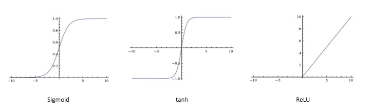

*图 2：不同的激活函数。*

偏置的重要性：偏置的主要功能是为每一个节点提供可训练的常量值（在节点接收的正常输入以外）。神经元中偏置的作用，详见这个链接：[http://stackoverflow.com/q/2480650/3297280](https://link.zhihu.com/?target=http%3A//stackoverflow.com/q/2480650/3297280)

## **前馈神经网络**

前馈神经网络是最先发明也是最简单的人工神经网络 [3]。它包含了安排在多个层中的多个神经元（节点）。相邻层的节点有连接或者边（edge）。所有的连接都配有权重。

图 3 是一个前馈神经网络的例子。

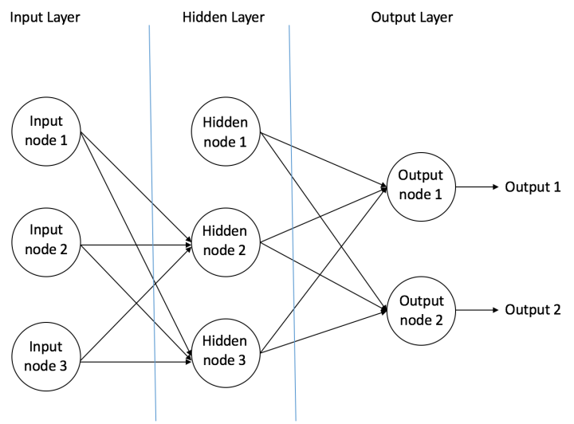

*图3： 一个前馈神经网络的例子*

一个前馈神经网络可以包含三种节点：

\1. 输入节点（Input Nodes）：输入节点从外部世界提供信息，总称为「输入层」。在输入节点中，不进行任何的计算——仅向隐藏节点传递信息。

\2. 隐藏节点（Hidden Nodes）：隐藏节点和外部世界没有直接联系（由此得名）。这些节点进行计算，并将信息从输入节点传递到输出节点。隐藏节点总称为「隐藏层」。尽管一个前馈神经网络只有一个输入层和一个输出层，但网络里可以没有也可以有多个隐藏层。

\3. 输出节点（Output Nodes）：输出节点总称为「输出层」，负责计算，并从网络向外部世界传递信息。

在前馈网络中，信息只单向移动——从输入层开始前向移动，然后通过隐藏层（如果有的话），再到输出层。在网络中没有循环或回路 [3]（前馈神经网络的这个属性和递归神经网络不同，后者的节点连接构成循环）。

下面是两个前馈神经网络的例子：

\1. 单层感知器——这是最简单的前馈神经网络，不包含任何隐藏层。你可以在 [4] [5] [6] [7] 中了解更多关于单层感知器的知识。

\2. 多层感知器——多层感知器有至少一个隐藏层。我们在下面会只讨论多层感知器，因为在现在的实际应用中，它们比单层感知器要更有用。

## **多层感知器**

多层感知器（Multi Layer Perceptron，即 MLP）包括至少一个隐藏层（除了一个输入层和一个输出层以外）。单层感知器只能学习线性函数，而多层感知器也可以学习非线性函数。

*图 4：有一个隐藏层的多层感知器*

图 4 表示了含有一个隐藏层的多层感知器。注意，所有的连接都有权重，但在图中只标记了三个权重（w0,，w1，w2）。

输入层：输入层有三个节点。偏置节点值为 1。其他两个节点从 X1 和 X2 取外部输入（皆为根据输入数据集取的数字值）。和上文讨论的一样，在输入层不进行任何计算，所以输入层节点的输出是 1、X1 和 X2 三个值被传入隐藏层。

隐藏层：隐藏层也有三个节点，偏置节点输出为 1。隐藏层其他两个节点的输出取决于输入层的输出（1，X1，X2）以及连接（边界）所附的权重。图 4 显示了隐藏层（高亮）中一个输出的计算。其他隐藏节点的输出计算同理。需留意 *f *指代激活函数。这些输出被传入输出层的节点。

输出层：输出层有两个节点，从隐藏层接收输入，并执行类似高亮出的隐藏层的计算。这些作为计算结果的计算值（Y1 和 Y2）就是多层感知器的输出。

给出一系列特征 X = (x1, x2, ...) 和目标 Y，一个多层感知器可以以分类或者回归为目的，学习到特征和目标之间的关系。

为了更好的理解多层感知器，我们举一个例子。假设我们有这样一个学生分数数据集：

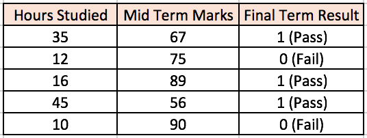

两个输入栏表示了学生学习的时间和期中考试的分数。最终结果栏可以有两种值，1 或者 0，来表示学生是否通过的期末考试。例如，我们可以看到，如果学生学习了 35 个小时并在期中获得了 67 分，他 / 她就会通过期末考试。

现在我们假设我们想预测一个学习了 25 个小时并在期中考试中获得 70 分的学生是否能够通过期末考试。

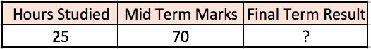

这是一个二元分类问题，多层感知器可以从给定的样本（训练数据）进行学习，并且根据给出的新的数据点，进行准确的预测。在下面我们可以看到一个多层感知器如何学习这种关系。

## **训练我们的多层感知器：反向传播算法**

> ***反向传播误差，\****通常缩写为「BackProp」，是几种训练人工神经网络的方法之一。这是一种监督学习方法，即通过标记的训练数据来学习（有监督者来引导学习）。*
>
> *简单说来，BackProp 就像「从错误中学习」。监督者在人工神经网络犯错误时进行纠正。*
>
> *一个人工神经网络包含多层的节点；输入层，中间隐藏层和输出层。相邻层节点的连接都有配有「权重」。学习的目的是为这些边缘分配正确的权重。通过输入向量，这些权重可以决定输出向量。*
>
> *在监督学习中，训练集是已标注的。这意味着对于一些给定的输入，我们知道期望 / 期待的输出（标注）。*
>
> ***反向传播算法\****：**最初，所有的边权重（edge weight）都是随机分配的。对于所有训练数据集中的输入，人工神经网络都被激活，并且观察其输出。这些输出会和我们已知的、期望的输出进行比较，误差会「传播」回上一层。该误差会被标注，权重也会被相应的「调整」。该流程重复，直到输出误差低于制定的标准。*
>
> *上述算法结束后，我们就得到了一个学习过的人工神经网络，该网络被认为是可以接受「新」输入的。该人工神经网络可以说从几个样本（标注数据）和其错误（误差传播）中得到了学习。*

### 激励传播

每次迭代中的传播环节包含两步：

1. (前向传播阶段)将训练输入送入网络以获得激励响应；
2. (反向传播阶段)将激励响应同训练输入对应的目标输出求差，从而获得隐层和输出层的响应误差。

### 权重更新

对于每个突触上的权重，按照以下步骤进行更新：

1. 将输入激励和响应误差相乘，从而获得权重的梯度；
2. 将这个梯度乘上一个比例并取反后加到权重上。
3. 这个比例将会影响到训练过程的速度和效果，因此称为“学习率”或“步长”。梯度的方向指明了误差扩大的方向，因此在更新权重的时候需要对其取反，从而减小权重引起的误差。

项目描述多层神经网络采用反向传播算法。为了说明这一过程,这里有三层神经网络，有两个输入和一个输出,如下图中所示,

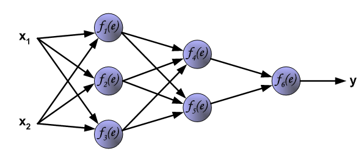

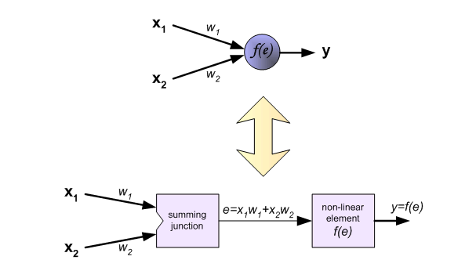

每个神经元是由两个单元组成的。第一个方块包含权重系数和输入信号。第二个方块实现非线性函数,称为神经元激活函数。

e是上一层summing junction的输出信号，y = f(e)是非线性元件的输出信号。信号y也是神经元的输出信号。

我们需要的神经网络训练数据集。训练数据集由输入信号(x_1和x_2)分配相应的目标(预期的输出)为z。网络训练是一个迭代的过程。在每个迭代中权重系数的节点会用新的训练数据集的数据进行修改。修改计算使用下面描述的算法:每个步骤都是从训练集中的两个输入信号开始,在这个阶段我们可以确定每个网络层中的每个神经元的输出信号值。图片下面的说明信号是通过网络传播,符号w(x_m)_n代表网络输入x_m和神经元n层之间的连接权重，符号y_n代表神经元n的输出信号。

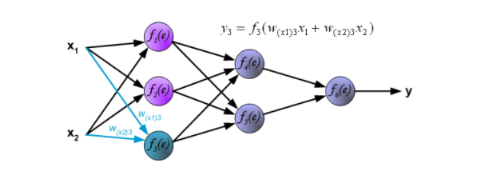

传播的信号需要通过隐藏层。符号w_mn代表m和输入和输出神经元n之间的连接权重。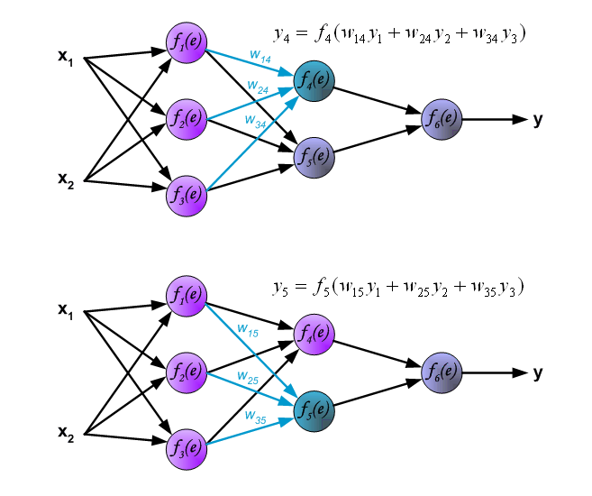

传播信号通过输出层。

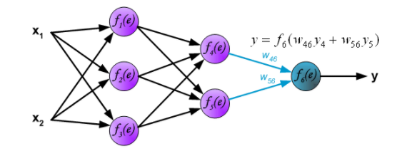

以上都是正向传播。算法的下一步，计算得出的输出y和训练集和的真实结果z有一定的误差，这个误差就叫做误差信号。用误差信号反向传递给前面的各层，来调整网络参数。

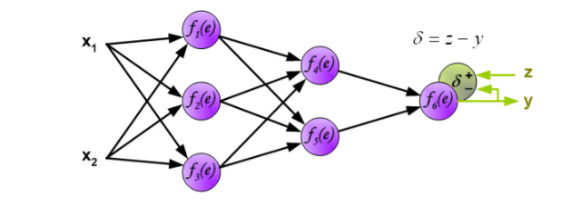

之前的算法是不可能直接为内部神经元计算误差信号,因为这些神经元的输出值是未知的。因此反向传播算法对此问题进行了解决。这个算法的创新点就是传播误差信号δ=z-y，返回到所有神经元,输出信号会根据输入神经元进行更改。

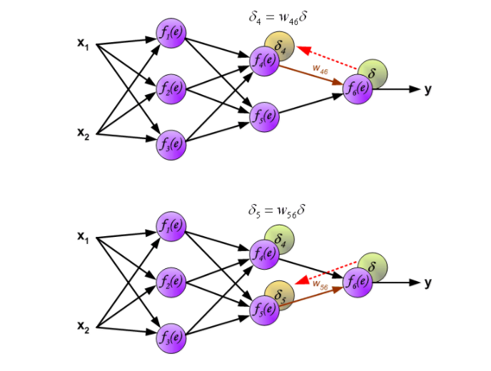

权重系数的W_mn用来传播误差信号δ，它是等于通过计算得出输出值，便会得到新的误差δ_m。只有数据流的方向是改变(信号传播从输出到输入一个接一个的进行权值更新)。这一技术是用于所有网络层。如果当传播错误来自一些神经元。将误差δ根据之前的权重会获得每个神经元的各自误差δ_5，δ_4，...δ_1.

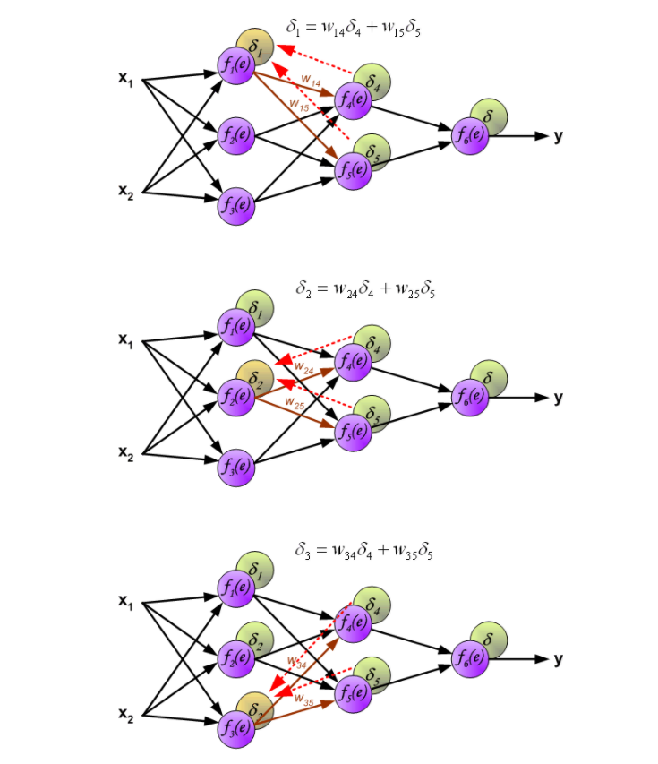

当每个神经元的误差都计算完后，每个神经元的权重系数也会更新。下面的公式就是神经元的激活函数（更新权重），利用误差δ_1和之前的权重以及之前e函数的倒数来获得新的权重w'.这里η是系数，它影响着权重改变大小的范围。它的选择也是有很多方法的。

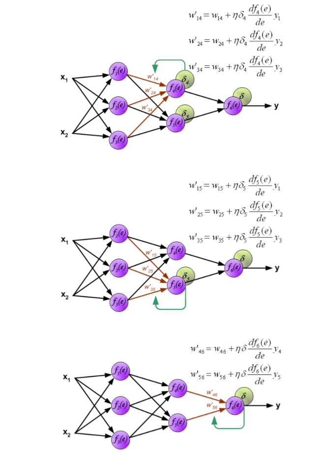

以上就是正向传入输入值，获得误差，根据误差反向传播误差，获得每一个神经元的误差值，在根据误差值和e的倒数来更新权重，达到了对整个网络的修正。